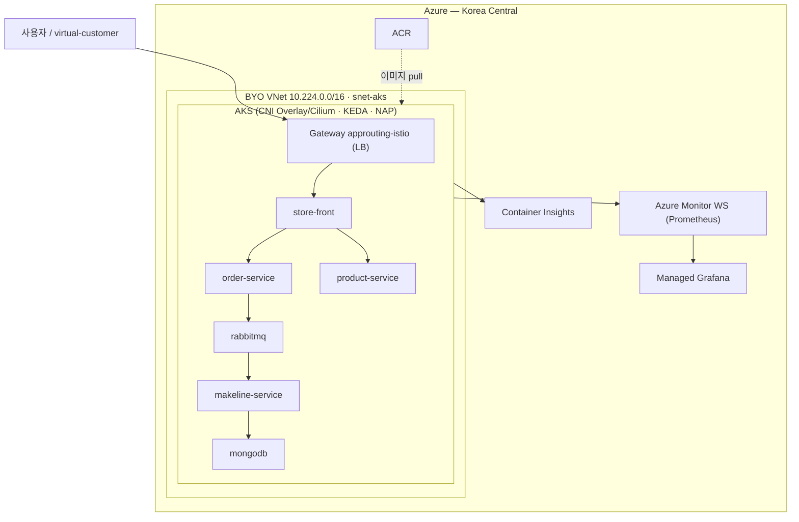

# Azure Kubernetes Service(AKS) 플랫폼 핸즈온 워크샵

> 인프라/플랫폼 엔지니어를 위한 **약 2~2.5시간** AKS 실습. Terraform으로 클러스터를 프로비저닝하고, 마이크로서비스 앱 배포 · Gateway API 인그레스 · 오토스케일링(Pod/노드) · 모니터링을 직접 체험합니다.

## WAF / CAF 란?

이 워크숍의 인프라는 마이크로소프트의 두 가지 공식 프레임워크를 따릅니다.

- **CAF (Cloud Adoption Framework)** — 조직이 Azure를 **도입·운영하는 방법론**입니다. 리소스 **명명 규칙**(예: `rg-<workload>-<purpose>-<env>-<region>-<instance>`), **태깅**, 리소스 그룹/구독 구성, 거버넌스 등 "클라우드를 어떻게 정리·표준화할 것인가"를 다룹니다.
  - 참고: [Cloud Adoption Framework 개요](https://learn.microsoft.com/azure/cloud-adoption-framework/overview) · [리소스 명명 규칙](https://learn.microsoft.com/azure/cloud-adoption-framework/ready/azure-best-practices/resource-naming) · [리소스 약어 목록](https://learn.microsoft.com/azure/cloud-adoption-framework/ready/azure-best-practices/resource-abbreviations) · [태깅 전략](https://learn.microsoft.com/azure/cloud-adoption-framework/ready/azure-best-practices/resource-tagging)
- **WAF (Well-Architected Framework)** — 개별 워크로드를 **잘 설계하기 위한 5대 품질 기둥**입니다: **안정성(Reliability)**, **보안(Security)**, **비용 최적화(Cost Optimization)**, **운영 우수성(Operational Excellence)**, **성능 효율성(Performance Efficiency)**.
  - 참고: [Well-Architected Framework 개요](https://learn.microsoft.com/azure/well-architected/) · [5대 기둥](https://learn.microsoft.com/azure/well-architected/pillars) · [AKS 서비스 가이드](https://learn.microsoft.com/azure/well-architected/service-guides/azure-kubernetes-service)

이 실습에 적용된 예시: 리소스 그룹을 **수명주기별 3개로 분리**(network/aks/monitoring)하고 **일관된 태그**를 부여(CAF·운영 우수성), 관리자 키 대신 **관리 ID + RBAC** 사용(보안), **BYO VNet**으로 네트워크 통제(보안·안정성), 실습 후 **즉시 정리**로 비용 관리(비용 최적화).

## 아키텍처

사용자 → Gateway(`approuting-istio` LoadBalancer) → store-front → order/product/makeline-service · rabbitmq · mongodb. AKS는 **직접 만든 VNet/Subnet(BYO 네트워크)** 에 배포되며, virtual-customer가 자동 부하를 생성하고, ACR가 이미지를, NAP가 노드 확장을, Managed Prometheus/Grafana·Container Insights가 관측을 담당합니다. 인그레스는 기본 경로(05, application routing add-on) 대신 **(옵션) [05.1 Application Gateway for Containers(AGC)](docs/05.1-ingress-option-agc.md)** 로 대체할 수 있습니다.

## 학습 목표
- Terraform으로 AKS(CNI Overlay/Cilium · KEDA · Container Insights)와 ACR · Log Analytics · Azure Monitor Workspace · Managed Grafana를 프로비저닝 (WAF/CAF 명명·태깅 + 리소스 그룹 3분리 + BYO VNet)
- kubectl로 AKS Store Demo 배포·검증
- application routing add-on의 Gateway API(`approuting-istio`)로 외부 인그레스 구성 — 또는 **(옵션)** Application Gateway for Containers(AGC, [05.1](docs/05.1-ingress-option-agc.md))
- KEDA로 Pod 수평 확장(이벤트/큐 기반, scale-to-zero), NAP로 노드 자동 프로비저닝 관찰
- Managed Grafana/Prometheus와 Container Insights로 관측

## 시간표 (실제 약 2~2.5시간 / 120–160분)

아래는 각 모듈의 **실제 측정 기반** 소요 시간입니다. 합계는 **약 120–160분**(대표값 ≈ **2시간 15분**)으로, 억지로 120분에 맞추지 않았습니다. 시간의 상당 부분은 **Azure 측 프로비저닝 대기**(클러스터/Grafana 생성, 애드온 활성화, LB·노드 프로비저닝)이며, 이 대기 동안 다음 모듈 문서를 미리 읽으면 체감 시간을 줄일 수 있습니다.

| 모듈 | 내용 | 시간 | 주 소요 요인 |
|---|---|---|---|
| 개요 (이 문서) | 아키텍처·목표 | ~5분 | 문서 읽기 |
| [01 사전 준비](docs/01-prerequisites.md) | az 로그인, 공급자 등록, terraform init | ~10분 | 리소스 공급자 등록·쿼터 확인 |
| [02 인프라 프로비저닝](docs/02-provision-terraform.md) | plan/apply(3단계), 애드온 + Managed Prometheus | **25–35분** | **apply 15–25분**(Grafana 5–10·AKS 5–8) + 메트릭 활성화 3–5분 |
| ┗ [02.1 (옵션) az CLI 프로비저닝](docs/02.1-provision-option-azcli.md) | Terraform이 안 될 때 우회 | (02 대체) | 02와 유사 |
| [03 컨테이너 이미지 빌드](docs/03-build-images.md) | 소스 → ACR (병렬 `az acr build`) | **10–15분** | 병렬 빌드 8–10분(Rust `product-service`가 최장) |
| [04 앱 배포](docs/04-deploy-app.md) | store-demo 배포 | **10–15분** | 첫 배포 시 NAP user 노드 생성 2–4분 + 이미지 pull |
| [05 Gateway API 인그레스](docs/05-ingress-gateway-api.md) | application routing add-on + Gateway | **12–18분** | 애드온 활성화 6–12분 + LB 공인 IP 1–3분 |
| ┗ [05.1 **(옵션)** AGC 인그레스](docs/05.1-ingress-option-agc.md) | Application Gateway for Containers + Gateway | (05 대체) | 애드온/아이덴티티 + AGC 프로비저닝 5–6분 |
| [06 오토스케일링 (1) KEDA](docs/06-autoscaling-keda.md) | RabbitMQ 큐 트리거로 Pod 0↔N | **10–15분** | 큐 적재→확장, scale-to-zero 쿨다운 대기 |
| [07 오토스케일링 (2) NAP](docs/07-autoscaling-nap.md) | NAP로 노드 자동 프로비저닝 | **12–18분** | 신규 노드 프로비저닝 1–3분 + scale-in 대기 |
| [08 모니터링](docs/08-monitoring.md) | Grafana/Prometheus + Container Insights/KQL | **12–18분** | 대시보드·Explore·KQL, 로그 수집 지연 1–5분 |
| [09 정리](docs/09-cleanup.md) | terraform destroy | **8–12분** | AKS·Grafana 삭제에 수 분 소요 |

> 시작하려면 [01. 사전 준비](docs/01-prerequisites.md)로 이동하세요.

## 사전 요구사항
- Owner 권한 Azure 구독
- Azure Cloud Shell (Bash), Azure CLI ≥ 2.86

## 예상 비용
Korea Central, 약 2~2.5시간 1회 기준 소액(수천 원 수준 — AKS 노드 + Managed Grafana + Standard LB + 로그/메트릭 수집). **실습 후 반드시 [09. 정리](docs/09-cleanup.md)의 `terraform destroy`를 실행하세요.**

## 트러블슈팅
증상별 **원인 → 진단 → 조치**는 각 모듈 문서 하단의 **트러블슈팅** 섹션에 정리되어 있습니다.

| 영역 | 참고 모듈 |
|---|---|
| Terraform/프로비저닝(쿼터·권한·이름 충돌·NAP 모드 등) | [02. 인프라 프로비저닝](docs/02-provision-terraform.md#트러블슈팅) |
| 컨테이너 이미지 빌드(ACR 권한·빌드 실패) | [03. 이미지 빌드](docs/03-build-images.md#트러블슈팅) |
| 앱 배포·클러스터 접속(kubeconfig·ImagePull·Pending) | [04. 애플리케이션 배포](docs/04-deploy-app.md#트러블슈팅) |
| 인그레스/Gateway API(EXTERNAL-IP·Istio·404/502) | [05. Gateway API 인그레스](docs/05-ingress-gateway-api.md#트러블슈팅) · [05.1 AGC **(옵션)**](docs/05.1-ingress-option-agc.md#트러블슈팅) |
| 오토스케일링 KEDA(ScaledObject·큐 트리거) | [06. KEDA](docs/06-autoscaling-keda.md#트러블슈팅) |
| 오토스케일링 NAP(Pending·노드 생성·scale-in) | [07. NAP](docs/07-autoscaling-nap.md#트러블슈팅) |
| 모니터링(Grafana·Prometheus·ContainerLogV2) | [08. 모니터링](docs/08-monitoring.md#트러블슈팅) |
| 정리/삭제(destroy 실패·잔여 RG) | [09. 정리](docs/09-cleanup.md#트러블슈팅) |
| 로그인/구독/쿼터 등 사전 준비 | [01. 사전 준비](docs/01-prerequisites.md#트러블슈팅) |

## 참고

워크숍에서 다룬 기술별 Microsoft 공식 문서입니다.

**AKS 기본 / IaC**
- [Azure Kubernetes Service(AKS) 문서](https://learn.microsoft.com/azure/aks/)
- [AKS 베스트 프랙티스](https://learn.microsoft.com/azure/aks/best-practices)
- [AKS용 Terraform(azurerm) 리소스 `azurerm_kubernetes_cluster`](https://registry.terraform.io/providers/hashicorp/azurerm/latest/docs/resources/kubernetes_cluster)
- [Cloud Adoption Framework — 리소스 명명/태깅](https://learn.microsoft.com/azure/cloud-adoption-framework/ready/azure-best-practices/resource-naming)

**네트워킹 (CNI Overlay / Cilium / BYO VNet)**
- [Azure CNI Overlay 네트워킹](https://learn.microsoft.com/azure/aks/azure-cni-overlay)
- [Azure CNI Powered by Cilium](https://learn.microsoft.com/azure/aks/azure-cni-powered-by-cilium)
- [기존 VNet/서브넷에 AKS 배포(BYO 네트워크)](https://learn.microsoft.com/azure/aks/configure-azure-cni)

**인그레스 (Gateway API / app routing)**
- [application routing add-on with Gateway API](https://learn.microsoft.com/azure/aks/app-routing-gateway-api)
- [관리형 NGINX 수신(application routing add-on)](https://learn.microsoft.com/azure/aks/app-routing)
- [Kubernetes Gateway API](https://gateway-api.sigs.k8s.io/)

**오토스케일링 (KEDA / NAP)**
- [AKS의 KEDA 애드온](https://learn.microsoft.com/azure/aks/keda-about)
- [Node Auto Provisioning(NAP)](https://learn.microsoft.com/azure/aks/node-autoprovision)
- [Karpenter(NAP의 엔진)](https://karpenter.sh/)
- [클러스터 오토스케일러 vs NAP 개요](https://learn.microsoft.com/azure/aks/cluster-autoscaler-overview)

**모니터링 (Managed Prometheus / Grafana / Container Insights)**
- [Managed Prometheus(Azure Monitor 메트릭)](https://learn.microsoft.com/azure/azure-monitor/essentials/prometheus-metrics-overview)
- [Azure Managed Grafana](https://learn.microsoft.com/azure/managed-grafana/overview)
- [Container Insights 개요](https://learn.microsoft.com/azure/azure-monitor/containers/container-insights-overview)
- [`ContainerLogV2` 스키마 / 관리 ID 인증](https://learn.microsoft.com/azure/azure-monitor/containers/container-insights-logging-v2)

**보안 (관리 ID / RBAC)**
- [AKS의 관리 ID 사용](https://learn.microsoft.com/azure/aks/use-managed-identity)
- [Azure RBAC로 Kubernetes 권한 관리](https://learn.microsoft.com/azure/aks/manage-azure-rbac)
- [AKS에서 ACR 통합(AcrPull)](https://learn.microsoft.com/azure/aks/cluster-container-registry-integration)

**샘플 앱**
- [Azure-Samples/aks-store-demo](https://github.com/Azure-Samples/aks-store-demo)

