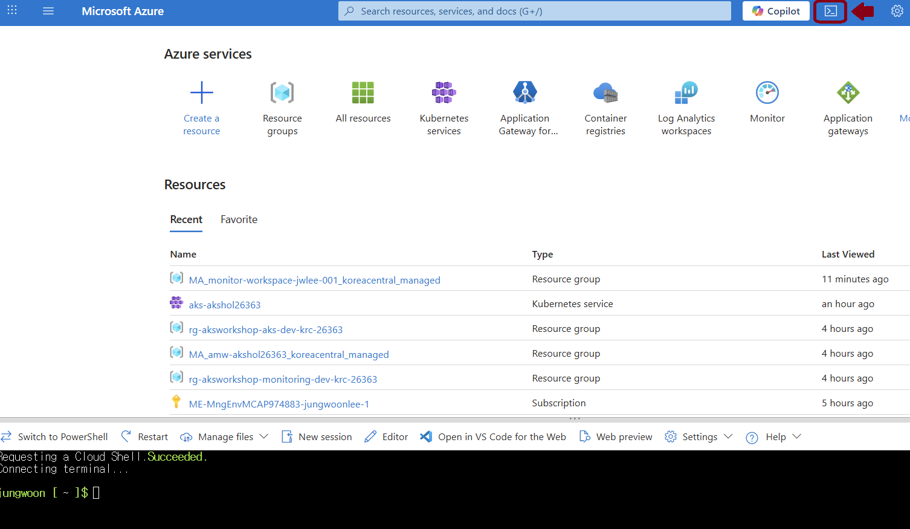
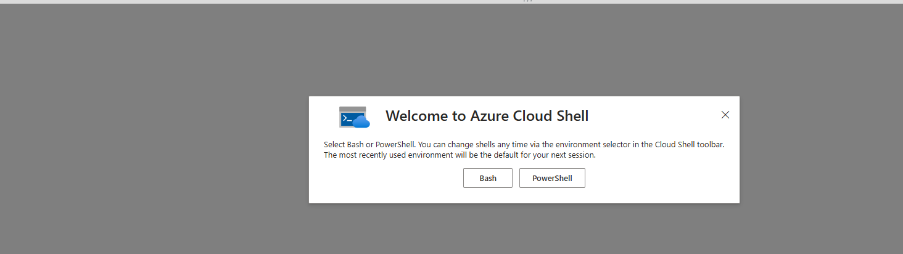
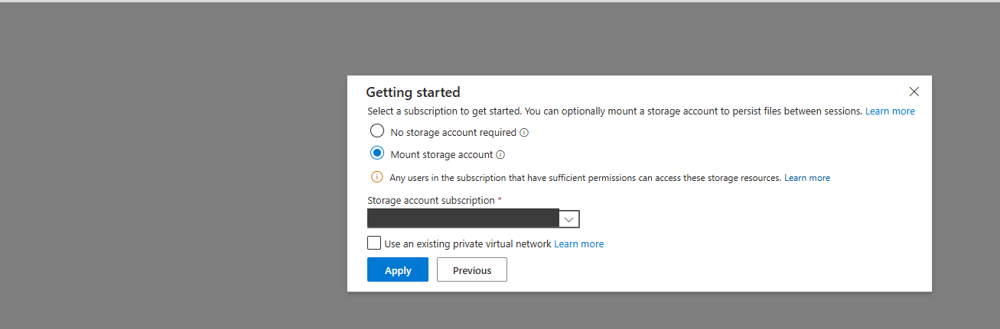
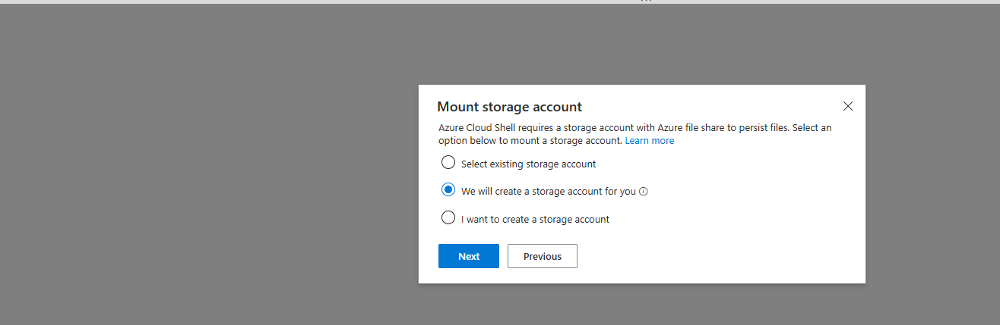
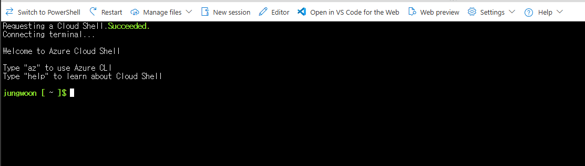

# 01. 사전 준비

본 모듈에서는 워크숍을 시작하기 전에 **권한·도구·구독 설정·리소스 공급자 등록·쿼터**를 점검하고, 저장소를 클론해 Terraform을 초기화합니다. 여기서 꼼꼼히 준비하면 이후 `terraform apply` 단계에서 권한/쿼터/공급자 미등록으로 인한 실패를 예방할 수 있습니다.

- 예상 소요: 약 10분
- 권장 환경: **Azure Cloud Shell (Bash)** — Azure CLI·Terraform·kubectl이 모두 사전 설치되어 있고 자동 인증됩니다.

> 💡 **Azure Cloud Shell 예시 화면** — [Azure Portal](https://portal.azure.com) 상단의 `>_` 아이콘을 클릭하면 브라우저에서 바로 Bash 셸이 열립니다. 별도 설치 없이 아래 모든 실습 명령을 그대로 실행할 수 있습니다.



> ⚠️ **Cloud Shell은 반드시 "스토리지 계정 마운트(영구)" 옵션으로 시작하세요.** 처음 Cloud Shell을 열면 **시작하기(Getting started)** 창에서 두 옵션이 나란히 표시되는데, 기본으로 영구가 선택되지는 않습니다. **No storage account required(임시·ephemeral)** 를 고르면 세션이 끝나거나 **20분간 입력이 없어 자동 로그아웃**되면 클론한 저장소·`terraform.tfvars`·**로컬 Terraform state까지 모두 사라집니다.** state가 사라지면 이미 만든 Azure 자원과 어긋나 [09. 정리](09-cleanup.md)의 `terraform destroy`가 꼬일 수 있으므로, 이 워크숍에서는 임시 세션을 권장하지 않습니다.
>
> **영구 스토리지로 시작하는 클릭 순서**
>
> 1. [Azure Portal](https://portal.azure.com) 상단 `>_` 아이콘 클릭 → **Welcome to Azure Cloud Shell** 창에서 **Bash** 선택
>
> 
>
> 2. **Getting started** 창에서 **Mount storage account** 라디오 선택 → **Storage account subscription** 드롭다운에서 대상 구독 선택 → **Apply** ( *No storage account required* 를 고르지 않도록 주의)
>
> 
>
> 3. **Mount storage account** 창에서 **We will create a storage account for you** 선택 → **Next** (RG·스토리지 계정이 자동 생성됨, 직접 만들 필요 없음)
>
> 
>
> 4. `Requesting a Cloud Shell.Succeeded.` 후 프롬프트(`jungwoon [ ~ ]$`)가 뜨면 준비 완료입니다. 이제 파일이 세션 간 유지됩니다.
>
> 
>
> 참고: 스토리지 계정 자동 생성에는 구독에 **Contributor 이상** 권한이 필요합니다. 이미 임시 세션으로 시작했다면 **설정(⚙️) → Reset User Settings** 후 Cloud Shell을 다시 열어 영구 옵션을 선택하세요. 영구로 시작해도 **`$HOME` 밖의 변경(추가 설치 도구 등)과 실행 중인 명령은 보존되지 않으므로**, 긴 `terraform apply` 도중에는 자리를 비우지 마세요.

---

## 0) 준비물 체크리스트

작업을 시작하기 전에 아래 항목을 먼저 확인하세요.

| 구분 | 항목 | 비고 |
|---|---|---|
| 계정 | Azure 구독 | 유효한 구독 1개 |
| 권한 | 구독 범위 **Owner**(권장) 또는 **Contributor + User Access Administrator** | Terraform이 **역할 할당 4종**을 생성하므로 `Microsoft.Authorization/roleAssignments/write` 권한이 필수입니다 |
| 도구 | Azure CLI >= 2.86, Terraform >= 1.5, kubectl | Cloud Shell은 모두 사전 설치(자동 최신) |
| 네트워크 | 인터넷 egress | Terraform Registry / 컨테이너 이미지 pull |
| 지식 | 기본 Linux 셸, Kubernetes 기본 개념(Pod/Deployment/Service) | 실습 진행에 도움 |
| 비용 | AKS·AMW·Grafana는 과금 리소스 | 실습 후 **반드시 [09. 정리](09-cleanup.md)** 로 삭제 |

> 💡 **왜 Owner가 필요한가요?** 일반적인 리소스 생성은 Contributor로 충분하지만, 본 워크숍은 AKS-ACR(AcrPull), AKS-Subnet(Network Contributor), Grafana-AMW(Monitoring Data Reader), 사용자-Grafana(Grafana Admin) 등 **RBAC 역할 할당**을 Terraform이 직접 만듭니다. 역할 할당 쓰기 권한은 **Owner** 또는 **User Access Administrator** 에게만 있습니다.

---

## 1) Cloud Shell 진입 및 구독 설정

[Azure Portal](https://portal.azure.com)에서 우측 상단 Cloud Shell(`>_`)을 열고 **Bash**를 선택합니다. (로컬 환경이라면 먼저 `az login` 으로 인증하세요.)

```bash
# 현재 로그인/구독 확인
az account show -o table

# 여러 구독이 있으면 대상 구독을 명시적으로 선택
az account set --subscription "<구독 ID 또는 이름>"
```

예상 출력:
```text
EnvironmentName    Name                  IsDefault    State    TenantId
-----------------  --------------------  -----------  -------  ------------------------------------
AzureCloud         My Subscription       True         Enabled  72f988bf-xxxx-xxxx-xxxx-xxxxxxxxxxxx
```

내 권한이 Owner인지 확인합니다.
```bash
# 현재 로그인 사용자의 UPN(로그인 이메일)과 구독 ID — 별도 Graph 호출 없이 현재 세션에서 바로 읽습니다.
MY_UPN=$(az account show --query user.name -o tsv)   # 예: user@contoso.com
SUB_ID=$(az account show --query id -o tsv)

# 값이 제대로 설정됐는지 먼저 확인
echo "MY_UPN=$MY_UPN"
echo "SUB_ID=$SUB_ID"

# 구독 범위에서 내게 부여된 역할 확인 (Owner 또는 User Access Administrator 가 보여야 함)
az role assignment list --assignee "$MY_UPN" \
  --scope "/subscriptions/$SUB_ID" \
  --query "[].roleDefinitionName" -o tsv
```
> `--assignee`는 objectId뿐 아니라 **사용자 로그인 이름(UPN/이메일)** 도 그대로 받습니다. `az account show --query user.name`은 이미 로그인된 토큰에서 UPN을 읽으므로 `az ad signed-in-user show`(Graph API) 호출이 필요 없어 더 간단하고 Graph 권한 문제도 피할 수 있습니다.
>
> 게스트(B2B) 계정 등 UPN 매칭이 잘 안 되는 환경에서는 objectId가 더 안정적입니다. 그럴 땐 `MY_ID=$(az ad signed-in-user show --query id -o tsv)`로 얻은 값을 `--assignee "$MY_ID"`에 사용하세요.

예상 출력:
```text
MY_UPN=user@contoso.com
SUB_ID=72f988bf-xxxx-xxxx-xxxx-xxxxxxxxxxxx
Owner
```

> 💡 **상위 스코프에서 상속된 권한까지 보고 싶다면** `--include-inherited`(관리 그룹·테넌트 루트에서 상속), `--include-groups`(내가 속한 그룹에 부여된 역할)를 추가합니다. `scope` 컬럼을 함께 출력하면 각 역할이 **어디서** 왔는지 구분됩니다.
> ```bash
> az role assignment list --assignee "$MY_UPN" \
>   --scope "/subscriptions/$SUB_ID" \
>   --include-inherited --include-groups \
>   --query "[].{role:roleDefinitionName, scope:scope}" -o table
> ```
> 기본 동작은 지정한 스코프와 **그 하위**의 직접 할당만 표시합니다. 위 두 옵션을 더하면 상위 상속·그룹 경유 권한까지 합쳐 나에게 유효한 전체 권한을 확인할 수 있습니다.
> ```text
> Role                          Scope
> ----------------------------  ------------------------------------------------------------
> Owner                         /subscriptions/72f988bf-xxxx-xxxx-xxxx-xxxxxxxxxxxx
> Reader                        /providers/Microsoft.Management/managementGroups/mg-platform
> ```

---

## 2) 도구 버전 확인

| 도구 | 최소 버전 | 확인 명령 |
|---|---|---|
| Azure CLI | 2.86 이상 | `az version` |
| Terraform | 1.5 이상 | `terraform version` |
| kubectl | 클러스터와 +-1 마이너 | `kubectl version --client` |

```bash
az version                 # Cloud Shell은 항상 최신, 로컬이면 az upgrade
terraform version          # >= 1.5 필요 (providers.tf의 required_version)
kubectl version --client   # 클러스터와 ±1 마이너 권장
```

예상 출력(예):
```text
Client Version: v1.34.x
```

---

## 3) 리소스 공급자(Resource Provider) 등록

Terraform이 생성하는 리소스의 **네임스페이스가 구독에 등록**되어 있어야 합니다. 미등록 상태면 `apply` 중 `MissingSubscriptionRegistration` 오류가 납니다. 아래 명령으로 한 번에 등록합니다(이미 등록돼 있으면 즉시 통과).

```bash
for ns in \
  Microsoft.ContainerService \
  Microsoft.ContainerRegistry \
  Microsoft.OperationalInsights \
  Microsoft.Monitor \
  Microsoft.Dashboard \
  Microsoft.Insights \
  Microsoft.Network; do
  az provider register --namespace "$ns"
done
```

| 네임스페이스 | 워크숍에서의 용도 |
|---|---|
| `Microsoft.ContainerService` | AKS 클러스터 / NAP |
| `Microsoft.ContainerRegistry` | ACR(이미지 레지스트리) |
| `Microsoft.OperationalInsights` | Log Analytics(Container Insights) |
| `Microsoft.Monitor` | Azure Monitor Workspace(Managed Prometheus) |
| `Microsoft.Dashboard` | Azure Managed Grafana |
| `Microsoft.Insights` | DCE/DCR(메트릭 수집 파이프라인) |
| `Microsoft.Network` | VNet/Subnet(BYO 네트워크) |

등록 상태를 확인합니다(모두 `Registered` 여야 합니다).
```bash
for ns in Microsoft.ContainerService Microsoft.ContainerRegistry Microsoft.OperationalInsights \
          Microsoft.Monitor Microsoft.Dashboard Microsoft.Insights Microsoft.Network; do
  state=$(az provider show --namespace "$ns" --query registrationState -o tsv)
  echo "$ns: $state"
done
```

예상 출력:
```text
Microsoft.ContainerService: Registered
Microsoft.ContainerRegistry: Registered
Microsoft.OperationalInsights: Registered
Microsoft.Monitor: Registered
Microsoft.Dashboard: Registered
Microsoft.Insights: Registered
Microsoft.Network: Registered
```

> 등록은 구독 단위로 **최초 1회**만 하면 됩니다. 상태가 `Registering`이면 몇 분 후 다시 확인하세요.
>
> 참고: 본 워크숍의 NAP(노드 자동 프로비저닝)는 현재 **정식 출시(GA)** 되어 별도의 프리뷰 기능(`az feature register`) 등록이 필요 없습니다.

---

## 4) 리전 및 vCPU 쿼터 확인

배포 리전(`location`, 기본값 `koreacentral`)에서 **시스템 노드 VM 패밀리의 vCPU 쿼터**가 충분한지 확인합니다. 기본값은 **데모 최소사양** `Standard_D2s_v5` x 2대 = **4 vCPU**(Dsv5 패밀리)이며, NAP가 추가 노드를 띄우면 더 필요할 수 있습니다.

```bash
LOCATION=koreacentral
# Dsv5 계열 vCPU 사용량/한도 확인
az vm list-usage --location "$LOCATION" -o table \
  | grep -iE "Name|DSv5|Total Regional vCPUs"
```

예상 출력(예):
```text
CurrentValue    Limit    LocalName
--------------  -------  ----------------------------------------
8               100      Total Regional vCPUs
0               20       Standard DSv5 Family vCPUs
```

- `Limit - CurrentValue` 가 최소 8 이상이면 OK입니다. 부족하면 `terraform.tfvars`의 `system_node_vm_size`를 `Standard_D2s_v5`로 낮추거나, [쿼터 증설](https://learn.microsoft.com/azure/quotas/quickstart-increase-quota-portal)을 요청하세요.
- AMW(Managed Prometheus)와 Managed Grafana가 해당 리전에서 제공되는지도 확인하세요. `koreacentral`은 두 서비스를 모두 지원합니다. 다른 리전을 쓸 경우 [지역별 제품 가용성](https://azure.microsoft.com/explore/global-infrastructure/products-by-region/)을 확인합니다.

---

## 5) 저장소 클론 및 Terraform 초기화

```bash
git clone https://github.com/jungwoonlee_microsoft/ms-aks-basic-workshop01.git
cd ms-aks-basic-workshop01/terraform
cp terraform.tfvars.example terraform.tfvars
terraform init
```

`terraform init` 예상 출력(끝부분):
```text
Initializing provider plugins...
- Installing hashicorp/azurerm v4.x.x...
- Installing hashicorp/random v3.x.x...

Terraform has been successfully initialized!
```

`terraform.tfvars`는 변수 기본값을 담은 파일입니다. 필요하면 값을 수정합니다.
```hcl
prefix              = "akshol"          # 리소스 이름 접두사(소문자/숫자)
location            = "koreacentral"    # 배포 리전
system_node_vm_size = "Standard_D2s_v5" # 시스템 노드 VM 크기(데모 최소사양; 운영은 D4s_v5+)
system_node_count   = 2                 # 시스템 노드 수

# WAF/CAF: 환경 및 태깅
environment = "dev"
workload    = "aksworkshop"
owner       = "platform-team"
cost_center = "workshop"

# BYO 네트워크 (AKS가 사용할 VNet/Subnet)
vnet_address_space          = ["10.224.0.0/16"]
aks_subnet_address_prefixes = ["10.224.0.0/24"]
```

- `terraform init`은 `providers.tf`에 선언된 azurerm/random Provider 플러그인을 다운로드하고 작업 디렉터리를 초기화합니다. 최초 1회만 필요합니다.
- `.tfvars`에는 환경별 값이 들어가므로 `.gitignore`로 git 추적에서 제외되어 있습니다(`*.tfvars`). 예시 파일(`*.tfvars.example`)만 저장소에 포함됩니다.

---

## 준비 완료 최종 체크리스트

다음 항목이 모두 충족되면 [02. 인프라 프로비저닝](02-provision-terraform.md)으로 진행하세요.

- [ ] `az account show`로 **대상 구독**이 선택되어 있다
- [ ] 구독 범위에서 내 역할이 **Owner**(또는 Contributor + User Access Administrator)다
- [ ] `az version` >= 2.86, `terraform version` >= 1.5, `kubectl version --client` 정상
- [ ] 필요한 **리소스 공급자 7종**이 모두 `Registered`
- [ ] 배포 리전의 **Dsv5 vCPU 쿼터**가 8 이상 여유
- [ ] `terraform init` 출력에 `Terraform has been successfully initialized!`

---

## 트러블슈팅

| 증상 | 원인 | 진단 | 조치 |
|---|---|---|---|
| `terraform: command not found` | Terraform 미설치(로컬 환경) | `terraform version` | Cloud Shell 사용 또는 [Terraform 설치](https://developer.hashicorp.com/terraform/install) |
| `az login` 후에도 권한 오류 | 잘못된 구독 선택 | `az account show -o table` | `az account set --subscription <ID>`로 대상 구독 지정 |
| `az` 명령이 `Please run 'az login'` | 세션 만료/미인증 | `az account show` | `az login`(Cloud Shell은 자동 인증) |
| 역할 목록에 Owner가 안 보임 | 권한 부족(Reader/Contributor만 보유) | `az role assignment list --assignee <UPN 또는 objectId>` | 구독 관리자에게 **Owner** 또는 **User Access Administrator** 부여 요청 |
| `apply` 시 `MissingSubscriptionRegistration` | 리소스 공급자 미등록 | `az provider show --namespace <ns> --query registrationState` | 위 3) 단계의 `az provider register` 재실행 후 `Registered` 확인 |
| `apply` 시 `QuotaExceeded` / `SkuNotAvailable` | vCPU 쿼터 부족 또는 리전 미지원 SKU | `az vm list-usage --location <region> -o table` | `system_node_vm_size`를 낮추거나 쿼터 증설/리전 변경 |
| `RoleAssignmentExists`/`AuthorizationFailed`(역할 할당) | 역할 할당 권한 없음 | `az role assignment list --assignee <id>` | Owner/User Access Administrator 권한 확보 후 재시도 |
| `terraform init` 실패(provider 다운로드) | 네트워크/프록시 또는 레지스트리 접근 차단 | `terraform init` 출력의 URL 확인 | 네트워크 확인 후 재실행, 필요 시 `terraform init -upgrade` |
| `git clone` 인증 실패 | 비공개 저장소 권한 없음 | `gh auth status` | `gh auth login` 후 재클론 |
| 클론한 저장소·`terraform.tfvars`·state가 재접속 후 사라짐 | Cloud Shell을 **임시(ephemeral) 세션**으로 시작(20분 무활동 시 자동 로그아웃·호스트 재활용) | 세션 시작 시 "ephemeral storage" 안내가 보였는지 확인 | **설정 → Reset User Settings** 후 재시작하여 **Mount storage account(영구)** 선택. state 유실 시 09의 `terraform destroy`가 어긋날 수 있으니 영구 세션에서 다시 진행 |
| AMW/Grafana 생성 실패(`LocationNotAvailable`) | 선택 리전에서 서비스 미제공 | [지역별 가용성](https://azure.microsoft.com/explore/global-infrastructure/products-by-region/) 확인 | 지원 리전(예: `koreacentral`, `eastus`)으로 `location` 변경 |

다음: [02. 인프라 프로비저닝](02-provision-terraform.md)
