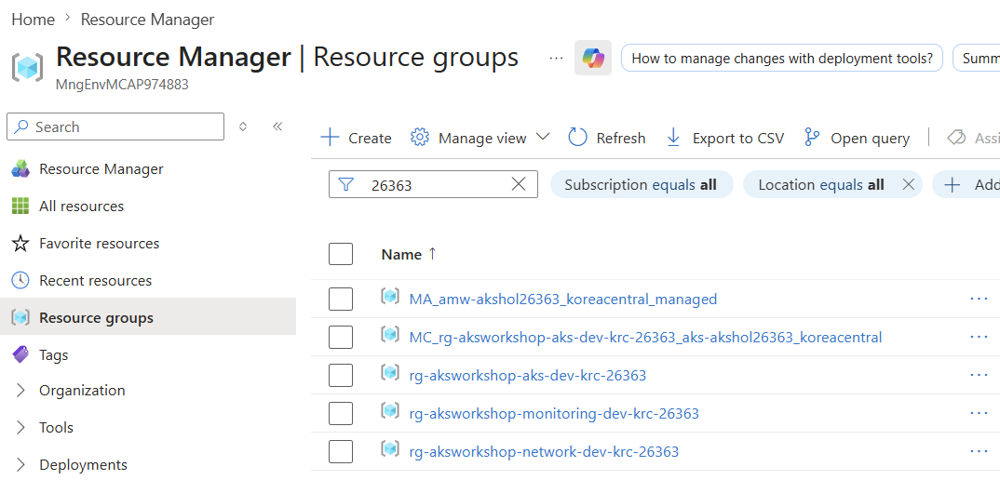
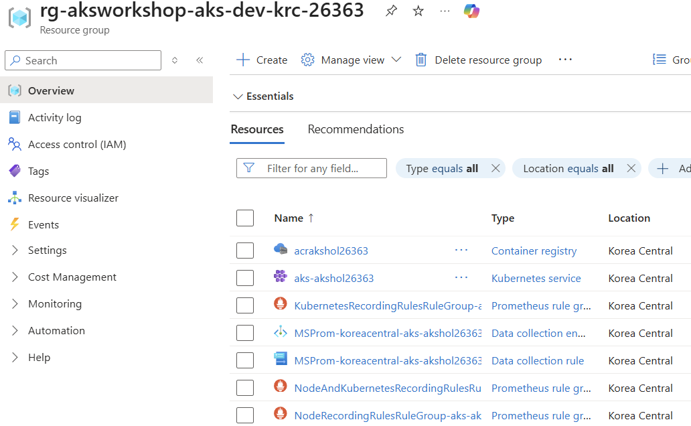

# 02. 인프라 프로비저닝 (Terraform)

이 모듈에서는 `terraform/` 폴더의 코드를 **파일별로 먼저 읽고 이해한 뒤** 실제로 적용합니다. 그냥 `apply`만 하지 않고, 각 리소스가 왜 필요한지·어떤 옵션이 핵심인지 짚어 봅니다.

## 0) Terraform 파일 구조 이해

```
terraform/
├── providers.tf          # Terraform/Provider 버전 및 인증 설정
├── variables.tf          # 입력 변수(리전, 노드 크기 등)
├── main.tf               # 전역 요소: data/random/locals + 리소스 그룹 3개
├── network.tf            # VNet/Subnet + 네트워크 역할 할당
├── aks.tf                # ACR + AKS 클러스터 + ACR 역할 할당
├── monitoring.tf         # Log Analytics/AMW/Grafana + 모니터링 역할 할당
├── outputs.tf            # 다른 모듈에서 참조할 출력값
└── terraform.tfvars.example  # 변수 기본값 예시(복사해서 사용)
```

> HashiCorp 스타일 가이드 권장에 따라 리소스를 **도메인별 파일로 분리**했습니다(network/aks/monitoring). Terraform은 디렉터리 내 모든 `.tf` 파일을 합쳐서 해석하므로, 파일을 나눠도 동작은 동일하고 가독성·유지보수성이 좋아집니다.

Terraform은 선언형 IaC 도구입니다. **원하는 최종 상태**를 코드로 적으면, Terraform이 현재 상태와 비교해 필요한 API 호출(생성/수정/삭제)을 자동으로 계산합니다.

---

### providers.tf — Provider/버전 고정

```hcl
terraform {
  required_version = ">= 1.5"
  required_providers {
    azurerm = { source = "hashicorp/azurerm", version = "~> 4.0" }
    random  = { source = "hashicorp/random",  version = "~> 3.6" }
  }
}

provider "azurerm" {
  features {
    resource_group {
      # destroy 시 Terraform이 모르는 잔여 자원(예: CLI가 만든 MSProm DCE/DCR/레코딩 룰)이
      # 워크로드 RG에 남아 있어도 RG 삭제가 막히지 않도록 허용
      prevent_deletion_if_contains_resources = false
    }
  }
}
```

- `required_version` / `version`: Terraform과 Provider 버전을 고정해 **재현 가능한** 인프라를 보장합니다. `~> 4.0`은 4.x 최신을 허용(5.0 미만).
- `azurerm`: Azure 리소스를 다루는 공식 Provider. `features {}`는 필수 블록입니다. 여기서 **`resource_group.prevent_deletion_if_contains_resources = false`** 를 설정해, 모듈 09 `terraform destroy` 시 **CLI가 만든 메트릭 파이프라인(MSProm DCE/DCR + 레코딩 룰)** 처럼 Terraform state 밖의 자원이 워크로드 RG에 남아 있어도 RG 삭제가 막히지 않게 합니다.
- `random`: 리소스 이름 충돌을 피하기 위한 난수 생성용(아래 `main.tf`에서 사용).
- 인증 정보는 코드에 두지 않습니다. Cloud Shell에 이미 로그인된 `az` 세션을 자동으로 사용합니다.

### variables.tf — 입력 변수

```hcl
variable "prefix"              { default = "akshol" }          # 리소스 이름 접두사
variable "location"            { default = "koreacentral" }    # 배포 리전
variable "system_node_vm_size" { default = "Standard_D2s_v5" } # 시스템 노드 VM 크기(데모 최소사양)
variable "system_node_count"   { default = 2 }                 # 시스템 노드 수
```

- 환경마다 달라질 수 있는 값을 변수로 분리합니다. 기본값이 있으므로 그대로 써도 되고, `terraform.tfvars`에서 덮어쓸 수 있습니다.
- `system_node_vm_size`/`system_node_count`: 시스템 노드풀의 크기/개수. 이 워크숍은 **데모 목적이라 최소사양 `Standard_D2s_v5`(2 vCPU/8 GiB) × 2대**를 기본값으로 씁니다. 시스템 노드풀은 `CriticalAddonsOnly` taint로 시스템 Pod 전용이고 앱은 NAP user 노드로 가므로 이 크기로 충분합니다. 운영 환경에서는 더 큰 SKU(예: `Standard_D4s_v5`)를 권장합니다. quota가 부족하면 이 값을 낮추거나 리전을 바꿉니다(트러블슈팅 참고).

### 리소스 상세 설명 — 각 apply 단계에서 "기다리며 읽기"

`main.tf`·`network.tf`·`aks.tf`·`monitoring.tf`의 **리소스별 상세 설명(HCL 코드 포함)** 은 아래 **`2) apply`의 각 단계로 옮겨** 두었습니다. `terraform apply`는 단계마다 수 분이 걸리므로, **명령을 실행해 둔 뒤 리소스가 만들어지는 동안** 그 단계의 설명을 읽으면 대기 시간을 학습에 활용할 수 있습니다.

- **2.1 (기반)** — 고유 이름 생성, 리소스 그룹 3종, ACR, Log Analytics, VNet/Subnet(BYO 네트워크), Azure Monitor Workspace, Managed Grafana
- **2.2 (AKS)** — AKS 클러스터(CNI Overlay·Cilium / KEDA / Container Insights), `aks_network`·`aks_acr` 역할 할당
- **2.3 (Grafana 역할 + 로그 DCR)** — `grafana_reader`·`grafana_admin` 역할 할당, Container Insights 로그 **DCR + DCRA**

### outputs.tf — 출력값

```hcl
output "resource_group_name"        { ... }
output "aks_cluster_name"           { ... }
output "acr_login_server"           { ... }
output "azure_monitor_workspace_id" { ... }
output "grafana_resource_id"        { ... }
output "grafana_endpoint"           { ... }
output "get_credentials_command"    { ... }
```
- 다음 모듈들이 `terraform output -raw <이름>`으로 참조합니다. 예) `get_credentials_command`는 kubeconfig를 가져오는 `az aks get-credentials ...` 명령을 그대로 출력합니다. 값을 손으로 복사하지 않아도 되도록 설계했습니다.

---

## 1) plan 검토

> 📁 이후 이 모듈의 모든 명령은 **`terraform` 디렉터리에서 실행**합니다. 아래에서 한 번 이동하면 모듈 끝까지 같은 디렉터리를 유지합니다.

```bash
cd ~/ms-aks-basic-workshop01/terraform
terraform plan
```
- `plan`은 **무엇을 만들지 미리 보여주는** 단계(실제 변경 없음). 출력 끝의 `Plan: N to add, 0 to change, 0 to destroy`에서 생성 리소스 수를 확인합니다.
- 각 리소스 앞의 `+`(생성) 기호로 무엇이 생성될지 확인합니다. 각 리소스의 **상세 설명(코드 포함)은 아래 `2) apply`의 해당 단계**에서 적용과 함께 다룹니다.

예상 출력(끝부분):
```text
  # azurerm_kubernetes_cluster.this will be created
  + resource "azurerm_kubernetes_cluster" "this" {
      + name = "aks-akshol12345"
      ...
    }

Plan: 17 to add, 0 to change, 0 to destroy.

Changes to Outputs:
  + acr_login_server               = (known after apply)
  + acr_name                       = (known after apply)
  + aks_cluster_name               = (known after apply)
  + aks_subnet_id                  = (known after apply)
  + azure_monitor_workspace_id     = (known after apply)
  + get_credentials_command        = (known after apply)
  + grafana_endpoint               = (known after apply)
  + grafana_resource_id            = (known after apply)
  + monitoring_resource_group_name = (known after apply)
  + network_resource_group_name    = (known after apply)
  + resource_group_name            = (known after apply)
  + vnet_name                      = (known after apply)
```

생성될 리소스: **Resource Group 3종(network/aks/monitoring)**, VNet/Subnet(BYO 네트워크), ACR, Log Analytics, Azure Monitor Workspace, Managed Grafana, AKS(BYO 서브넷 + CNI Overlay/Cilium + KEDA + Container Insights), **Container Insights 로그용 DCR + DCRA**, 역할 할당 4종(Network Contributor 포함). **NAP(노드 자동 프로비저닝)와 Managed Prometheus 메트릭 수집(MSProm DCE/DCR/DCRA + 레코딩 룰)** 은 Terraform이 아니라 **배포 마지막의 `az aks update`** 한 번으로 함께 활성화합니다(아래 "3) ..." 참고). 즉 **로그 파이프라인의 DCR/DCRA는 Terraform이**, **메트릭 파이프라인의 DCR류는 CLI가** 만듭니다.

## 2) apply — 3단계로 나눠 적용 (전체 약 15–25분)

> ⏱️ **단계별 예상 소요 시간** (구독/리전 부하에 따라 변동)
> - **2.1 (1단계) — 기반:** 약 **8–12분** (Managed Grafana 프로비저닝이 5–10분으로 가장 오래 걸림. VNet/ACR/Log Analytics/AMW는 각각 1–2분)
> - **2.2 (2단계) — AKS 클러스터:** 약 **5–8분** (AKS 컨트롤 플레인 + 시스템 노드풀 생성이 대부분. 역할 할당은 각 10초 내외)
> - **2.3 (3단계) — Grafana 역할 할당(전체 수렴):** 약 **1–3분** (역할 할당 수 초 + 전체 그래프 점검)
>
> 합계 대략 **15–25분**입니다. 클러스터/Grafana 생성은 Azure 측 프로비저닝 시간이라 환경에 따라 더 길어질 수 있습니다.

본 워크숍은 **안전한 진행을 위해 자원을 3단계로 나눠 생성**하고, 각 단계에서 리소스가 실제로 만들어졌는지 확인한 뒤 다음 단계로 넘어갑니다. 각 단계는 다음 단계가 의존하는 리소스를 먼저 만들도록 **의존성 순서**에 맞춰 구성했습니다.

> `-target`은 지정한 리소스와 **그 의존성만** 골라서 적용하는 옵션입니다. 단계적 확인·디버깅에 유용하지만, Terraform은 "전체를 한 번에 수렴"하는 것을 기본 전제로 하므로 **마지막 3단계에서 반드시 대상 없이 `terraform apply`를 실행**해 남은 리소스까지 모두 수렴시킵니다.

**의존성 요약**
- AKS 클러스터는 **Subnet(BYO 네트워크)** 과 **Log Analytics(oms_agent)** 에 의존합니다 → 이들을 1단계에서 먼저 생성.
- `aks_network`·`aks_acr` 역할 할당, Grafana 역할 할당은 모두 **AKS에 의존**합니다 → AKS 생성(2단계) 이후에 적용. (**NAP와 Managed Prometheus 메트릭 수집**은 전체 배포 후 `az aks update` 한 번으로 함께 활성화)

### 2.1 — 기반(네트워크 + 레지스트리 + 모니터링 백엔드) — 약 8–12분

RG 3종, VNet/Subnet, ACR, Log Analytics, Azure Monitor Workspace, Grafana를 만듭니다(모두 AKS에 의존하지 않음). `random_integer`는 의존성으로 자동 포함됩니다.

```bash
terraform apply \
  -target=azurerm_resource_group.network \
  -target=azurerm_resource_group.workload \
  -target=azurerm_resource_group.monitoring \
  -target=azurerm_virtual_network.this \
  -target=azurerm_subnet.aks \
  -target=azurerm_container_registry.this \
  -target=azurerm_log_analytics_workspace.this \
  -target=azurerm_monitor_workspace.this \
  -target=azurerm_dashboard_grafana.this
```
입력 확인 프롬프트에 `yes`를 입력하면 적용이 시작됩니다.

> ⏳ **apply가 도는 동안 아래 설명을 읽어 두세요.** 이 단계가 만드는 리소스의 코드와 설계 의도입니다.

**(참고-1) 고유 이름 생성** (`main.tf`)
```hcl
resource "random_integer" "suffix" { min = 10000, max = 99999 }
locals { name = "${var.prefix}${random_integer.suffix.result}" }
```
- ACR·Grafana 등은 이름이 **전역적으로 유일**해야 합니다. 난수 5자리를 접미사로 붙여 충돌을 방지합니다. 예) `akshol12345`.

**(참고-2) Resource Group(3개로 분리) / ACR / Log Analytics**
```hcl
locals {
  region_short = lookup(local.region_abbreviations, var.location, "reg")  # koreacentral -> krc
  common_tags  = { workload, environment, owner, costCenter, managedBy = "terraform", ... }
  rg_suffix    = "${var.environment}-${local.region_short}-${random_integer.suffix.result}"
}

# WAF/CAF: 수명주기·소유권별로 RG 분리. 명명 rg-<workload>-<purpose>-<env>-<region>-<instance>
resource "azurerm_resource_group" "network"    { name = "rg-${var.workload}-network-${local.rg_suffix}",    tags = merge(common_tags, { layer = "network" }) }
resource "azurerm_resource_group" "workload"   { name = "rg-${var.workload}-aks-${local.rg_suffix}",        tags = merge(common_tags, { layer = "workload" }) }
resource "azurerm_resource_group" "monitoring" { name = "rg-${var.workload}-monitoring-${local.rg_suffix}", tags = merge(common_tags, { layer = "monitoring" }) }

resource "azurerm_container_registry" "this"    { resource_group_name = azurerm_resource_group.workload.name,   ... }
resource "azurerm_log_analytics_workspace" "this"{ resource_group_name = azurerm_resource_group.monitoring.name, ... }
```
- **리소스 그룹 분리 (WAF/CAF)**: CAF는 리소스를 **수명주기·소유권·과금 단위**로 묶어 별도 RG에 두기를 권장합니다. 이 워크숍은 3개로 나눕니다.
  - `rg-<workload>-**network**-...`: VNet/Subnet 등 **장수명·플랫폼 소유** 네트워크 (예: `rg-aksworkshop-network-dev-krc-12345`)
  - `rg-<workload>-**aks**-...`: AKS·ACR 등 **애플리케이션 런타임** (예: `rg-aksworkshop-aks-dev-krc-12345`)
  - `rg-<workload>-**monitoring**-...`: Log Analytics·AMW·Grafana 등 **관측 스택** (예: `rg-aksworkshop-monitoring-dev-krc-12345`)
  - 각 RG에는 `layer` 태그를 추가로 부여해 계층을 식별합니다. 이렇게 분리하면 네트워크/모니터링은 유지한 채 워크로드만 재배포하는 등 **독립적 수명주기 관리**가 가능하고, RBAC을 RG 단위로 위임하기도 쉽습니다.
  - 참고: AKS는 노드·LB 등을 담는 **노드 리소스 그룹**(`MC_<workload-rg>_<aks>_<region>`)을 자동으로 하나 더 만듭니다(총 4개 RG가 보일 수 있음).
- **공통 태그(WAF 운영 우수성)**: `workload`/`environment`/`owner`/`costCenter`/`managedBy` 태그를 `local.common_tags`로 정의해 **모든 리소스에 일관되게 부여**합니다. 비용 배분·소유권 추적·거버넌스의 기반이 됩니다.
- **ACR(Azure Container Registry)**: 컨테이너 이미지 레지스트리. `admin_enabled = false`로 관리자 계정 대신 **관리 ID + RBAC**로 인증(보안 모범사례). → 워크로드 RG.
- **Log Analytics Workspace**: Container Insights(컨테이너 로그)의 저장소. → 모니터링 RG.

**(참고-2-1) BYO 네트워크 — VNet / Subnet (네트워크 RG)**
```hcl
# CAF 명명: vnet-/snet-
resource "azurerm_virtual_network" "this" {
  name                = "vnet-${var.workload}-${var.environment}-${local.region_short}-${random_integer.suffix.result}"
  resource_group_name = azurerm_resource_group.network.name
  address_space       = var.vnet_address_space          # 기본 10.224.0.0/16
  tags                = local.common_tags
}
resource "azurerm_subnet" "aks" {
  name                 = "snet-aks-${var.environment}"
  resource_group_name  = azurerm_resource_group.network.name
  virtual_network_name = azurerm_virtual_network.this.name
  address_prefixes     = var.aks_subnet_address_prefixes  # 기본 10.224.0.0/24
}
```
- **BYO(Bring Your Own) VNet**: AKS가 자동 생성하는 VNet 대신 **직접 만든 VNet/서브넷**에 클러스터를 배포합니다. 이렇게 하면 주소 대역, NSG, 사설 엔드포인트, 피어링 등 네트워크를 **직접 통제**할 수 있어 엔터프라이즈/프로덕션에 권장됩니다(WAF 보안·안정성).
- **주소 대역 설계**: VNet `10.224.0.0/16`은 AKS **서비스 CIDR(10.0.0.0/16)** 및 **Pod 오버레이 CIDR(10.244.0.0/16)** 과 겹치지 않도록 선택했습니다. 겹치면 라우팅 충돌이 발생합니다.
- AKS 시스템 관리 ID에는 이 서브넷에 대한 **Network Contributor** 역할을 부여(아래 역할 할당)해 로드밸런서·네트워크 구성을 관리하게 합니다.

**(참고-3) 모니터링 백엔드 — Managed Prometheus + Grafana**
```hcl
resource "azurerm_monitor_workspace" "this"   { name = "amw-${local.name}" }
resource "azurerm_dashboard_grafana" "this" {
  name = "graf-${local.name}", grafana_major_version = 12
  identity { type = "SystemAssigned" }
  azure_monitor_workspace_integrations { resource_id = azurerm_monitor_workspace.this.id }
}
```
- **Azure Monitor Workspace(AMW)**: Managed Prometheus 메트릭이 저장되는 곳.
- **Managed Grafana**: 시각화 대시보드. `azure_monitor_workspace_integrations`로 위 AMW를 데이터소스로 연결합니다.
- `SystemAssigned` 관리 ID: Grafana가 AMW에서 메트릭을 읽을 때 사용(아래 역할 할당과 연결).

> 💡 **`MA_<amw 이름>_<region>_managed` RG가 따로 생기는 건 정상입니다.** AMW를 만들면 Azure가 **기본 DCE/DCR**(데이터 수집 엔드포인트/규칙)을 담는 **플랫폼 관리형 RG**(`MA_..._managed`)를 **자동 생성**합니다. 이 RG의 이름·위치는 **플랫폼이 고정**하므로, 모니터링 RG 등 **내가 지정한 RG로 옮기거나 이름을 바꿀 수 없습니다(설계상 제약)**. 이 RG와 내부 리소스는 **AMW를 삭제하면 함께 자동 삭제**되므로, 모듈 09의 `terraform destroy`로 AMW가 지워지면 정리됩니다(별도 수동 삭제 불필요).
>
> - **"AMW를 미리 만들어 지정하면 안 생기나요?"** — 아니요. 이 `MA_` RG는 **AMW를 만드는 그 순간** 생성됩니다(AKS가 연결될 때가 아님). 이 워크숍은 이미 AMW를 **미리(`azurerm_monitor_workspace.this`)** 만들어 모니터링 RG에 두지만, 그 생성 시점에 `MA_` RG가 함께 생깁니다. 즉 **AMW 1개당 `MA_` RG 1개**는 누가/어디에 만들든 항상 따라오며, 이를 억제하거나 다른 RG로 보내는 옵션은 없습니다.
> - 조직에 RG/리소스 **이름 규칙 정책**이 있어 이 RG 생성이 막히면, 해당 RG에 대한 **정책 예외(exemption)** 를 만드세요.

예상 출력(끝부분):
```text
azurerm_resource_group.network: Creating...
azurerm_container_registry.this: Creating...
...
azurerm_dashboard_grafana.this: Creation complete after 2m31s

Apply complete! Resources: 10 added, 0 changed, 0 destroyed.
```

확인: 포털 또는 CLI로 RG 3종과 네트워크/레지스트리/모니터링 백엔드가 생성됐는지 봅니다.

> ⚠️ **여러 사람이 같은 구독에서 작업하는 경우**, 공통 접두사(`aksworkshop`)로 `grep`하면 **다른 사람의 RG까지 섞여** 나옵니다. 이 배포는 이름에 **난수 접미사**(`random_integer.suffix`)가 붙어 전역적으로 고유하므로, 아래처럼 `terraform output`이 알려주는 **내 배포의 정확한 RG 이름**으로 조회하세요.

```bash
# 이 배포의 고유 RG 이름(난수 접미사 포함)을 terraform output에서 읽습니다.
RG=$(terraform output -raw resource_group_name)
RG_NET=$(terraform output -raw network_resource_group_name)
RG_MON=$(terraform output -raw monitoring_resource_group_name)
echo "RG=$RG  RG_NET=$RG_NET  RG_MON=$RG_MON"

# 내 배포의 3개 RG만 정확히 조회(다른 사람 RG와 섞이지 않음)
az group list \
  --query "[?name=='$RG' || name=='$RG_NET' || name=='$RG_MON'].{Name:name, Location:location}" \
  -o table

# 로컬 상태 파일 기준 확인(상태 파일은 내 배포만 담고 있어 항상 안전)
terraform state list | grep -E 'resource_group|virtual_network|subnet|container_registry|log_analytics|monitor_workspace|grafana'
```
예상: RG 3종, VNet/Subnet, ACR, Log Analytics, AMW, Grafana가 생성됩니다(`random_integer`는 의존성으로 함께 생성). `Apply complete!`의 `added` 숫자로 생성 수를 확인하세요.

예상 출력:
```text
$ echo "RG=$RG  RG_NET=$RG_NET  RG_MON=$RG_MON"
RG=rg-aksworkshop-aks-dev-krc-12345  RG_NET=rg-aksworkshop-network-dev-krc-12345  RG_MON=rg-aksworkshop-monitoring-dev-krc-12345

$ az group list --query "[?name=='$RG' || ...]" -o table
Name                                     Location
---------------------------------------  ------------
rg-aksworkshop-aks-dev-krc-12345         koreacentral
rg-aksworkshop-network-dev-krc-12345     koreacentral
rg-aksworkshop-monitoring-dev-krc-12345  koreacentral

$ terraform state list | grep -E 'resource_group|virtual_network|...'
azurerm_container_registry.this
azurerm_dashboard_grafana.this
azurerm_log_analytics_workspace.this
azurerm_monitor_workspace.this
azurerm_resource_group.monitoring
azurerm_resource_group.network
azurerm_resource_group.workload
azurerm_subnet.aks
azurerm_virtual_network.this
```

### 2.2 — AKS 클러스터(+ 역할 할당) — 약 5–8분

AKS 클러스터와, AKS에 의존하는 `aks_acr`·`aks_network` 역할 할당을 만듭니다. AKS 생성이 가장 오래 걸립니다(수 분).

```bash
terraform apply \
  -target=azurerm_kubernetes_cluster.this \
  -target=azurerm_role_assignment.aks_acr \
  -target=azurerm_role_assignment.aks_network
```

> ⏳ **apply가 도는 동안 아래 설명을 읽어 두세요.** 이 단계가 만드는 리소스의 코드와 설계 의도입니다.

**(참고-4) AKS 클러스터 — 가장 중요한 리소스**
```hcl
resource "azurerm_kubernetes_cluster" "this" {
  default_node_pool {
    name = "system", node_count = var.system_node_count, vm_size = var.system_node_vm_size
    vnet_subnet_id = azurerm_subnet.aks.id   # 위에서 만든 BYO 서브넷에 노드 배치
    only_critical_addons_enabled = true      # CriticalAddonsOnly taint → 시스템 Pod 전용(앱은 NAP user 노드로)
  }
  identity { type = "SystemAssigned" }

  network_profile {
    network_plugin      = "azure"     # Azure CNI
    network_plugin_mode = "overlay"   # Overlay: Pod IP가 VNet IP를 소모하지 않음
    network_data_plane  = "cilium"    # eBPF 기반 데이터플레인 (NAP 요구사항)
    service_cidr   = "10.0.0.0/16"    # VNet과 겹치지 않는 서비스 CIDR
    dns_service_ip = "10.0.0.10"
    pod_cidr       = "10.244.0.0/16"  # 오버레이 Pod CIDR
  }

  workload_autoscaler_profile { keda_enabled = true }   # KEDA 이벤트 기반 오토스케일러
  oms_agent {                                           # Container Insights 로그 수집
    log_analytics_workspace_id      = ...
    msi_auth_for_monitoring_enabled = true              # 관리 ID(AAD) 인증 → 로그가 ContainerLogV2로 적재
  }
  tags = local.common_tags

  # NAP·Managed Prometheus(메트릭)는 배포 마지막 단계의 az aks update로 함께 활성화 → 아래 "3) ..." 참고
  lifecycle { ignore_changes = [monitor_metrics] }
}

# (monitoring.tf) Container Insights '로그' DCR + DCRA — MSI 인증에서는 이게 있어야 로그가 흐른다
resource "azurerm_monitor_data_collection_rule" "container_insights" {
  name = "MSCI-${var.location}-${azurerm_kubernetes_cluster.this.name}"
  kind = "Linux"
  destinations { log_analytics { name = "la-workspace", workspace_resource_id = ... } }
  data_flow   { streams = ["Microsoft-ContainerInsights-Group-Default"], destinations = ["la-workspace"] }
  data_sources {
    extension {
      name = "ContainerInsightsExtension", extension_name = "ContainerInsights"
      streams        = ["Microsoft-ContainerInsights-Group-Default"]
      extension_json = jsonencode({ dataCollectionSettings = { enableContainerLogV2 = true } })  # ContainerLogV2 활성
    }
  }
}
resource "azurerm_monitor_data_collection_rule_association" "container_insights" {
  name                    = "ContainerInsightsExtension"
  target_resource_id      = azurerm_kubernetes_cluster.this.id        # DCR을 AKS에 연결
  data_collection_rule_id = azurerm_monitor_data_collection_rule.container_insights.id
}
```
- **vnet_subnet_id**: 노드를 자동 생성 VNet이 아닌 **우리가 만든 `snet-aks` 서브넷**에 배치합니다. 이것이 BYO 네트워크의 핵심 연결점입니다.
- **only_critical_addons_enabled = true (베스트 프랙티스)**: 시스템 노드풀에 `CriticalAddonsOnly=true:NoSchedule` taint를 붙여 **시스템(critical) Pod 전용**으로 둡니다. 일반 앱 Pod는 이 풀에 뜨지 못하고, **NAP가 자동 생성하는 user 노드(`aks-default-*`)** 로 스케줄링됩니다(모듈 04에서 앱을 처음 배포할 때 NAP가 노드를 만듭니다). 이렇게 system/user를 분리하면 폭주하는 앱 Pod가 시스템 Pod 자원을 빼앗아 클러스터를 불안정하게 만드는 것을 막을 수 있습니다([AKS 시스템 노드풀 가이드](https://learn.microsoft.com/azure/aks/use-system-pools)). 그래서 이 단계의 `kubectl get nodes`에는 (앱 배포 전이라) **시스템 노드 2개만** 보입니다.
- **Kubernetes 버전 — AzureRM 기본값 사용**: `aks.tf`에는 `kubernetes_version`을 **명시하지 않았습니다.** 이 경우 AzureRM Provider는 클러스터를 **생성 시점의 AKS 기본(권장) 버전**으로 만듭니다(자동 업그레이드는 아님). 따라서 아래 예상 출력의 버전 문자열은 **실습 시점에 따라 달라집니다**(이 문서 작성 시점 koreacentral 기본값 예: `1.34`). 특정 버전이 필요하면 `kubernetes_version = "1.3x"`를 추가해 고정하세요. 마찬가지로 `sku_tier`(기본 `Free`), `default_node_pool.type`(기본 `VirtualMachineScaleSets`)도 명시하지 않아 Provider 기본값이 적용됩니다.
- **network_profile**: Azure CNI **Overlay + Cilium**. Overlay는 대규모 Pod에서도 VNet 주소 고갈이 없고, Cilium(eBPF)은 고성능 네트워킹과 **NAP(노드 자동 프로비저닝)** 의 전제 조건입니다. 서비스/Pod CIDR을 명시해 BYO VNet과의 주소 충돌을 방지합니다.
- **workload_autoscaler_profile.keda_enabled**: KEDA를 클러스터 애드온으로 설치(이벤트 소스 기반 스케일링).
- **oms_agent**: Container Insights 에이전트(`ama-logs`)를 배포해 컨테이너 로그를 Log Analytics로 보냅니다. **`msi_auth_for_monitoring_enabled = true`** 로 워크스페이스 키 대신 **관리 ID(AAD) 인증 + DCR 기반 온보딩**을 사용합니다. 이때 컨테이너 로그가 레거시 `ContainerLog`(V1)가 아니라 **`ContainerLogV2`** 스키마로 적재됩니다(`PodNamespace`/`PodName`/`LogMessage` 컬럼 제공 — 모듈 08의 KQL 쿼리가 이 스키마를 사용). 이 값을 빼면(레거시 키 인증) 로그가 V1 테이블로 가서 모듈 08의 `ContainerLogV2` 쿼리가 **빈 결과**를 반환합니다.
  - > ⚠️ **`oms_agent` 블록만으로는 부족합니다 — 로그 DCR을 반드시 함께 선언하세요.** `oms_agent { msi_auth_for_monitoring_enabled = true }` 는 **addon(ama-logs) 활성화 + AAD(MSI) 인증 설정 + LAW 연결**까지만 합니다. **MSI 인증에서는 컨테이너 로그가 '키로 직접 push'가 아니라 DCR(데이터 수집 규칙)을 통해서만** LAW로 전송됩니다. 따라서 위 `azurerm_monitor_data_collection_rule.container_insights`(MSCI DCR) + `..._association`(DCRA)이 **없으면** ama-logs가 로그를 보낼 경로가 없어 **`ContainerLogV2`/`Logs by Volume`이 빈 결과**가 됩니다(반면 메트릭은 별도 `MSProm-...` DCR로 흐르므로 정상 — *메트릭은 나오는데 로그만 안 나오는* 전형적 증상). `enableContainerLogV2 = true`로 stdout/stderr가 V2 스키마로 적재되며, DCRA가 이 DCR을 AKS 클러스터에 붙여 줍니다.
- **Managed Prometheus(메트릭) + NAP**: 둘 다 클러스터 생성 시점에는 켜지 않고, **배포 마지막 단계의 `az aks update --enable-azure-monitor-metrics --azure-monitor-workspace-resource-id <AMW> --node-provisioning-mode Auto`** 한 줄로 **함께** 활성화합니다. 메트릭은 에이전트(`ama-metrics`) + DCE/DCR/DCRA(+레코딩 룰)를 자동 생성해 위 (참고-3)의 AMW에 연결하고, `--node-provisioning-mode Auto`는 NAP(Karpenter)를 켭니다. `lifecycle.ignore_changes = [monitor_metrics]`는 메트릭 out-of-band 변경을 Terraform이 되돌리지 않게 합니다.
  - > **왜 NAP를 Terraform이 아니라 여기서 켜나요?** 예전에는 NAP를 Terraform(AzAPI)으로 켰지만, 그 경우 **이후의 메트릭 `az aks update`가 클러스터를 전체 PUT으로 왕복하며 `nodeProvisioningProfile`을 누락 → NAP가 기본값 `Manual`로 조용히 되돌아가는** 문제가 있었습니다(mode 미지정 시 기본값은 Manual). 그래서 **메트릭과 NAP를 같은 `az aks update` 한 번(단일 PUT)** 으로 켜서 덮어쓰기를 원천 차단합니다.

**(참고-5) 역할 할당(RBAC) — AKS에 의존**
```hcl
azurerm_role_assignment "aks_network"  # AKS 관리 ID -> 서브넷: Network Contributor (BYO 네트워크 관리)
azurerm_role_assignment "aks_acr"      # kubelet 관리 ID -> ACR: AcrPull (이미지 pull)
```
- **Network Contributor**: BYO 서브넷에 AKS가 로드밸런서·네트워크 리소스를 만들 수 있도록 부여. BYO VNet 사용 시 필수입니다.
- **AcrPull**: AKS가 ACR 이미지를 비밀번호 없이 pull. 관리 ID 기반이라 시크릿 관리가 불필요합니다.

예상 출력(끝부분):
```text
azurerm_kubernetes_cluster.this: Still creating... [4m20s elapsed]
azurerm_kubernetes_cluster.this: Creation complete after 4m41s
azurerm_role_assignment.aks_acr: Creation complete after 8s
azurerm_role_assignment.aks_network: Creation complete after 9s

Apply complete! Resources: 3 added, 0 changed, 0 destroyed.
```

확인: 클러스터 자격증명을 받아 노드가 `Ready`인지 봅니다. (NAP는 아직 켜지 않았습니다 — 배포 마지막 "3)" 단계에서 메트릭과 함께 켭니다.)
```bash
eval "$(terraform output -raw get_credentials_command)"
kubectl get nodes
```
예상: AKS·역할 할당 2종이 추가되고, 시스템 노드 2개가 `Ready`가 됩니다. (이 노드들은 `CriticalAddonsOnly` taint가 붙은 **시스템 전용**이라, 앱은 모듈 04 배포 시 NAP가 만드는 user 노드로 갑니다.)

예상 출력:
```text
$ kubectl get nodes
NAME                                STATUS   ROLES    AGE   VERSION
aks-system-12345678-vmss000000      Ready    <none>   2m    v1.34.x
aks-system-12345678-vmss000001      Ready    <none>   2m    v1.34.x
```

### 2.3 — Grafana 역할 할당 + 로그 DCR/DCRA(전체 수렴) — 약 1–3분

남은 Grafana 역할 할당과 **Container Insights 로그용 DCR/DCRA**를 만들고, **대상 없이 실행해 전체 구성을 최종 수렴**합니다.

```bash
terraform apply -auto-approve
```
- Grafana 역할 할당은 Grafana/AMW에, 로그 **DCRA**는 AKS 클러스터(2.2)·LAW(2.1)에 의존하므로 앞 단계 이후에 생성됩니다.
- `-target` 없이 실행하므로 누락된 리소스가 없는지 Terraform이 전체 그래프를 점검합니다. 추가 변경이 없으면 멱등하게 `0 added`가 나올 수도 있고, 남은 리소스가 있으면 그만큼 `added`로 표시됩니다(여기서는 Grafana 역할 2종 + DCR + DCRA = **4종**).

> ⏳ **apply가 도는 동안 아래 설명을 읽어 두세요.** 이 단계가 만드는 리소스의 코드와 설계 의도입니다.

**(참고-6) 역할 할당(RBAC) — Grafana/AMW에 의존**
```hcl
azurerm_role_assignment "grafana_reader" # Grafana 관리 ID -> AMW: Monitoring Data Reader (메트릭 읽기)
azurerm_role_assignment "grafana_admin"  # 실습자 -> Grafana: Grafana Admin (로그인/편집)
```
- **Monitoring Data Reader**: Grafana가 Prometheus 메트릭을 조회할 권한.
- **Grafana Admin**: 현재 로그인한 사용자(`data.azurerm_client_config`)에게 Grafana 관리자 권한 부여.

예상 출력(끝부분): 남은 Grafana 역할 + 로그 DCR/DCRA가 추가되고, 마지막에 `outputs.tf`의 출력값이 표시됩니다.
```text
Apply complete! Resources: 4 added, 0 changed, 0 destroyed.

Outputs:

acr_login_server = "acrakshol12345.azurecr.io"
aks_cluster_name = "aks-akshol12345"
grafana_endpoint = "https://graf-akshol12345-xxxx.kms.grafana.azure.com"
monitoring_resource_group_name = "rg-aksworkshop-monitoring-dev-krc-12345"
network_resource_group_name = "rg-aksworkshop-network-dev-krc-12345"
resource_group_name = "rg-aksworkshop-aks-dev-krc-12345"
...
```

확인: 최종적으로 모든 리소스가 존재하고, 추가 변경이 없어야 합니다.
```bash
terraform state list        # 모든 리소스가 보이는지 확인
terraform plan              # 'No changes' 가 나오면 전체 수렴 완료
```
예상: 이후 `terraform plan`은 `No changes. Your infrastructure matches the configuration.` 를 표시합니다.
```text
$ terraform plan
...
No changes. Your infrastructure matches the configuration.
```

> **NAP와 Managed Prometheus 메트릭 수집은 Terraform이 아니라 배포 마지막 단계의 `az aks update` 한 번으로 함께 활성화**합니다(아래 "3) ..." 참고). 활성화 결과는 **검증 및 완료 체크리스트**에서 확인합니다.

> **심화 — 원격 상태(remote state):** 이 실습은 단순화를 위해 로컬 `terraform.tfstate`를 사용합니다. 팀 협업·CI/CD에서는 상태 파일을 **Azure Storage 백엔드**에 두는 것이 모범사례입니다(상태에 시크릿이 포함될 수 있어 git 커밋 금지). `providers.tf`의 `terraform {}` 블록에 아래처럼 추가합니다.
> ```hcl
> backend "azurerm" {
>   resource_group_name  = "rg-tfstate"
>   storage_account_name = "<고유이름>"
>   container_name       = "terraform-state"
>   key                  = "aks.tfstate"
> }
> ```

> kubeconfig를 가져와 클러스터에 접속하는 단계는 다음 모듈 [04. 애플리케이션 배포](04-deploy-app.md)의 **1) 클러스터 접속 설정**에서 이어집니다.

## 3) NAP + Managed Prometheus 메트릭 수집 활성화 (배포 마지막)

인프라(2단계 또는 맨 끝의 az CLI 옵션)가 모두 만들어진 **마지막 단계**에서, AKS에 **NAP(노드 자동 프로비저닝)와 Managed Prometheus 메트릭 수집**을 **한 번의 `az aks update`** 로 함께 켭니다. `--enable-azure-monitor-metrics`는 메트릭 에이전트(`ama-metrics`)와 **수집 파이프라인(DCE/DCR/DCRA + 레코딩 룰)** 을 자동 생성해 `--azure-monitor-workspace-resource-id`로 지정한 **Azure Monitor Workspace(AMW)** 로 보내고, `--node-provisioning-mode Auto`는 **NAP(Karpenter)** 를 켭니다.

```bash
RG=$(terraform output -raw resource_group_name)
AKS=$(terraform output -raw aks_cluster_name)
AMW=$(terraform output -raw azure_monitor_workspace_id)

az aks update -g "$RG" -n "$AKS" \
  --enable-azure-monitor-metrics \
  --azure-monitor-workspace-resource-id "$AMW" \
  --node-provisioning-mode Auto
```
- **왜 한 줄에 합치나요?** `az aks update`는 클러스터를 전체 PUT으로 왕복합니다. NAP를 별도 단계(또는 Terraform)로 먼저 켜 두면, 이 메트릭 업데이트가 `nodeProvisioningProfile`을 누락해 **NAP가 기본값 `Manual`로 되돌아갈 수 있습니다**(mode 미지정 시 기본값 Manual). 두 설정을 **같은 update(단일 PUT)** 에 넣으면 덮어쓰기가 원천 차단됩니다.
- 이 단계는 **인프라 생성 이후 한 번만** 수행합니다(클러스터 in-place 업데이트라 수 분 소요).
- `--node-provisioning-mode Auto`는 Cilium 데이터플레인이 전제 조건이며 위 (참고-4)에서 충족했습니다. NAP가 GA라 이 인자는 core Azure CLI로 동작합니다(별도 확장 불필요).
- Terraform의 `azurerm_kubernetes_cluster.this`에는 `lifecycle { ignore_changes = [monitor_metrics] }`가 있어, 이후 `terraform apply`가 이 CLI 활성화를 **되돌리지 않습니다**. (NAP는 AzureRM이 관리하는 속성이 아니므로 드리프트가 발생하지 않습니다.)
- **CLI가 만든 메트릭 파이프라인**(MSProm DCE/DCR + Prometheus 레코딩 룰 6종)은 Terraform state 밖에 있으며 **워크로드 RG**(`rg-<workload>-aks-...`)에 생성됩니다(모니터링 RG가 아닙니다). `terraform destroy`가 이 RG(`azurerm_resource_group.workload`)를 삭제하면 RG 안의 자원으로 **함께 제거(cascade)** 됩니다. `providers.tf`의 `prevent_deletion_if_contains_resources = false`는 워크로드 RG에 Terraform이 모르는 자원이 남아 있어도 RG 삭제가 막히지 않게 해 줍니다(자세한 내용은 모듈 09 참고).
  - 반면 **Container Insights 로그용 DCR(`MSCI-...`)+DCRA는 Terraform이 직접 관리**(2.3에서 생성)하므로 destroy 시 **명시적으로 삭제**됩니다(cascade 의존 아님). 메트릭 DCRA는 AKS 클러스터 스코프의 자식 자원이라 **클러스터 삭제와 함께 제거**됩니다.

예상 출력(끝부분): 업데이트가 완료되면 클러스터 JSON이 반환되고, `azureMonitorProfile.metrics.enabled`가 `true`입니다.
```text
{
  ...
  "azureMonitorProfile": {
    "metrics": {
      "enabled": true,
      ...
    }
  },
  "provisioningState": "Succeeded",
  ...
}
```

확인: 메트릭 에이전트가 기동했는지, NAP가 `Auto`로 켜졌는지 함께 봅니다.
```bash
kubectl get pods -n kube-system | grep ama-metrics   # ama-metrics-* 가 Running 예상
az aks show -g "$RG" -n "$AKS" --query azureMonitorProfile.metrics.enabled -o tsv   # true 예상
az aks show -g "$RG" -n "$AKS" --query nodeProvisioningProfile.mode -o tsv          # Auto 예상
```

예상 출력:
```text
$ kubectl get pods -n kube-system | grep ama-metrics
ama-metrics-5b8c6f7d49-abcde            2/2     Running   0   3m
ama-metrics-5b8c6f7d49-fghij            2/2     Running   0   3m
ama-metrics-ksm-7c9b8d6f5-klmno         1/1     Running   0   3m
ama-metrics-node-pqrst                  2/2     Running   0   3m
ama-metrics-node-uvwxy                  2/2     Running   0   3m

$ az aks show ... --query azureMonitorProfile.metrics.enabled -o tsv
true

$ az aks show ... --query nodeProvisioningProfile.mode -o tsv
Auto
```

> `nodeProvisioningProfile.mode`가 비어 있거나 `Manual`이면 NAP가 켜지지 않은 것입니다. NAP를 메트릭과 **별도** `az aks update`로 켜면 이후 업데이트의 전체 PUT에 덮여 `Manual`로 되돌아갈 수 있으니, 위처럼 **한 번의 update**에 두 인자를 함께 넣어 다시 실행하세요.

## 검증 및 완료 체크리스트

아래 명령으로 애드온·NAP 활성화 결과를 확인하고, 모든 항목을 체크한 뒤 [03. 컨테이너 이미지 빌드](03-build-images.md)로 진행하세요.

```bash
# 검증을 위해 kubeconfig를 먼저 연결합니다(클러스터 접속 단계는 모듈 04에서 자세히 다룹니다).
eval "$(terraform output -raw get_credentials_command)"
kubectl get nodes
kubectl get pods -n kube-system | grep -E 'ama-metrics|keda|cilium'
kubectl get pods -n kube-system | grep ama-logs   # Container Insights
RG=$(terraform output -raw resource_group_name)
AKS=$(terraform output -raw aks_cluster_name)
az aks show -g "$RG" -n "$AKS" --query nodeProvisioningProfile.mode -o tsv   # Auto 예상
```
예상: 노드 `Ready`, `ama-metrics-*`(Prometheus)·`ama-logs-*`(Insights)·`cilium-*`·`keda-*` Pod가 `Running`, NAP 모드는 `Auto`.

예상 출력:
```text
$ kubectl get nodes
NAME                             STATUS   ROLES    AGE   VERSION
aks-system-12345678-vmss000000   Ready    <none>   12m   v1.34.x
aks-system-12345678-vmss000001   Ready    <none>   12m   v1.34.x

$ kubectl get pods -n kube-system | grep -E 'ama-metrics|keda|cilium'
ama-metrics-5b8c6f7d49-abcde     2/2     Running   0   3m
cilium-abcde                     1/1     Running   0   12m
keda-operator-7c9b8d6f5-klmno    1/1     Running   0   12m

$ kubectl get pods -n kube-system | grep ama-logs
ama-logs-pqrst                   3/3     Running   0   12m

$ az aks show ... --query nodeProvisioningProfile.mode -o tsv
Auto
```

**관리 콘솔(Azure Portal) 화면 확인 예시**

- 리소스 그룹 목록에서 **내 배포의 난수 접미사**(예: `26363`)로 필터링하면 워크로드/네트워크/모니터링 RG 3종과 노드 RG(`MC_...`), AMW 관리형 RG(`MA_amw-...`)가 보입니다.



- 워크로드 RG(`rg-aksworkshop-aks-dev-krc-<suffix>`)를 열면 ACR(`acr...`), AKS(`aks-...`), Terraform이 만든 **Container Insights 로그 DCR(`MSCI-...`)**, 그리고 `3) az aks update`로 활성화된 Managed Prometheus의 **DCE/DCR(`MSProm-...`)·레코딩 룰(`*RecordingRulesRuleGroup`)** 이 함께 보입니다.



- [ ] 3단계 apply의 `added` 합계가 **17**(1단계 10 + 2단계 3 + 3단계 4)
- [ ] `kubectl get nodes`에서 시스템 노드가 `Ready`(kubeconfig 정상 연결)
- [ ] `3) az aks update --enable-azure-monitor-metrics`로 Managed Prometheus 메트릭을 활성화함
- [ ] `kube-system`에 `ama-metrics-*`·`ama-logs-*`·`cilium-*`·`keda-*` Pod가 모두 `Running`
- [ ] 로그 DCRA가 클러스터에 연결됨(메트릭만 나오고 로그 누락 방지): `az monitor data-collection rule association list --resource $(az aks show -g "$RG" -n "$AKS" --query id -o tsv) -o table`에서 `MSProm-...`(메트릭)과 `MSCI-...`(로그)이 **모두** 보임
- [ ] `az aks show ... --query nodeProvisioningProfile.mode` 결과가 `Auto`(NAP 활성)
- [ ] 포털에 RG 3종(network/aks/monitoring)과 노드 RG(`MC_...`)가 생성됨

---

## 트러블슈팅
| 증상 | 원인 | 진단 | 조치 |
|---|---|---|---|
| `apply`가 `QuotaExceeded`/`SkuNotAvailable` | vCPU 쿼터 부족 또는 리전에 SKU 미제공 | `az vm list-usage -l koreacentral -o table` | 기본값은 이미 최소사양 `Standard_D2s_v5`입니다. 그래도 부족하면 `system_node_count`를 줄이거나 `location`을 변경, 또는 쿼터 증설을 요청 |
| `apply`가 역할 할당에서 `AuthorizationFailed` | 구독 권한 부족 | `az role assignment list --assignee $(az ad signed-in-user show --query id -o tsv) -o table` | 구독 `Owner` 또는 `User Access Administrator` 확보 후 재실행 |
| `3) az aks update`에서 `--node-provisioning-mode` 인식 안 됨 | 깨진/오래된 `aks-preview` 확장이 `az aks`를 가로채 미지원 api-version 강제 | `az aks update ...` 실행 시 `InvalidApiVersionParameter` | `az extension remove --name aks-preview`(NAP는 GA라 core CLI로 동작) 후 재실행 |
| `nodeProvisioningProfile.mode`가 `Auto`가 아님(Manual/빈값) | NAP를 메트릭과 별도로 켜서 이후 `az aks update`가 덮어씀 | `az aks show ... --query nodeProvisioningProfile.mode -o tsv` | 메트릭과 **같은** `az aks update`에 `--node-provisioning-mode Auto`를 포함(3단계), 또는 `az aks update -g "$RG" -n "$AKS" --node-provisioning-mode Auto` 재실행 |
| `Name ... already taken`(ACR/Grafana) | 전역 고유 이름 충돌 | — | `prefix` 변경 후 재적용(난수 접미사 재생성) |
| `apply`가 중간에 멈춤/타임아웃 | AKS·Grafana 생성 지연 | `az aks list -o table`, 포털 배포 상태 | 잠시 후 `terraform apply` 재실행(멱등성으로 이어서 진행) |
| `ServiceCidrOverlap`/네트워크 충돌 | VNet과 서비스/Pod CIDR 중복 | `main.tf`의 `network_profile` 확인 | VNet `10.224.0.0/16`, 서비스 `10.0.0.0/16`, Pod `10.244.0.0/16`가 안 겹치게 유지 |
| `kubectl`이 `no such host`(`...hcp...azmk8s.io ... 53: no such host`) | 이전 실습 클러스터를 가리키는 **스테일 kubeconfig 컨텍스트**(재배포로 클러스터 이름/FQDN이 바뀜) | `kubectl config current-context`로 현재 컨텍스트가 방금 만든 클러스터인지 확인 | `eval "$(terraform output -raw get_credentials_command)"`(또는 `az aks get-credentials -g "$RG" -n "$AKS" --overwrite-existing`)로 kubeconfig를 **현재 클러스터로 다시 연결** 후 재실행 |
| `MA_<amw>_<region>_managed` RG가 별도로 생성됨 | (정상) AMW 생성 시 기본 DCE/DCR을 담는 **플랫폼 관리형 RG**가 자동 생성됨 | 포털에서 `MA_...managed` RG 확인 | **조치 불필요.** 이름·위치가 고정이라 지정 RG로 못 옮깁니다(설계상). 이름 규칙 정책이 막으면 **정책 예외** 생성. AMW 삭제(`terraform destroy`) 시 함께 삭제됨 |
| **메트릭은 나오는데 컨테이너 로그(`ContainerLogV2`/`Logs by Volume`)만 빈 결과** | MSI 인증인데 **Container Insights 로그 DCR(`MSCI-...`)+DCRA 누락** → ama-logs가 LAW로 보낼 경로 없음 (`oms_agent` 블록만으론 DCR이 생성되지 않음) | 클러스터의 DCRA 목록에 `MSProm-...`만 있고 `MSCI-...`가 없음: `az monitor data-collection rule association list --resource $(az aks show -g "$RG" -n "$AKS" --query id -o tsv) -o table` | `monitoring.tf`의 `azurerm_monitor_data_collection_rule.container_insights` + `..._association` 적용(이 워크숍 코드엔 포함됨). 기존 클러스터 임시 복구는 `az aks enable-addons -g "$RG" -n "$AKS" -a monitoring --workspace-resource-id "$LAW_ID" --enable-msi-auth-for-monitoring`. 수 분 뒤 새 로그부터 `ContainerLogV2`에 적재 |

---

## (옵션) az aks CLI로 생성하기

**Terraform이 잘 동작하지 않을 때**(프로바이더 다운로드 실패, 상태 파일 손상, 사내 정책상 Terraform 제한 등)를 대비한 **우회 경로**입니다. Azure CLI만으로 위 Terraform 구성과 **동일한 인프라**(3개 RG·BYO VNet·ACR·AKS+NAP+KEDA·Managed Prometheus/Grafana·역할 할당)를 생성할 수 있습니다.

> 📄 전체 단계는 별도 문서로 분리했습니다 → **[02.1 (옵션) az aks CLI로 인프라 프로비저닝](02.1-provision-option-azcli.md)**
>
> 특별한 사유가 없다면 **기본 경로인 Terraform(위 2)을 우선 사용**하고, Terraform 진행이 반복 실패할 때만 이 옵션을 사용하세요.

다음: [03. 컨테이너 이미지 빌드](03-build-images.md)
