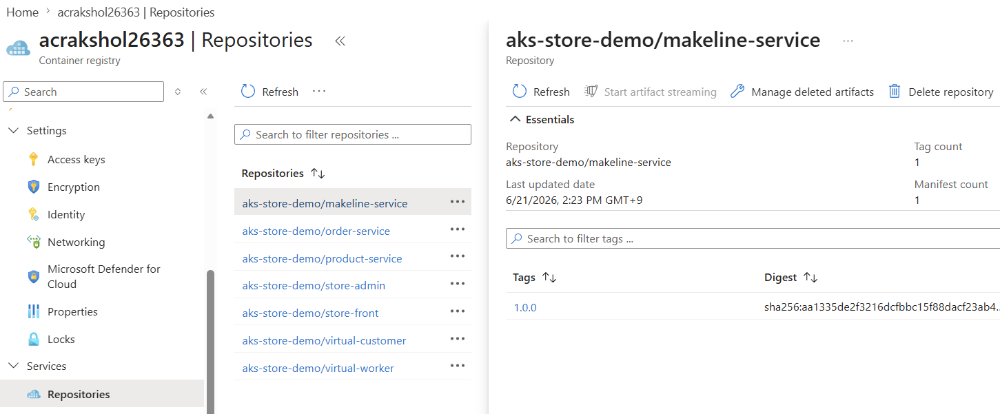

# 03. 컨테이너 이미지 빌드 (소스 → ACR)

AKS Store Demo(마이크로서비스)의 **실제 소스 코드**로 각 서비스의 컨테이너 이미지를 빌드하고, 모듈 02에서 만든 **Azure Container Registry(ACR)** 에 푸시합니다. 다음 모듈 [04. 애플리케이션 배포](04-deploy-app.md)는 퍼블릭 이미지(`ghcr.io/...`) 대신 **여기서 빌드한 ACR 이미지**로 배포합니다.

- 소스 코드는 [AKS Store Demo 공식 저장소](https://github.com/Azure-Samples/aks-store-demo)를 이 워크숍 저장소의 **`aks-store-demo/` 폴더에 포함**해 두었습니다. 따라서 별도로 `git clone` 할 필요 없이 바로 빌드합니다.
- 빌드는 **`az acr build`(ACR Tasks, 클라우드 빌드)** 로 수행합니다. 로컬에 Docker가 없어도 되고, Cloud Shell에서 바로 실행됩니다(소스를 ACR로 업로드 → 클라우드에서 빌드 → 레지스트리에 푸시).
- 예상 소요: **병렬 빌드 약 8–10분**(권장) / 순차 빌드 약 15–25분(7개 서비스). **Rust 서비스(`product-service`·`virtual-customer`·`virtual-worker`)는 컴파일 때문에 더 오래 걸립니다**(`product-service`는 단독 8분 이상일 수 있음). 아래 **2) 병렬 빌드**로 전체 시간을 가장 오래 걸리는 1개 수준으로 단축할 수 있습니다.
- 사전 조건: [02. 인프라 프로비저닝](02-provision-terraform.md)을 완료해 **ACR가 생성**되어 있어야 합니다.

## 0) 빌드 대상

`manifests/aks-store-all-in-one.yaml`가 사용하는 9개 구성요소 중 **직접 빌드하는 애플리케이션 서비스는 7개**입니다. `mongodb`/`rabbitmq`는 퍼블릭 베이스 이미지를 그대로 사용하므로 빌드하지 않습니다.

| 서비스 | 언어/런타임 | 소스 경로 |
|---|---|---|
| `order-service` | Node.js | `aks-store-demo/src/order-service` |
| `makeline-service` | Go | `aks-store-demo/src/makeline-service` |
| `product-service` | Rust | `aks-store-demo/src/product-service` |
| `store-front` | Vue.js + nginx | `aks-store-demo/src/store-front` |
| `store-admin` | Vue.js + nginx | `aks-store-demo/src/store-admin` |
| `virtual-customer` | Rust | `aks-store-demo/src/virtual-customer` |
| `virtual-worker` | Rust | `aks-store-demo/src/virtual-worker` |

각 서비스 디렉터리에는 `Dockerfile`이 포함되어 있어, 별도 설정 없이 빌드됩니다.

## 1) 변수 설정

모듈 02의 Terraform 출력에서 ACR 정보를 읽어옵니다.

```bash
cd ~/ms-aks-basic-workshop01/terraform
ACR=$(terraform output -raw acr_name)              # 예: acrakshol12345
ACR_SERVER=$(terraform output -raw acr_login_server) # 예: acrakshol12345.azurecr.io
IMAGE_TAG=1.0.0                                     # 워크숍 빌드 태그(모듈 04와 동일하게 사용)

echo "ACR=$ACR  SERVER=$ACR_SERVER  TAG=$IMAGE_TAG"
```
> az CLI 옵션([02.1](02.1-provision-option-azcli.md))으로 인프라를 만들었다면 `terraform output` 대신 모듈 02.1의 `$ACR` 변수와 `ACR_SERVER=$(az acr show -n "$ACR" --query loginServer -o tsv)` 를 사용하세요.

## 2) 이미지 빌드 및 ACR 푸시 — 병렬 약 8–10분 (순차 약 15–25분)

저장소에 포함된 `aks-store-demo/src/<서비스>` 소스를 그대로 빌드합니다. `az acr build` 한 번이 **빌드 + 푸시**를 함께 수행하며, ACR Tasks(클라우드)에서 실행되므로 로컬 Docker가 필요 없습니다.

> ⏱️ **서비스별 예상 소요 시간** (ACR Tasks 부하·캐시 상태에 따라 변동)
> - **일반 서비스 4종**(`order-service`·`makeline-service`·`store-front`·`store-admin`): 각 약 **1–3분**
> - **Rust 서비스 3종**(`product-service`·`virtual-customer`·`virtual-worker`): 각 약 **5–8분** (특히 `product-service`는 컴파일이 무거워 **8분 이상**일 수 있음)
> - **순차 합계**: 약 **15–25분** / **병렬 실행 시**: 가장 오래 걸리는 1개 수준인 약 **8–10분**

### 빌드 실행 (병렬, 권장)

7개 빌드를 **백그라운드로 동시에 큐잉**하면 ACR이 병렬로 처리해 전체 시간이 크게 줄어듭니다. 로그가 섞이지 않도록 서비스별 파일로 분리하고, 끝에 결과를 요약합니다.

```bash
cd ~/ms-aks-basic-workshop01
services="order-service makeline-service product-service store-front store-admin virtual-customer virtual-worker"

mkdir -p /tmp/acrbuild
for svc in $services; do
  echo "===== queued: $svc ====="
  az acr build \
    --registry "$ACR" \
    --image "aks-store-demo/${svc}:${IMAGE_TAG}" \
    "aks-store-demo/src/${svc}" > "/tmp/acrbuild/${svc}.log" 2>&1 &
done

wait   # 모든 백그라운드 빌드가 끝날 때까지 대기

echo "===== 빌드 결과 요약 ====="
for svc in $services; do
  echo "[$svc] $(tail -n 1 "/tmp/acrbuild/${svc}.log")"
done
```
- 각 `az acr build` 뒤의 `&`로 빌드를 백그라운드로 보내고, `wait`로 전체 완료를 기다립니다.
- 개별 빌드 로그는 `/tmp/acrbuild/<서비스>.log`에서 확인합니다(예: `tail -f /tmp/acrbuild/product-service.log`).
- 참고: ACR은 **동시 실행 수 제한**이 있어 일부 빌드는 큐에 대기했다가 순차로 풀릴 수 있습니다. 그래도 순차 루프보다 훨씬 빠릅니다(특히 Rust 3종이 겹쳐 도는 효과).
- `--registry`: 빌드 결과를 푸시할 ACR 이름.
- `--image`: `<리포지토리>:<태그>` 형식. 퍼블릭 경로와 동일하게 `aks-store-demo/<서비스>` 리포지토리로 정리합니다(모듈 04의 치환과 일치).
- 마지막 인자(`aks-store-demo/src/<서비스>`)는 **빌드 컨텍스트**(Dockerfile 위치)입니다.

> 💡 **더 줄이는 방법**
> - **빌드 대상 축소**: 부하 생성기 `virtual-customer`·`virtual-worker`(Rust)는 데모 동작에 **필수가 아닙니다.** 핵심 4종(`order-service`·`makeline-service`·`product-service`·`store-front`)만 ACR로 빌드하고 나머지는 모듈 04에서 **퍼블릭 이미지(`ghcr.io/...`)** 로 배포하면 Rust 2종 컴파일(약 10–16분)을 절약합니다. (이 경우 `services` 변수에서 두 서비스를 빼고 실행)
> - **ACR Premium + 전용 에이전트 풀**: `az acr agentpool`로 vCPU가 큰 전용 에이전트를 쓰면 Rust 컴파일이 빨라지고 동시 실행 한도도 올라갑니다(비용 발생). 대규모 반복 빌드에 적합합니다.

## 3) 푸시 결과 확인

```bash
az acr repository list -n "$ACR" -o table
az acr repository show-tags -n "$ACR" --repository aks-store-demo/store-front -o table
```
예상: `aks-store-demo/order-service` ~ `aks-store-demo/virtual-worker` 7개 리포지토리가 보이고, 각 리포지토리에 `1.0.0` 태그가 존재합니다.

`az acr repository list` 출력 예시(7개 리포지토리):
```text
Result
-------------------------------
aks-store-demo/makeline-service
aks-store-demo/order-service
aks-store-demo/product-service
aks-store-demo/store-admin
aks-store-demo/store-front
aks-store-demo/virtual-customer
aks-store-demo/virtual-worker
```

`az acr repository show-tags`(예: `store-front`) 출력 예시:
```text
Result
--------
1.0.0
```
> 다른 리포지토리도 동일하게 `--repository aks-store-demo/<서비스>`로 태그를 확인할 수 있습니다. 7개 리포지토리 모두에 `1.0.0` 태그가 있어야 정상입니다. 한 번에 전부 확인하려면 아래처럼 반복할 수 있습니다.
> ```bash
> for repo in $(az acr repository list -n "$ACR" -o tsv); do
>   echo "== $repo =="
>   az acr repository show-tags -n "$ACR" --repository "$repo" -o tsv
> done
> ```

**관리 콘솔(Azure Portal) 화면 확인 예시**

- ACR(`acr...`) 리소스를 열고 **설정 > Repositories**로 이동하면 `aks-store-demo/*` 7개 리포지토리가 보입니다. 특정 리포지토리(예: `makeline-service`)를 선택하면 **Tags**에 `1.0.0` 태그와 다이제스트(`sha256:...`)가 표시됩니다.



---

## 검증 및 완료 체크리스트

다음 항목이 모두 충족되면 [04. 애플리케이션 배포](04-deploy-app.md)로 진행하세요.

- [ ] 저장소의 `aks-store-demo/src/`에 7개 서비스 디렉터리가 있음(`ls aks-store-demo/src`)
- [ ] `az acr build`가 7개 서비스 모두 `Run ID: ... succeeded`로 완료됨
- [ ] `az acr repository list`에 `aks-store-demo/*` 7개 리포지토리가 보임
- [ ] 각 리포지토리에 `1.0.0`(= `$IMAGE_TAG`) 태그가 존재함
- [ ] `ACR_SERVER`/`IMAGE_TAG` 값을 기억(모듈 04 배포에서 동일하게 사용)

## 트러블슈팅
| 증상 | 원인 | 진단 | 조치 |
|---|---|---|---|
| `az acr build`가 `AuthorizationFailed`/`unauthorized` | 호출자에게 ACR 푸시 권한 없음 | `az acr show -n "$ACR" -o table`, `az role assignment list --scope $(az acr show -n "$ACR" --query id -o tsv) -o table` | 구독 `Owner`/`Contributor` 또는 ACR `AcrPush` 역할 확보 후 재실행 |
| `terraform output -raw acr_name`가 빈 값 | 모듈 02 apply 미완료 또는 다른 디렉터리에서 실행 | `cd ~/ms-aks-basic-workshop01/terraform && terraform state list \| grep container_registry` | 모듈 02의 `apply` 완료 후 `terraform` 디렉터리에서 실행 |
| 빌드가 특정 서비스에서 실패 | 일시적 패키지 다운로드 실패(npm/cargo/go) | 해당 빌드 로그의 마지막 오류 확인 | 해당 서비스만 `az acr build ... "aks-store-demo/src/<서비스>"` 재실행 |
| `Dockerfile not found` | 잘못된 빌드 컨텍스트 경로 | `ls aks-store-demo/src/<서비스>/Dockerfile` | 저장소 루트(`~/ms-aks-basic-workshop01`)에서 실행 중인지, 경로가 `aks-store-demo/src/<서비스>`인지 확인 |
| 빌드가 매우 느림 | 7개 순차 빌드(Rust 컴파일 포함) | — | **병렬 빌드**로 전환(약 8–10분). 더 줄이려면 부하 생성기 2종 제외 또는 ACR Premium 전용 에이전트 풀 |

다음: [04. 애플리케이션 배포](04-deploy-app.md)
