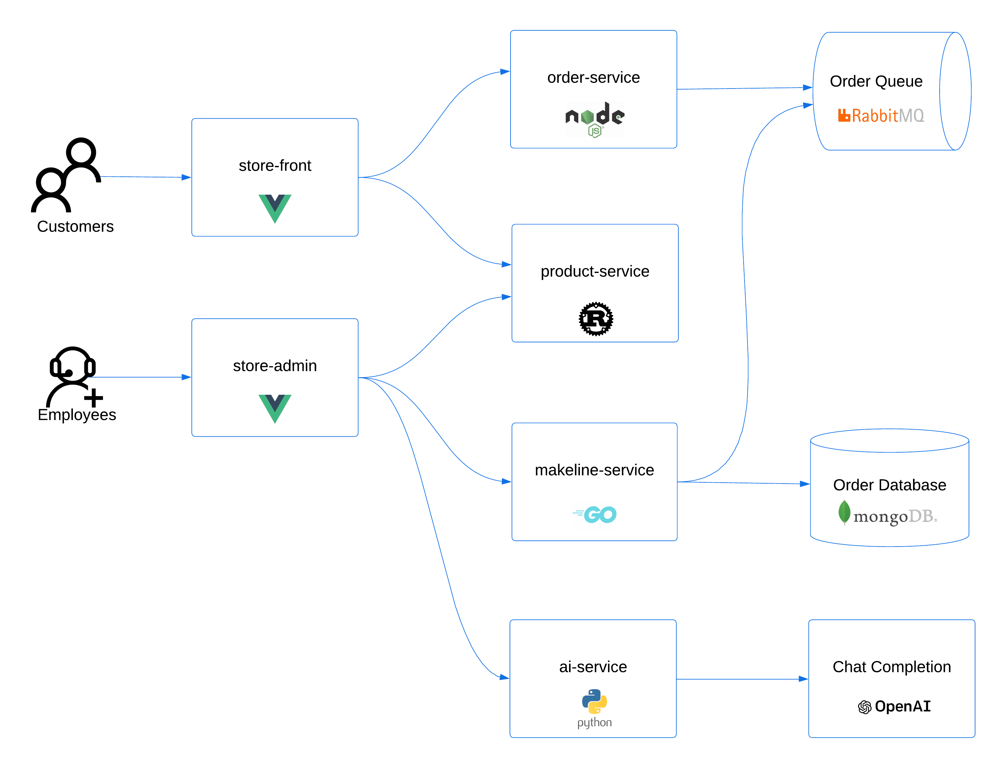

# 04. 애플리케이션 배포

AKS Store Demo(마이크로서비스)를 `pets` 네임스페이스에 배포합니다. 이 앱은 Azure 공식 샘플로, 실제 마이크로서비스 패턴(프론트엔드 + API + 메시지 큐 + DB + 부하 생성기)을 담고 있어 오토스케일링·인그레스 실습에 적합합니다. 앱 이미지는 [03. 컨테이너 이미지 빌드](03-build-images.md)에서 **소스로부터 직접 빌드해 ACR에 올린 것**을 사용합니다.

## 0) 애플리케이션 아키텍처 이해



`manifests/aks-store-all-in-one.yaml` 한 파일에 아래 구성요소의 Deployment/Service/StatefulSet/ConfigMap이 모두 들어 있습니다.

| 구성요소 | 역할 |
|---|---|
| `store-front` | 고객용 웹 UI(Vue.js). 외부에 노출할 대상(모듈 05). 포트 80 → 8080 |
| `store-admin` | 상품/주문 관리용 관리자 웹 UI. 내부용(`ClusterIP`), 포트 80 → 8081 |
| `order-service` | 주문 접수 API. 주문을 RabbitMQ로 발행(모듈 06 부하 대상) |
| `product-service` | 상품 정보 API |
| `makeline-service` | 큐에서 주문을 꺼내 처리(주문 이행) |
| `rabbitmq` | 서비스 간 비동기 메시지 큐 |
| `mongodb` | 주문/상품 데이터 저장소 |
| `virtual-customer` | 가짜 고객. 주기적으로 주문을 생성하는 **부하 생성기** |
| `virtual-worker` | 가짜 작업자. 주문 이행을 시뮬레이션 |

데이터 흐름: `virtual-customer → store-front/order-service → rabbitmq → makeline-service → mongodb`. virtual-customer 덕분에 별도 부하 도구 없이도 트래픽이 흐르며, 모듈 06에서 이 복제본 수를 늘려 부하를 키웁니다.

> Kubernetes 객체 복습: **Deployment**(상태 없는 앱의 복제본 관리), **Service**(Pod 묶음에 안정적 가상 IP/DNS 부여), **Namespace**(리소스 격리 단위 — 여기서는 `pets`).

## 1) 클러스터 접속 설정 (kubeconfig)

앱을 배포하기 전에, [모듈 02](02-provision-terraform.md)에서 만든 AKS 클러스터에 `kubectl`로 접속할 수 있도록 자격증명(kubeconfig)을 가져옵니다.

```bash
cd ~/ms-aks-basic-workshop01/terraform
eval "$(terraform output -raw get_credentials_command)"
kubectl get nodes
```
- `get_credentials_command` 출력(= `az aks get-credentials ...`)을 `eval`로 즉시 실행해 현재 셸의 kubeconfig를 클러스터에 연결합니다.
- az CLI 옵션([02.1](02.1-provision-option-azcli.md))으로 인프라를 만들었다면 `terraform output` 대신 `az aks get-credentials -g "$RG" -n "$AKS" --overwrite-existing` 을 사용하세요.
- 시스템 노드 2개가 `Ready` 로 보이면 정상입니다. 이 노드들은 `CriticalAddonsOnly` taint가 붙은 **시스템 전용**(모듈 02 베스트 프랙티스)이라, 아래에서 앱을 배포하면 **NAP가 user 노드(`aks-default-*`)를 자동 생성**해 그 위에 앱이 뜹니다.

```text
NAME                              STATUS   ROLES    AGE   VERSION
aks-system-12345678-vmss000000    Ready    <none>   3m    v1.34.x
aks-system-12345678-vmss000001    Ready    <none>   3m    v1.34.x
```

## 2) 네임스페이스 생성 및 배포

[03. 컨테이너 이미지 빌드](03-build-images.md)에서 ACR에 올린 이미지를 사용하도록, 매니페스트의 퍼블릭 이미지 경로(`ghcr.io/azure-samples/aks-store-demo/...`)를 우리 ACR 경로로 치환해 배포합니다.

```bash
cd ~/ms-aks-basic-workshop01
# ACR 로그인 서버와 빌드 태그(모듈 03과 동일하게 맞춥니다)
ACR_SERVER=$(cd terraform && terraform output -raw acr_login_server)   # 예: acrakshol12345.azurecr.io
IMAGE_TAG=1.0.0

kubectl create namespace pets

# 7개 앱 이미지의 레지스트리/태그를 ACR 빌드본으로 치환한 뒤 적용
sed -E "s|ghcr.io/azure-samples/aks-store-demo/([a-z-]+):[0-9.]+|${ACR_SERVER}/aks-store-demo/\1:${IMAGE_TAG}|g" \
  manifests/aks-store-all-in-one.yaml | kubectl apply -n pets -f -
```
- 치환은 **7개 앱 서비스 이미지**(`ghcr.io/azure-samples/aks-store-demo/*`)에만 적용됩니다. `mongodb`/`rabbitmq`/`busybox`는 빌드 대상이 아니므로 퍼블릭 이미지를 그대로 사용합니다.
- AKS는 모듈 02에서 ACR에 `AcrPull` 권한이 부여되어 있어 **비밀번호 없이** 이미지를 당겨옵니다.
- az CLI 옵션([02.1](02.1-provision-option-azcli.md))으로 만들었다면 `ACR_SERVER=$(az acr show -n "$ACR" --query loginServer -o tsv)` 로 설정하세요.
- 치환이 잘 됐는지 미리 보려면 적용 전에 `sed ... manifests/aks-store-all-in-one.yaml | grep image:` 로 확인할 수 있습니다.

> **먼저 ACR에 이미지가 제대로 올라갔는지 확인**하려면 아래로 점검합니다. 7개 리포지토리(`aks-store-demo/store-front` 등)가 보이고 각 리포에 `1.0.0` 태그가 있으면 정상입니다.
> ```bash
> ACR=$(cd terraform && terraform output -raw acr_name)
> az acr repository list -n "$ACR" -o table
> az acr repository show-tags -n "$ACR" --repository aks-store-demo/store-front -o table
> ```
> `az acr repository list` 출력 예시(7개 리포지토리):
> ```text
> Result
> -------------------------------
> aks-store-demo/makeline-service
> aks-store-demo/order-service
> aks-store-demo/product-service
> aks-store-demo/store-admin
> aks-store-demo/store-front
> aks-store-demo/virtual-customer
> aks-store-demo/virtual-worker
> ```
> `az acr repository show-tags`(store-front) 출력 예시:
> ```text
> Result
> --------
> 1.0.0
> ```
> 7개 리포지토리가 모두 보이지 않거나 `1.0.0` 태그가 없으면 [03. 컨테이너 이미지 빌드](03-build-images.md)를 다시 확인하거나, 아래 **옵션(퍼블릭 이미지)** 경로로 진행하세요.

### 옵션) ACR 빌드가 안 된 경우 — 퍼블릭 이미지로 배포

모듈 03의 ACR 빌드가 실패했거나(예: ACR Task 오류, 권한 문제) 위 점검에서 이미지가 보이지 않으면, **치환 없이 퍼블릭 이미지(`ghcr.io`)를 그대로** 배포해 실습을 계속할 수 있습니다. 이 경우 ACR 대신 인터넷에서 이미지를 당겨오며, 기능/실습 결과는 동일합니다.

원본 매니페스트(`manifests/aks-store-all-in-one.yaml`)는 위 기본 경로에서 `sed`로 변경될 수 있으므로, 변경되지 않은 **백업본 `manifests/aks-store-all-in-one-backup.yaml`** 를 사용합니다(리포지토리에 미리 포함되어 있습니다). 이 백업본은 퍼블릭 이미지(`ghcr.io`) 경로 그대로이므로 ACR이 비어 있어도 동작합니다.

```bash
cd ~/ms-aks-basic-workshop01
kubectl create namespace pets

# 치환되지 않은 백업본(퍼블릭 ghcr.io 이미지)을 그대로 적용
kubectl apply -n pets -f manifests/aks-store-all-in-one-backup.yaml
```
- 백업본은 치환하지 않은 **퍼블릭 이미지 그대로**이므로 **ACR이 비어 있어도 동작**합니다. 이미지 빌드 트러블슈팅과 분리해 앱 배포 실습을 먼저 진행하고 싶을 때 유용합니다.
- 네임스페이스를 이미 만들었다면 `kubectl create namespace pets`는 생략하세요(`AlreadyExists` 무시 가능).
- 나중에 ACR 빌드를 고친 뒤 ACR 이미지로 다시 배포하려면, 위 **기본 경로(sed 치환)** 명령을 다시 실행하면 됩니다(`kubectl apply`가 이미지 경로만 갱신).

## 3) 기동 관찰
```bash
kubectl get pods -n pets -w
```
모든 Pod이 `Running`이 되면 `Ctrl+C`.

> **처음 배포는 노드 자동 생성으로 시간이 더 걸립니다(약 2~4분).** 시스템 노드풀은 `CriticalAddonsOnly` taint로 앱을 받지 않으므로, 앱 Pod는 잠깐 `Pending` 상태가 되었다가 **NAP가 user 노드(`aks-default-*`)를 만들면** 그 위에서 `Running`이 됩니다. 이후 의존성·헬스체크 때문에 초기에 일부 재시작/에러가 보일 수 있으나, 노드가 준비되고 1~2분 뒤 모두 `1/1 Running`이 되면 정상입니다.

예상 출력:
```text
NAME                                READY   STATUS    RESTARTS   AGE
mongodb-0                           1/1     Running   0          90s
order-service-7c9b8d6f5-abcde       1/1     Running   2          80s
product-service-6d8c7b5f4-fghij     1/1     Running   0          80s
makeline-service-5b7d9c8f6-klmno    1/1     Running   1          80s
rabbitmq-0                          1/1     Running   0          90s
store-front-8f6d5c7b9-pqrst         1/1     Running   0          80s
store-admin-9a7e6d8c0-bcdef         1/1     Running   0          80s
virtual-customer-7b9d8c6f5-uvwxy    1/1     Running   0          80s
virtual-worker-6c8b7d9f5-zabcd      1/1     Running   0          80s
```

앱 Pod가 **NAP가 만든 user 노드**에 배치됐는지 확인합니다(시스템 노드풀은 taint로 제외됨).
```bash
kubectl get nodes -L karpenter.sh/nodepool      # aks-default-* 가 새로 보이면 NAP가 추가한 것
kubectl get pods -n pets -o wide | awk '{print $1, $7}'   # NODE 열이 aks-default-* 인지 확인
```
예상(시스템 2개 + NAP가 추가한 user 노드 `aks-default-*`):
```text
NAME                             STATUS   ROLES    AGE   VERSION   NODEPOOL
aks-system-12345678-vmss000000   Ready    <none>   30m   v1.34.x
aks-system-12345678-vmss000001   Ready    <none>   30m   v1.34.x
aks-default-abcde                Ready    <none>   3m    v1.34.x   default   ← 앱이 뜨는 user 노드
```

## 4) 구성 확인
```bash
kubectl get deploy,statefulset,svc -n pets
```
예상: Deployment 7종(`store-front`, `store-admin`, `order-service`, `product-service`, `makeline-service`, `virtual-customer`, `virtual-worker`) + StatefulSet 2종(`rabbitmq`, `mongodb`), 그리고 각 구성요소의 Service. (모든 Service가 `ClusterIP` — 외부 노출은 모듈 05의 Gateway가 담당)

```text
NAME                               READY   UP-TO-DATE   AVAILABLE   AGE
deployment.apps/order-service      1/1     1            1           3m
deployment.apps/store-front        1/1     1            1           3m
...
NAME                     TYPE        CLUSTER-IP     EXTERNAL-IP   PORT(S)
service/order-service    ClusterIP   10.0.120.10    <none>        3000/TCP
service/rabbitmq         ClusterIP   10.0.98.44     <none>        5672/TCP,15672/TCP
service/store-front      ClusterIP   10.0.140.21    <none>        80/TCP
```
> store-front은 모듈 05에서 Gateway로 외부 노출하므로 여기서는 `ClusterIP`입니다.

## 5) 주문 흐름 확인 (선택)
```bash
kubectl logs -n pets deploy/order-service --tail=20
```
virtual-customer가 생성한 주문이 order-service → rabbitmq로 흐르는 로그를 확인합니다.

```text
{"level":30,"time":1718960000000,"pid":1,"hostname":"order-service-7d9f8c6b5-abcde","reqId":"req-1","req":{"method":"POST","url":"/order"},"msg":"incoming request"}
{"level":30,"time":1718960000050,"pid":1,"hostname":"order-service-7d9f8c6b5-abcde","msg":"Sending order to queue: {\"orderId\":\"a1b2c3\",\"items\":[{\"productId\":1,\"quantity\":2}]}"}
{"level":30,"time":1718960000060,"pid":1,"hostname":"order-service-7d9f8c6b5-abcde","reqId":"req-1","res":{"statusCode":201},"responseTime":58,"msg":"request completed"}
```
> 위처럼 `POST /order` → `Sending order to queue` → `statusCode 201`이 반복되면 정상입니다. 큐에 적재된 주문은 makeline-service(worker)가 소비합니다(모듈 06 KEDA에서 이 큐 길이로 오토스케일).

---

## 검증 및 완료 체크리스트

다음 항목이 모두 충족되면 [05. Gateway API 인그레스](05-ingress-gateway-api.md)로 진행하세요. (**옵션**: [05.1 Application Gateway for Containers](05.1-ingress-option-agc.md))

- [ ] `kubectl get nodes`로 클러스터 접속(kubeconfig)이 정상이고 시스템 노드가 `Ready`
- [ ] `pets` 네임스페이스가 생성됨
- [ ] 7개 앱 Pod의 이미지가 **ACR(`<acr>.azurecr.io/aks-store-demo/*:1.0.0`)** 에서 정상 pull됨(`kubectl get pods -n pets -o jsonpath` 또는 describe로 확인)
- [ ] 9개 구성요소 Pod(`store-front`/`store-admin`/`order-service`/`product-service`/`makeline-service`/`rabbitmq`/`mongodb`/`virtual-customer`/`virtual-worker`)가 모두 `Running`
- [ ] `kubectl get svc -n pets`에서 모든 서비스가 `ClusterIP`(외부 노출은 모듈 05 Gateway 담당)
- [ ] (선택) `order-service` 로그에 주문 흐름이 보임

---

## 트러블슈팅
| 증상 | 원인 | 진단 | 조치 |
|---|---|---|---|
| `kubectl`이 클러스터에 연결 안 됨 | kubeconfig 미설정 또는 스테일 컨텍스트 | `kubectl config current-context` | 위 **1) 클러스터 접속 설정**의 `az aks get-credentials -g "$RG" -n "$AKS" --overwrite-existing`(또는 `terraform output`의 `get_credentials_command`) 재실행 |
| `ImagePullBackOff`/`ErrImagePull` | ACR 이미지 미빌드/태그 불일치 또는 `AcrPull` 권한 | `kubectl describe pod <pod> -n pets`(Events의 이미지 경로 확인) | 모듈 03에서 7개 이미지가 `1.0.0` 태그로 푸시됐는지(`az acr repository show-tags`), 배포 시 `ACR_SERVER`/`IMAGE_TAG` 치환이 맞는지 확인. ACR `AcrPull` 역할(모듈 02) 확인 |
| Pod `Pending` 지속 | (정상) 첫 배포 시 NAP가 user 노드를 만드는 중, 또는 노드 자원 부족 | `kubectl describe pod <pod> -n pets` (Events의 `FailedScheduling`/`untolerated taint`), `kubectl get events -A --field-selector source=karpenter` | 첫 배포는 NAP 노드 생성으로 2~4분 `Pending`이 정상. 더 지속되면 NAP `mode=Auto`(모듈 02)·vCPU 쿼터 확인. 모듈 07에서 NAP 동작을 자세히 다룹니다 |
| Pod `CrashLoopBackOff` | 의존 서비스(rabbitmq/mongodb) 미기동 | `kubectl logs <pod> -n pets --previous` | 의존 Pod가 `Running`이 될 때까지 대기(자동 재시도) |
| `product-service`만 `CrashLoopBackOff`(상품 페이지에서 `Error occurred while fetching products`) | upstream 기본 매니페스트의 리소스 limit이 너무 낮으면 `/health` liveness probe가 CPU 쓰로틀로 실패(이 저장소 매니페스트는 이미 `requests cpu 10m/memory 64Mi`, `limits cpu 200m/memory 128Mi`로 상향) | `kubectl describe pod -n pets -l app=product-service \| grep -iE 'liveness\|OOM\|Last State\|Restart'` | 스테일 클론 등으로 낮은 값이 떠 있으면 `kubectl set resources deploy/product-service -n pets --requests=cpu=10m,memory=64Mi --limits=cpu=200m,memory=128Mi` 후 `kubectl rollout status deploy/product-service -n pets` |
| `CreateContainerConfigError` | ConfigMap/Secret 누락 | `kubectl describe pod <pod> -n pets` | 위 2)의 sed 치환 파이프라인으로 매니페스트 재적용(`sed -E "s\|ghcr.io/azure-samples/aks-store-demo/([a-z-]+):[0-9.]+\|${ACR_SERVER}/aks-store-demo/\1:${IMAGE_TAG}\|g" manifests/aks-store-all-in-one.yaml \| kubectl apply -n pets -f -`) |
| 전체가 `Pending`이고 노드 0개 | NAP 전용 클러스터에 시스템 노드 부족 | `kubectl get nodes` | 시스템 노드풀이 `Ready`인지 확인, 모듈 02 재검토 |

다음: [05. Gateway API 인그레스](05-ingress-gateway-api.md) (**옵션**: [05.1 Application Gateway for Containers](05.1-ingress-option-agc.md))
