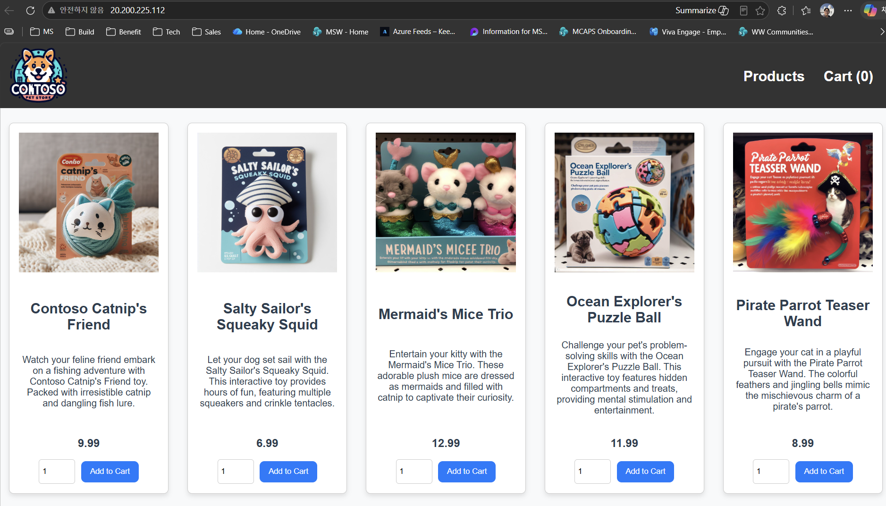

# 05. Gateway API 인그레스 (application routing add-on)

application routing add-on의 Kubernetes Gateway API 구현(`approuting-istio`)으로 store-front를 외부에 노출합니다.

## 1) Managed Gateway API + app routing Istio 애드온 활성화 (전체 약 6–12분)

> ⏱️ **예상 소요: 약 6–12분** (애드온 활성화는 클러스터 업데이트 작업이라 시간이 걸립니다)
> - `--enable-gateway-api` (Gateway API CRD 설치)
> - `--enable-app-routing-istio` (Istio 컨트롤 플레인 구성 + `istiod` 기동)
>
> 두 옵션은 **하나의 `az aks update`로 함께 활성화**할 수 있습니다(단일 클러스터 업데이트 작업). 명령이 완료될 때까지 터미널이 블로킹됩니다. 기다리는 동안 아래 3) Gateway/HTTPRoute 개념 설명을 미리 읽어 두면 좋습니다.
>
> ⚠️ **`(EtagMismatch) Another operation is in progress` 오류가 나면**, NAP·오토업그레이드 등 **백그라운드 클러스터 작업이 진행 중**이라는 뜻입니다. 아래 대기 명령으로 `Succeeded`를 확인한 뒤 다시 실행하세요.

```bash
cd ~/ms-aks-basic-workshop01/terraform
RG=$(terraform output -raw resource_group_name)
AKS=$(terraform output -raw aks_cluster_name)

# Gateway API CRD 설치 + Istio 기반 app routing 애드온을 한 번에 활성화
az aks update -g "$RG" -n "$AKS" --enable-gateway-api --enable-app-routing-istio
```
> 예상: 클러스터 업데이트가 진행되며 약 6–12분 걸립니다. 완료되면 갱신된 클러스터 JSON이 반환되고, `aks-istio-system` 네임스페이스에 `istiod` 컨트롤 플레인이 기동됩니다.
> `--enable-gateway-api`는 Gateway API CRD를 설치하고, `--enable-app-routing-istio`는 Istio 컨트롤 플레인과 `approuting-istio` GatewayClass를 구성합니다. (az ≥ 2.86 요구).
>
> 💡 `(EtagMismatch)`로 실패했다면 아래로 완료를 확인한 뒤 같은 명령을 재실행하세요.
> ```bash
> az aks wait -g "$RG" -n "$AKS" --updated --interval 15 --timeout 1200   # 진행 중인 작업 완료까지 대기
> az aks show -g "$RG" -n "$AKS" --query provisioningState -o tsv          # Succeeded 여야 재실행 가능
> ```

Gateway API CRD(gateways, httproutes, gatewayclasses)가 설치되며 Gateway 리소스 배포가 가능해집니다.
```bash
kubectl get crds | grep gateway.networking.k8s.io
```
예상 출력:
```text
$ kubectl get crds | grep gateway.networking.k8s.io
gatewayclasses.gateway.networking.k8s.io    2026-06-21T05:12:01Z
gateways.gateway.networking.k8s.io          2026-06-21T05:12:01Z
httproutes.gateway.networking.k8s.io        2026-06-21T05:12:01Z
referencegrants.gateway.networking.k8s.io   2026-06-21T05:12:01Z
```

## 2) istiod 확인
```bash
kubectl get pods -n aks-istio-system
kubectl get gatewayclass approuting-istio
```
예상: `istiod-*` Running, `approuting-istio` GatewayClass 존재.

예상 출력:
```text
$ kubectl get pods -n aks-istio-system
NAME                                          READY   STATUS    RESTARTS   AGE
istiod-asm-xxxxx-7d9f8c6b5-abcde              1/1     Running   0          2m

$ kubectl get gatewayclass approuting-istio
NAME               CONTROLLER                              ACCEPTED   AGE
approuting-istio   istio.io/gateway-controller             True       2m
```

## 3) Gateway / HTTPRoute 적용

`manifests/gateway.yaml`은 **Kubernetes Gateway API** 표준 리소스 두 개로 구성됩니다(기존 Ingress의 후속 표준).

```yaml
apiVersion: gateway.networking.k8s.io/v1
kind: Gateway                       # L4/L7 진입점 정의 (LoadBalancer 생성 트리거)
metadata: { name: store-gateway, namespace: pets }
spec:
  gatewayClassName: approuting-istio  # 이 GatewayClass가 실제 구현(Istio) 담당
  listeners:
    - name: http
      port: 80                        # 외부에서 받을 포트
      protocol: HTTP
      allowedRoutes: { namespaces: { from: Same } }  # 같은 ns의 Route만 연결 허용
---
apiVersion: gateway.networking.k8s.io/v1
kind: HTTPRoute                       # 경로 → 백엔드 매핑 규칙
metadata: { name: store-front, namespace: pets }
spec:
  parentRefs: [{ name: store-gateway }]  # 위 Gateway에 연결
  rules:
    - matches: [{ path: { type: PathPrefix, value: / } }]  # "/" 이하 전부
      backendRefs: [{ name: store-front, port: 80 }]       # store-front Service:80로 전달
```

- **Gateway**: "어디로 트래픽을 받을지"(클래스/포트/프로토콜)를 선언. 적용하면 app routing add-on이 Azure LoadBalancer와 외부 IP를 자동 프로비저닝합니다.
- **HTTPRoute**: "받은 트래픽을 어떤 백엔드로 보낼지"(경로 라우팅) 선언. 여기서는 모든 경로(`/`)를 `store-front` 서비스로 보냅니다.
- **역할 분리**가 핵심: 플랫폼팀은 Gateway를, 앱팀은 HTTPRoute를 각각 소유할 수 있어 기존 단일 Ingress보다 책임이 명확합니다.

```bash
cd ~/ms-aks-basic-workshop01
kubectl apply -f manifests/gateway.yaml
```
예상 출력:
```text
$ kubectl apply -f manifests/gateway.yaml
gateway.gateway.networking.k8s.io/store-gateway created
httproute.gateway.networking.k8s.io/store-front created
```

## 4) 외부 IP 확인 및 접속

> ⏱️ Gateway 적용 후 Azure LoadBalancer와 공인 IP가 프로비저닝되기까지 약 1–3분 걸립니다. `ADDRESS`/`EXTERNAL-IP`가 `<pending>`이면 잠시 후 다시 조회하세요.

```bash
kubectl get gateway -n pets
kubectl get svc -n pets | grep store-gateway
```
예상 출력:
```text
$ kubectl get gateway -n pets
NAME            CLASS              ADDRESS          PROGRAMMED   AGE
store-gateway   approuting-istio   20.249.xxx.xxx   True         90s

$ kubectl get svc -n pets | grep store-gateway
store-gateway-approuting-istio   LoadBalancer   10.0.27.100   20.249.xxx.xxx   15021:30298/TCP,80:32763/TCP   90s
```
`store-gateway-approuting-istio` 서비스의 `EXTERNAL-IP`가 할당되면 브라우저로 `http://<EXTERNAL-IP>` 접속.

> 자동 생성되는 LoadBalancer 서비스 이름은 `<Gateway 이름>-<GatewayClass 이름>` 규칙을 따릅니다. 즉 Gateway가 `store-gateway`, GatewayClass가 `approuting-istio`이므로 서비스 이름은 `store-gateway-approuting-istio`가 됩니다.

**공인 IP 프로비저닝 완료 확인**

처음 조회 시 `ADDRESS`/`EXTERNAL-IP`가 `<pending>`이거나 비어 있을 수 있습니다. 아래 방법으로 할당 완료를 확인하세요.

```bash
# (a) Gateway가 준비될 때까지 반복 조회 (PROGRAMMED=True + ADDRESS 할당까지 5초 간격으로 확인)
kubectl get gateway store-gateway -n pets

# 여러 번 자동으로 다시 보고 싶으면 watch 사용(2초 간격, Ctrl+C로 종료)
watch -n 2 kubectl get gateway store-gateway -n pets

# (b) PROGRAMMED 상태 한 번에 확인 — "True"면 LB/공인 IP 프로비저닝 완료
kubectl get gateway store-gateway -n pets \
  -o jsonpath='{.status.conditions[?(@.type=="Programmed")].status}{"\n"}'

# (c) 할당된 IP 추출
IP=$(kubectl get gateway store-gateway -n pets -o jsonpath='{.status.addresses[0].value}')
echo "Gateway IP: $IP"
```
예상 출력:
```text
# 프로비저닝 진행 중 — ADDRESS 비어 있고 PROGRAMMED=Unknown/False
$ kubectl get gateway store-gateway -n pets
NAME            CLASS              ADDRESS   PROGRAMMED   AGE
store-gateway   approuting-istio             Unknown      20s

# 1~3분 뒤 다시 조회 — ADDRESS 할당 + PROGRAMMED=True
$ kubectl get gateway store-gateway -n pets
NAME            CLASS              ADDRESS          PROGRAMMED   AGE
store-gateway   approuting-istio   20.249.xxx.xxx   True         100s

$ kubectl get gateway store-gateway -n pets -o jsonpath='{.status.conditions[?(@.type=="Programmed")].status}{"\n"}'
True

$ echo "Gateway IP: $IP"
Gateway IP: 20.249.xxx.xxx
```

해당 IP가 실제 **Azure 공인 IP**로 생성됐는지, 그리고 외부에서 접속 가능한지까지 확인하려면:
```bash
# (d) Azure에 생성된 공인 IP 리소스 목록에서 같은 주소가 보이는지 확인
az network public-ip list --query "[?ipAddress=='$IP'].{name:name, ip:ipAddress, rg:resourceGroup}" -o table

# (e) HTTP 응답 코드로 외부 접속 가능 여부 확인 (200이면 정상)
curl -s -o /dev/null -w "HTTP %{http_code}\n" "http://$IP"
```
예상 출력:
```text
$ az network public-ip list --query "[?ipAddress=='$IP'].{name:name, ip:ipAddress, rg:resourceGroup}" -o table
Name                              Ip              ResourceGroup
--------------------------------  --------------  -------------------------------------------
kubernetes-xxxxxxxxxxxxxxxxxxxxx  20.249.xxx.xxx  MC_rg-aksworkshop-aks-...

$ curl -s -o /dev/null -w "HTTP %{http_code}\n" "http://$IP"
HTTP 200
```
> 공인 IP와 LoadBalancer는 AKS가 관리하는 노드 리소스 그룹(`MC_...`)에 생성됩니다. `curl`이 `200`을 반환하면 브라우저에서도 정상 접속됩니다.

접속 URL을 바로 출력하려면:
```bash
echo "Store URL: http://$(kubectl get gateway store-gateway -n pets -o jsonpath='{.status.addresses[0].value}')"
```
예상 출력:
```text
Store URL: http://20.249.xxx.xxx
```
브라우저로 열면 AKS Store(펫 스토어) UI가 표시됩니다.

**브라우저 화면 확인 예시**

- 주소창에 `http://<EXTERNAL-IP>`(예: `http://20.200.225.112`)를 입력하면 Contoso Pet Store 상품 목록 페이지가 로드됩니다. 각 상품 카드와 **Add to Cart** 버튼이 보이면 store-front가 Gateway를 통해 정상 노출된 것입니다.



## 검증 및 완료 체크리스트

다음 항목이 모두 충족되면 [06. 오토스케일링 (1) — KEDA](06-autoscaling-keda.md)로 진행하세요.

- [ ] `--enable-gateway-api`·`--enable-app-routing-istio`가 적용됨
- [ ] `aks-istio-system`의 `istiod-*` Pod가 `Running`
- [ ] `approuting-istio` GatewayClass가 `ACCEPTED=True`
- [ ] `store-gateway`에 `EXTERNAL-IP`(공인 IP)가 할당됨
- [ ] 브라우저에서 `http://<EXTERNAL-IP>`로 AKS Store UI가 표시됨

---

## 트러블슈팅
| 증상 | 원인 | 진단 | 조치 |
|---|---|---|---|
| `(EtagMismatch) Another operation is in progress` | NAP/오토업그레이드 등 백그라운드 클러스터 작업이 진행 중인데 `az aks update`를 실행 | `az aks show -g $RG -n $AKS --query provisioningState -o tsv` (≠ `Succeeded`이면 진행 중) | `az aks wait -g $RG -n $AKS --updated --timeout 1200`으로 완료 대기 후 같은 명령 재실행 |
| `EXTERNAL-IP`/`ADDRESS`가 `<pending>` 지속 | LB 프로비저닝 지연 또는 서브넷 권한 부족 | `kubectl describe gateway store-gateway -n pets`, `kubectl get events -n pets` | 1~2분 대기. 지속 시 AKS ID의 서브넷 **Network Contributor** 역할 확인 |
| `gatewayclass approuting-istio` 미존재 | app routing(Istio) 애드온/CRD 미적용 | `kubectl get gatewayclass`, `az aks show -g $RG -n $AKS --query ingressProfile` | 이 모듈(05)의 1)에서 실행한 `--enable-app-routing-istio`·`--enable-gateway-api` 완료 대기 |
| `istiod` not ready | 애드온 컨트롤플레인 기동 중 | `kubectl get pods -n aks-istio-system` | 모든 Pod `Running`까지 1~2분 대기 |
| 브라우저 404 | HTTPRoute 백엔드 포트 불일치 | `kubectl get httproute -n pets -o yaml` | `backendRefs.port`가 store-front svc 포트(80)와 일치하는지 확인 |
| 브라우저 502/503 | store-front Pod 미기동 | `kubectl get pods -n pets -l app=store-front` | Pod `Running` 확인, 미기동 시 모듈 04 재검토 |
| 페이지는 열리나 `Error occurred while fetching products` 표시 | 백엔드 `product-service`가 `CrashLoopBackOff`(낮은 CPU/메모리 limit으로 liveness probe 실패) | `kubectl get pods -n pets -l app=product-service` (RESTARTS 증가), `kubectl describe pod -n pets -l app=product-service \| grep -iE 'OOM\|liveness\|Last State'` | `kubectl set resources deploy/product-service -n pets --requests=cpu=10m,memory=64Mi --limits=cpu=200m,memory=128Mi` 후 새로고침 (모듈 04 최신 매니페스트에는 반영됨) |
| Gateway 적용 시 `no matches for kind "Gateway"` | Gateway API CRD 미설치 | `kubectl get crd \| grep gateway.networking` | `az aks update --enable-gateway-api` 후 재적용 |

다음: [06. 오토스케일링 (1) — KEDA](06-autoscaling-keda.md)

---

## (옵션) Application Gateway for Containers로 노출하기

app routing(Istio) 대신 **Azure 관리형 L7 로드밸런서인 Application Gateway for Containers(AGC)** 로 동일한 store-front를 노출할 수 있습니다. WAF·트래픽 분할·mTLS 등 Azure 관리형 인그레스 기능을 체험하고 싶다면 아래 **옵션** 모듈을 참고하세요.

> 📄 전체 단계는 별도 문서로 분리했습니다 → **[05.1 (옵션) Application Gateway for Containers 인그레스](05.1-ingress-option-agc.md)**
>
> 특별한 목적이 없다면 **기본 경로인 app routing(위 1~4)을 우선 사용**하세요. 두 경로는 동시에 적용하지 마세요(같은 `store-gateway` 이름 충돌).
