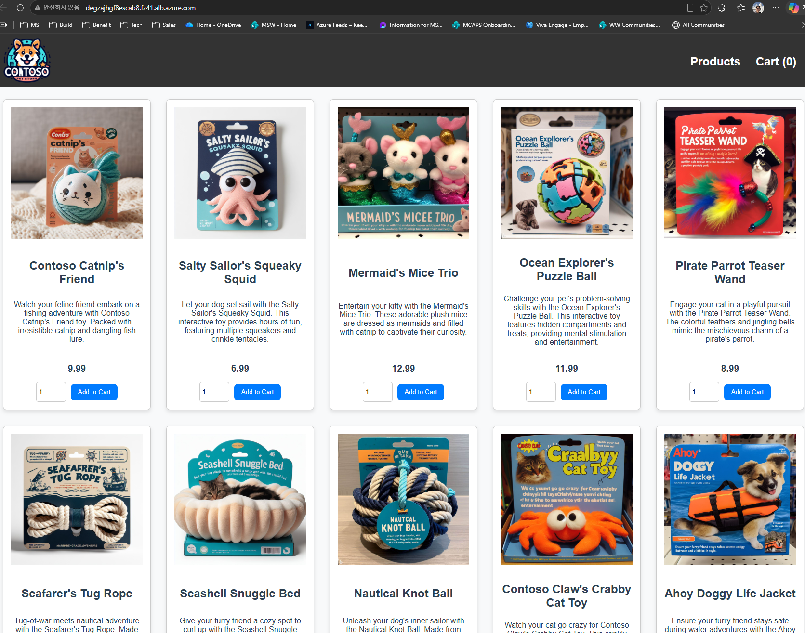

# 05.1 (옵션) Application Gateway for Containers 인그레스

> 🟢 **실행** = 직접 입력·수행 · 👁️ **예시** = 눈으로만(개념/발췌) · 📋 **예상 출력** = 비교용(입력 불필요)

> 🔀 **이 문서는 [05. Gateway API 인그레스(application routing add-on)](05-ingress-gateway-api.md)의 _옵션(선택)_ 경로입니다.**
> **기본 경로는 05(app routing Istio 애드온)** 이며, 보통은 05 문서를 그대로 따르면 됩니다. 이 문서는 동일한 store-front 노출을 **Application Gateway for Containers(AGC)** 로 구현하는 방법을 제공합니다. 다음과 같은 경우에 선택하세요.
> - Azure 관리형 L7 로드밸런서(WAF·트래픽 분할·mTLS·near real-time 업데이트 등)를 워크샵에서 직접 체험하고 싶을 때
> - 인그레스 데이터플레인을 **클러스터 밖(Azure 관리형)** 에 두고 싶을 때(AGC는 AKS 데이터플레인 외부에서 인그레스를 처리)
>
> 위와 같은 목적이 아니라면 **05 문서(app routing Istio)를 우선 사용하세요.** 두 경로 모두 동일하게 Kubernetes **Gateway API**(Gateway/HTTPRoute)로 store-front를 외부에 노출하지만, 구현 백엔드(GatewayClass)와 사전 설정이 다릅니다.

05와 같은 결과(브라우저로 AKS Store UI 접속)를 만들되, GatewayClass `azure-alb-external` 과 **ALB 컨트롤러 애드온**을 사용합니다.

- 예상 소요: 약 20~30분 (워크로드 아이덴티티·애드온 활성화 + AGC 리소스 프로비저닝 5~6분)
- 사전 조건: [04. 애플리케이션 배포](04-deploy-app.md)까지 완료(= `pets` 네임스페이스에 `store-front` Service:80 존재). 인프라는 [02. 프로비저닝](02-provision-terraform.md) 기준(BYO VNet `10.224.0.0/16`, AKS 서브넷 `10.224.0.0/24`, Azure CNI Overlay).

> ℹ️ **참고:** AGC ALB 컨트롤러 **애드온**(`--enable-application-load-balancer`)은 현재 **프리뷰** 기능이라 프리뷰 플래그 등록이 필요합니다. 리전은 **Korea Central**을 포함해 [지원 리전](https://learn.microsoft.com/azure/application-gateway/for-containers/overview#supported-regions)이어야 하며, 클러스터는 **Azure CNI 또는 CNI Overlay**(이 워크샵은 Overlay)여야 합니다.

> ⚠️ **05 모듈과 동시에 적용하지 마세요.** 두 모듈 모두 `pets` 네임스페이스에 `store-gateway`라는 이름의 Gateway를 만듭니다. 05를 이미 적용했다면 먼저 `kubectl delete -f manifests/gateway.yaml`로 제거한 뒤 진행하세요.

---

## 0) 변수 설정 · 확장/공급자/프리뷰 기능 등록

🟢 **실행**
```bash
cd ~/ms-aks-basic-workshop01/terraform
RG=$(terraform output -raw resource_group_name)
AKS=$(terraform output -raw aks_cluster_name)
NET_RG=$(terraform output -raw network_resource_group_name)
VNET=$(terraform output -raw vnet_name)

# AGC용 az 확장 설치 (alb + aks-preview)
#  - alb: AGC 리소스 조회/관리 명령(az network alb ...)
#  - aks-preview: `--enable-application-load-balancer` 플래그(프리뷰) 제공 — 없으면
#    "unrecognized arguments: --enable-application-load-balancer" 오류가 납니다.
az extension add --name alb
az extension add --name aks-preview

# 공급자 등록
az provider register --namespace Microsoft.ServiceNetworking
az provider register --namespace Microsoft.NetworkFunction

# 애드온 프리뷰 기능 등록 (반영까지 수 분 소요)
az feature register --namespace Microsoft.ContainerService --name ManagedGatewayAPIPreview
az feature register --namespace Microsoft.ContainerService --name ApplicationLoadBalancerPreview
```
예상 출력:
```text
$ az extension add --name alb
# (확장 설치 메시지 후 프롬프트로 복귀 — 별도 출력 없음)

$ az extension add --name aks-preview
# (설치 후 별도 출력 없음. 이미 있으면 `az extension add --upgrade --name aks-preview`로 갱신)

$ az feature register --namespace Microsoft.ContainerService --name ApplicationLoadBalancerPreview
{
  "name": "Microsoft.ContainerService/ApplicationLoadBalancerPreview",
  "properties": {
    "state": "Registering"
  },
  "type": "Microsoft.Features/providers/features"
}
```
> 💡 이미 확장이 설치돼 있는데 `--enable-application-load-balancer`가 인식되지 않으면 버전이 낮은 것입니다. `az extension add --upgrade --name aks-preview`로 갱신하세요.

기능 등록이 `Registered`가 될 때까지 기다린 뒤, 공급자를 다시 등록(refresh)해 변경을 반영합니다.

🟢 **실행**
```bash
az feature show --namespace Microsoft.ContainerService --name ManagedGatewayAPIPreview --query properties.state -o tsv
az feature show --namespace Microsoft.ContainerService --name ApplicationLoadBalancerPreview --query properties.state -o tsv
# 둘 다 Registered가 되면:
az provider register --namespace Microsoft.ContainerService
```
예상 출력:
```text
$ az feature show ... --query properties.state -o tsv
Registered
```
> 처음에는 `Registering`으로 표시될 수 있습니다. `Registered`가 될 때까지(보통 수 분) 기다리세요.

## 1) 워크로드 아이덴티티(OIDC) 활성화

AGC ALB 컨트롤러는 **워크로드 아이덴티티**로 Azure 리소스를 제어합니다. 이 워크샵 클러스터는 02에서 OIDC/워크로드 아이덴티티를 켜지 않으므로 여기서 활성화합니다.

🟢 **실행**
```bash
az aks update -g "$RG" -n "$AKS" --enable-oidc-issuer --enable-workload-identity
```
예상 출력:
```text
$ az aks update -g "$RG" -n "$AKS" --enable-oidc-issuer --enable-workload-identity
{
  ...
  "oidcIssuerProfile": {
    "enabled": true,
    "issuerUrl": "https://koreacentral.oic.prod-aks.azure.com/xxxxxxxx/"
  },
  "provisioningState": "Succeeded",
  "securityProfile": {
    "workloadIdentity": { "enabled": true }
  },
  ...
}
```
> ⏱️ 클러스터 업데이트로 약 3~5분 소요됩니다. 완료되면 위와 같이 `oidcIssuerProfile.enabled`·`workloadIdentity.enabled`가 `true`인 클러스터 JSON이 반환됩니다.

## 2) ALB 컨트롤러 + Gateway API 애드온 활성화 (약 3~6분)

> ⚠️ **앞의 `az aks update`가 끝난 뒤 실행하세요.** 진행 중에 다음 명령을 실행하면 `(EtagMismatch) Another operation is in progress` 오류가 납니다.

🟢 **실행**
```bash
# 앞 작업 완료 대기 (Succeeded 확인)
az aks wait -g "$RG" -n "$AKS" --updated --interval 15 --timeout 1200
az aks show -g "$RG" -n "$AKS" --query provisioningState -o tsv

az aks update -g "$RG" -n "$AKS" --enable-gateway-api --enable-application-load-balancer
```
예상 출력:
```text
$ az aks show -g "$RG" -n "$AKS" --query provisioningState -o tsv
Succeeded

$ az aks update -g "$RG" -n "$AKS" --enable-gateway-api --enable-application-load-balancer
{
  ...
  "ingressProfile": {
    "applicationLoadBalancer": { "enabled": true },
    "gatewayApi": { "installation": "Standard" }
  },
  "provisioningState": "Succeeded",
  ...
}
```
> `--enable-gateway-api`는 AKS 관리형 Gateway API CRD를, `--enable-application-load-balancer`는 ALB 컨트롤러(애드온)를 설치합니다. AGC 애드온은 **AKS 관리형 Gateway API 애드온과 함께** 사용해야 합니다.

ALB 컨트롤러 Pod와 GatewayClass를 확인합니다.

🟢 **실행**
```bash
kubectl get pods -n kube-system | grep alb-controller
kubectl get gatewayclass azure-alb-external
```
예상 출력:
```text
$ kubectl get pods -n kube-system | grep alb-controller
alb-controller-6648c5d5c-sdd9t   1/1   Running   0   2m
alb-controller-6648c5d5c-au234   1/1   Running   0   2m

$ kubectl get gatewayclass azure-alb-external
NAME                 CONTROLLER                              ACCEPTED   AGE
azure-alb-external   alb.networking.azure.io/alb-controller  True       2m
```

## 3) AGC 연결용 위임 서브넷 생성 (BYO VNet)

AGC는 트래픽을 받기 위해 **전용 위임 서브넷**(association subnet, 최소 250개 IP=`/24` 이상)이 필요합니다. 이 워크샵은 **BYO VNet**(`10.224.0.0/16`)을 쓰므로 애드온이 서브넷을 자동 생성하지 않습니다. 기존 AKS 서브넷(`10.224.0.0/24`)과 겹치지 않는 새 서브넷을 만듭니다.

🟢 **실행**
```bash
az network vnet subnet create \
  -g "$NET_RG" --vnet-name "$VNET" --name subnet-alb \
  --address-prefixes 10.224.1.0/24 \
  --delegations Microsoft.ServiceNetworking/trafficControllers

ALB_SUBNET_ID=$(az network vnet subnet show \
  -g "$NET_RG" --vnet-name "$VNET" --name subnet-alb --query id -o tsv)
echo "$ALB_SUBNET_ID"
```
예상 출력:
```text
$ echo "$ALB_SUBNET_ID"
/subscriptions/xxxxxxxx-xxxx-xxxx-xxxx-xxxxxxxxxxxx/resourceGroups/rg-aksworkshop-network-xxxx/providers/Microsoft.Network/virtualNetworks/vnet-akshol-dev-krc-xxxx/subnets/subnet-alb
```
> `az network vnet subnet create`는 생성된 서브넷 JSON(`delegations`에 `Microsoft.ServiceNetworking/trafficControllers` 포함)을 반환하고, `echo "$ALB_SUBNET_ID"`로 다음 단계에서 쓸 서브넷 ID가 출력됩니다.
> 서브넷 이름은 예약어(`GatewaySubnet`/`AzureFirewallSubnet`/`AzureBastionSubnet`)만 아니면 됩니다. 여기서는 `subnet-alb`를 사용합니다.

## 4) ALB 컨트롤러 아이덴티티에 서브넷 권한 부여

애드온은 노드 리소스 그룹(`MC_...`)에 `applicationloadbalancer-<클러스터명>` 관리형 ID를 자동 생성하고, **그 RG**에 대한 역할만 부여합니다. 위 위임 서브넷은 **네트워크 RG**에 있으므로, 서브넷에 합류(join)할 수 있도록 **Network Contributor** 역할을 직접 부여합니다.

🟢 **실행**
```bash
MC_RG=$(az aks show -g "$RG" -n "$AKS" --query nodeResourceGroup -o tsv)
ALB_PRINCIPAL_ID=$(az identity show -g "$MC_RG" -n "applicationloadbalancer-$AKS" --query principalId -o tsv)

az role assignment create \
  --assignee-object-id "$ALB_PRINCIPAL_ID" --assignee-principal-type ServicePrincipal \
  --scope "$ALB_SUBNET_ID" --role "Network Contributor"
```
예상 출력:
```text
$ echo "$ALB_PRINCIPAL_ID"
xxxxxxxx-xxxx-xxxx-xxxx-xxxxxxxxxxxx

$ az role assignment create --assignee-object-id "$ALB_PRINCIPAL_ID" ... --role "Network Contributor"
{
  "principalId": "xxxxxxxx-xxxx-xxxx-xxxx-xxxxxxxxxxxx",
  "principalType": "ServicePrincipal",
  "roleDefinitionName": "Network Contributor",
  "scope": ".../virtualNetworks/vnet-akshol-dev-krc-xxxx/subnets/subnet-alb",
  ...
}
```
> `Network Contributor`에는 서브넷 합류에 필요한 `Microsoft.Network/virtualNetworks/subnets/join/action` 권한이 포함됩니다. 최소 권한이 필요하면 해당 액션만 가진 커스텀 역할로 대체할 수 있습니다.

## 5) ApplicationLoadBalancer 리소스 생성 (AGC 프로비저닝)

`ApplicationLoadBalancer` 커스텀 리소스를 만들면 ALB 컨트롤러가 **Azure에 AGC 리소스와 association을 자동 생성**합니다(이름 규칙: `alb-<랜덤 8자>`, `as-<랜덤 8자>`).

🟢 **실행**
```bash
kubectl apply -f - <<EOF
apiVersion: v1
kind: Namespace
metadata:
  name: alb-test-infra
EOF

kubectl apply -f - <<EOF
apiVersion: alb.networking.azure.io/v1
kind: ApplicationLoadBalancer
metadata:
  name: alb-test
  namespace: alb-test-infra
spec:
  associations:
  - $ALB_SUBNET_ID
EOF
```
예상 출력:
```text
$ kubectl apply -f - <<EOF   # Namespace
namespace/alb-test-infra created

$ kubectl apply -f - <<EOF   # ApplicationLoadBalancer
applicationloadbalancer.alb.networking.azure.io/alb-test created
```

프로비저닝 진행 상태를 확인합니다. `InProgress` → `Programmed`로 바뀌면 완료이며 **약 5~6분** 걸립니다.

🟢 **실행**
```bash
kubectl get applicationloadbalancer alb-test -n alb-test-infra -o yaml -w
```
예상 출력(요약):
```text
status:
  conditions:
  - type: Accepted
    reason: Accepted
    message: Valid Application Gateway for Containers resource
    status: "True"
  - type: Deployment
    reason: Ready
    message: alb-id=/subscriptions/.../trafficControllers/alb-xxxxxxxx
    status: "True"
```
> `Deployment` 조건이 `Ready`(`alb-id=...` 표시)가 되면 Azure에 AGC 리소스가 만들어진 것입니다. `Ctrl+C`로 watch를 종료하세요.

## 6) Gateway / HTTPRoute 적용

`manifests/gateway-agc.yaml`은 05의 `gateway.yaml`과 동일한 **Gateway API** 리소스이지만, GatewayClass가 `azure-alb-external`이고 위 `alb-test`(AGC)를 어노테이션으로 참조합니다.

👁️ **예시**
```yaml
apiVersion: gateway.networking.k8s.io/v1
kind: Gateway
metadata:
  name: store-gateway
  namespace: pets
  annotations:
    alb.networking.azure.io/alb-namespace: alb-test-infra   # 5)의 ApplicationLoadBalancer 참조
    alb.networking.azure.io/alb-name: alb-test
spec:
  gatewayClassName: azure-alb-external      # ALB 컨트롤러가 구현 담당
  listeners:
    - name: http
      port: 80                              # AGC 리스너는 80/443만 허용
      protocol: HTTP
      allowedRoutes: { namespaces: { from: Same } }
---
apiVersion: gateway.networking.k8s.io/v1
kind: HTTPRoute
metadata:
  name: store-front
  namespace: pets
spec:
  parentRefs: [{ name: store-gateway }]
  rules:
    - matches: [{ path: { type: PathPrefix, value: / } }]
      backendRefs: [{ name: store-front, port: 80 }]        # store-front Service:80로 전달
```

- **Gateway**: 어노테이션으로 `alb-test`(AGC)를 참조합니다. 적용하면 ALB 컨트롤러가 AGC에 **Frontend 리소스**(`fe-<랜덤 8자>`)를 자동 생성하고 **공개 FQDN**을 부여합니다.
- **HTTPRoute**: 모든 경로(`/`)를 `store-front` 서비스로 보냅니다.
- 05와 달리 클러스터 안에 `LoadBalancer` 타입 Service가 생기지 않습니다. 진입점은 **AGC가 발급한 FQDN**(`*.alb.azure.com`)입니다.

🟢 **실행**
```bash
cd ~/ms-aks-basic-workshop01
kubectl apply -f manifests/gateway-agc.yaml
```
예상 출력:
```text
$ kubectl apply -f manifests/gateway-agc.yaml
gateway.gateway.networking.k8s.io/store-gateway created
httproute.gateway.networking.k8s.io/store-front created
```

## 7) FQDN 확인 및 접속

> ⏱️ Gateway 적용 후 Frontend 프로비저닝과 FQDN 할당까지 약 1~3분 걸립니다. `ADDRESS`가 비어 있으면 잠시 후 다시 조회하세요.

🟢 **실행**
```bash
# Gateway가 Programmed(True)되고 ADDRESS(FQDN)가 할당됐는지 확인
kubectl get gateway store-gateway -n pets

# PROGRAMMED 상태만 즉시 확인
kubectl get gateway store-gateway -n pets \
  -o jsonpath='{.status.conditions[?(@.type=="Programmed")].status}{"\n"}'

# 할당된 FQDN 추출
fqdn=$(kubectl get gateway store-gateway -n pets -o jsonpath='{.status.addresses[0].value}')
echo "Store URL: http://$fqdn"
```
예상 출력:
```text
$ kubectl get gateway store-gateway -n pets
NAME            CLASS                ADDRESS                          PROGRAMMED   AGE
store-gateway   azure-alb-external   xxxx.yyyy.alb.azure.com          True         90s

$ echo "Store URL: http://$fqdn"
Store URL: http://xxxx.yyyy.alb.azure.com
```

FQDN으로 HTTP 응답 코드를 확인합니다(`200`이면 정상).

🟢 **실행**
```bash
curl -s -o /dev/null -w "HTTP %{http_code}\n" "http://$fqdn"
```
예상 출력:
```text
$ curl -s -o /dev/null -w "HTTP %{http_code}\n" "http://$fqdn"
HTTP 200
```
> 05의 app routing은 **공인 IP(EXTERNAL-IP)** 로 노출했지만, AGC는 **FQDN**(`*.alb.azure.com`)으로 노출합니다. 브라우저에 그 FQDN을 입력하면 Contoso Pet Store 상품 목록 페이지가 로드됩니다.



## 검증 및 완료 체크리스트

다음 항목이 모두 충족되면 [06. Gateway API 트래픽 분할](06-traffic-split-gateway.md)로 진행하세요.

- [ ] `--enable-oidc-issuer`·`--enable-workload-identity`가 적용됨
- [ ] `kube-system`에 `alb-controller-*` Pod가 `Running`
- [ ] `azure-alb-external` GatewayClass가 `ACCEPTED=True`
- [ ] `applicationloadbalancer alb-test`의 `Deployment` 조건이 `Ready`(AGC 프로비저닝 완료)
- [ ] `store-gateway`에 FQDN(`*.alb.azure.com`)이 할당되고 `PROGRAMMED=True`
- [ ] 브라우저에서 `http://<FQDN>`로 AKS Store UI가 표시됨

> 🧹 **정리(teardown)는 [10. 정리](10-cleanup.md)에서 일괄 진행합니다.** 이 경로가 만든 AGC·위임 서브넷·역할 할당·애드온은 Terraform `destroy` 밖에 있으므로, 10의 **[1-B) AGC 인그레스 자원 먼저 정리](10-cleanup.md#1-b-옵션-agc-모듈-051-인그레스를-사용한-경우--destroy-전에-먼저-정리)** 를 `destroy` 전에 먼저 실행하세요(`ApplicationLoadBalancer` CR을 안 지우면 AGC association이 `subnet-alb`를 점유해 VNet/네트워크 RG 삭제가 막힙니다).

---

## 트러블슈팅
| 증상 | 원인 | 진단 | 조치 |
|---|---|---|---|
| `unrecognized arguments: --enable-application-load-balancer` | `aks-preview` 확장 미설치(또는 구버전) — 이 플래그는 프리뷰 확장에서 제공 | `az extension list -o table \| grep aks-preview` | `az extension add --name aks-preview`(이미 있으면 `az extension add --upgrade --name aks-preview`) 후 명령 재실행 (0) 단계 |
| `(FeatureNotRegistered)` / 애드온 활성화 실패 | 프리뷰 기능 미등록 또는 공급자 미갱신 | `az feature show ... --query properties.state` | `ManagedGatewayAPIPreview`·`ApplicationLoadBalancerPreview`가 `Registered`인지 확인 후 `az provider register --namespace Microsoft.ContainerService` 재실행 |
| `gatewayclass azure-alb-external` 미존재 | ALB 컨트롤러 애드온 미적용 | `kubectl get gatewayclass`, `az aks show -g $RG -n $AKS --query ingressProfile` | 2)의 `--enable-application-load-balancer` 완료 대기, `kubectl get pods -n kube-system | grep alb-controller` |
| `applicationloadbalancer`가 `Programmed`로 안 넘어감 | 서브넷 권한 부족 또는 위임 누락 | `kubectl describe applicationloadbalancer alb-test -n alb-test-infra` | 4)의 서브넷 **Network Contributor** 역할, 3)의 `Microsoft.ServiceNetworking/trafficControllers` 위임 확인 |
| Gateway `ADDRESS`(FQDN) 미할당 지속 | AGC/Frontend 프로비저닝 지연 또는 어노테이션 오타 | `kubectl describe gateway store-gateway -n pets`, `kubectl get events -n pets` | `alb-namespace`/`alb-name`이 `alb-test-infra`/`alb-test`와 일치하는지 확인, 1~3분 대기 |
| `curl`/브라우저 404 | HTTPRoute 백엔드 포트 불일치 | `kubectl get httproute store-front -n pets -o yaml` | `backendRefs.port`가 store-front Service 포트(80)와 일치하는지 확인 |
| `curl`/브라우저 502/503 | store-front Pod 미기동 | `kubectl get pods -n pets -l app=store-front` | Pod `Running` 확인, 미기동 시 모듈 04 재검토 |
| 페이지는 열리나 `Error occurred while fetching products` 표시 | 백엔드 `product-service`가 `CrashLoopBackOff`(낮은 limit으로 liveness probe 실패) | `kubectl get pods -n pets -l app=product-service` (RESTARTS 증가) | `kubectl set resources deploy/product-service -n pets --requests=cpu=10m,memory=64Mi --limits=cpu=200m,memory=128Mi` 후 새로고침 |
| `az identity show ... applicationloadbalancer-$AKS` 없음 | 애드온이 아직 ID를 만들지 않음 | `az identity list -g $MC_RG -o table` | 2)의 애드온 활성화가 `Succeeded`인지 확인 후 재시도 |

다음: [06. Gateway API 트래픽 분할](06-traffic-split-gateway.md)
