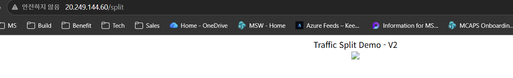

# 06. Gateway API 트래픽 분할 (가중치 라우팅)

> 🟢 **실행** = 직접 입력·수행 · 👁️ **예시** = 눈으로만(개념/발췌) · 📋 **예상 출력** = 비교용(입력 불필요)

[05. Gateway API 인그레스](05-ingress-gateway-api.md)에서 `Gateway`(진입점)와 `HTTPRoute`(라우팅 규칙)를 배웠습니다. 이 모듈에서는 같은 `HTTPRoute`의 **가중치(weight) 기반 백엔드 분할**로 **카나리(canary)·블루-그린** 배포의 핵심인 **트래픽 분할**을 실습합니다.

- **무엇을:** 같은 공인 IP의 **`/split` 경로**로 들어온 요청을 **두 버전(v1/v2)** 으로 **비율대로** 나눠 보냅니다(예: 50:50 → 90:10 → 0:100).
- **어떻게:** `HTTPRoute.spec.rules[].backendRefs[]`에 백엔드를 여러 개 두고 각 `weight`를 지정하면 됩니다. Gateway API 표준 기능이라 `approuting-istio` GatewayClass(Istio 구현)가 그대로 지원합니다 — **추가 애드온이 필요 없습니다.**
- **안전성:** 05에서 만든 `store-gateway`(공인 IP 1개)를 **그대로 재사용**합니다. 새 LoadBalancer/공인 IP 없이, 데모는 **`/split` 경로로만 분기**하고 기존 `store-front`(`/`)는 그대로 두므로 충돌·영향이 없습니다. 브라우저에서 `http://<store-IP>/split`만 새로고침하면 V1/V2가 번갈아 보입니다.

> 🔎 **선행 조건:** [05](05-ingress-gateway-api.md)을 완료해 `store-gateway`에 **EXTERNAL-IP(공인 IP)** 가 할당된 상태여야 합니다. (옵션 모듈 05.1 AGC 경로만 따른 경우 `store-gateway`가 없으므로 이 모듈은 05 경로 기준입니다.)

## 0) 개념 — 가중치 기반 백엔드 분할

아래는 이 모듈에서 적용할 `manifests/traffic-split.yaml`의 **HTTPRoute 일부**입니다. 같은 게이트웨이의 `/split` 경로를 백엔드 `/`로 재작성(URLRewrite)한 뒤, 한 규칙(`rule`) 안에 백엔드를 둘 두고 각 `weight`로 분배 비율을 정합니다(전체 매니페스트는 [1) 두 버전 백엔드 배포](#1-두-버전-백엔드-배포)에서 적용합니다).

👁️ **예시**
```yaml
rules:
  - matches:
      - path: { type: PathPrefix, value: /split }      # /split만 데모로
    filters:
      - type: URLRewrite                                # 백엔드엔 /로 전달
        urlRewrite: { path: { type: ReplacePrefixMatch, replacePrefixMatch: / } }
    backendRefs:
      - { name: hello-v1, port: 80, weight: 50 }        # 50%
      - { name: hello-v2, port: 80, weight: 50 }        # 50%
```

- `weight`는 **상대 비율**입니다. 합이 100일 필요는 없고(예: `9`/`1`도 90:10), Gateway가 **합으로 정규화**합니다.
- 한쪽을 `0`으로 두면 **트래픽을 완전히 차단**(= 승격/롤백)할 수 있습니다.
- **요청 단위**로 분배되므로, 같은 클라이언트라도 요청마다 다른 버전에 닿을 수 있습니다.

## 1) 두 버전 백엔드 배포

동일 이미지(`aks-helloworld`)에 `TITLE` 환경변수만 다르게 준 **v1/v2** 를 배포합니다. 응답 본문의 제목으로 어떤 버전이 답했는지 구분합니다. 요청량(requests)을 낮게 잡아 **기존 노드에 스케줄**되며 NAP 노드 증설을 유발하지 않습니다.

이 모듈에서 적용할 `manifests/traffic-split.yaml` 전체는 다음과 같습니다 — 백엔드 두 버전(Deployment+Service)과 가중치 라우팅(HTTPRoute)이 한 파일에 들어 있습니다.

👁️ **예시**
```yaml
# 백엔드 v1: 동일 이미지에 TITLE만 다르게 → 응답 본문으로 버전 구분
apiVersion: apps/v1
kind: Deployment
metadata:
  name: hello-v1
  namespace: pets
  labels: { app: hello, version: v1 }
spec:
  replicas: 1
  selector:
    matchLabels: { app: hello, version: v1 }
  template:
    metadata:
      labels: { app: hello, version: v1 }
    spec:
      containers:
        - name: hello
          image: mcr.microsoft.com/azuredocs/aks-helloworld:v1
          ports: [{ containerPort: 80 }]
          env:
            - name: TITLE
              value: "Traffic Split Demo - V1"      # v2와 구분되는 제목
          resources:
            requests: { cpu: 20m, memory: 48Mi }    # 낮게 잡아 기존 노드에 스케줄(NAP 미유발)
            limits: { cpu: 100m, memory: 128Mi }
---
apiVersion: v1
kind: Service
metadata:
  name: hello-v1
  namespace: pets
spec:
  selector: { app: hello, version: v1 }            # v1 Pod만 선택
  ports: [{ port: 80, targetPort: 80 }]
---
# 백엔드 v2: 신규 버전 역할(TITLE만 V2)
apiVersion: apps/v1
kind: Deployment
metadata:
  name: hello-v2
  namespace: pets
  labels: { app: hello, version: v2 }
spec:
  replicas: 1
  selector:
    matchLabels: { app: hello, version: v2 }
  template:
    metadata:
      labels: { app: hello, version: v2 }
    spec:
      containers:
        - name: hello
          image: mcr.microsoft.com/azuredocs/aks-helloworld:v1
          ports: [{ containerPort: 80 }]
          env:
            - name: TITLE
              value: "Traffic Split Demo - V2"
          resources:
            requests: { cpu: 20m, memory: 48Mi }
            limits: { cpu: 100m, memory: 128Mi }
---
apiVersion: v1
kind: Service
metadata:
  name: hello-v2
  namespace: pets
spec:
  selector: { app: hello, version: v2 }            # v2 Pod만 선택
  ports: [{ port: 80, targetPort: 80 }]
---
# 가중치 라우팅: 05의 store-gateway 재사용 + /split 경로 분기
apiVersion: gateway.networking.k8s.io/v1
kind: HTTPRoute
metadata:
  name: hello-split
  namespace: pets
spec:
  parentRefs:
    - name: store-gateway          # 05에서 만든 Gateway 재사용(같은 공인 IP)
  rules:
    - matches:
        - path: { type: PathPrefix, value: /split }   # '/split'만 데모로 분기('/'는 스토어 그대로)
      filters:
        - type: URLRewrite                             # 백엔드는 '/'에서 동작 → 접두사 /split 제거
          urlRewrite:
            path: { type: ReplacePrefixMatch, replacePrefixMatch: / }
      backendRefs:
        - name: hello-v1
          port: 80
          weight: 50               # 50%
        - name: hello-v2
          port: 80
          weight: 50               # 50%
```

- **Deployment/Service(v1·v2)**: 같은 이미지에 `TITLE`만 달라 본문으로 버전을 구분합니다. `selector`로 각 Service가 자기 버전 Pod만 백엔드로 묶습니다.
- **HTTPRoute(hello-split)**: `store-gateway`에 붙되 `/split` 경로만 매칭하고 `URLRewrite`로 `/split`→`/`로 깎아 백엔드에 전달합니다. `backendRefs`의 `weight`로 v1/v2 비율을 정합니다(초기 50:50). `/`는 그대로 스토어가 응답하므로 같은 IP에서 충돌 없이 공존합니다.

🟢 **실행**
```bash
cd ~/ms-aks-basic-workshop01
kubectl apply -f manifests/traffic-split.yaml
```
예상 출력:
```text
$ kubectl apply -f manifests/traffic-split.yaml
deployment.apps/hello-v1 created
service/hello-v1 created
deployment.apps/hello-v2 created
service/hello-v2 created
httproute.gateway.networking.k8s.io/hello-split created
```

Pod와 라우트가 준비됐는지 확인합니다.

🟢 **실행**
```bash
# 두 버전 Pod가 Running인지 확인
kubectl get pods -n pets -l app=hello

# HTTPRoute가 Gateway에 정상 연결(Accepted)됐는지 확인
kubectl get httproute hello-split -n pets
```
예상 출력:
```text
$ kubectl get pods -n pets -l app=hello
NAME                        READY   STATUS    RESTARTS   AGE
hello-v1-6c8f7d9b5c-abcde   1/1     Running   0          30s
hello-v2-7d9c8f6b4d-fghij   1/1     Running   0          30s

$ kubectl get httproute hello-split -n pets
NAME          HOSTNAMES   AGE
hello-split   *           30s
```

> `hello-split`은 **`/split` 경로만** 처리합니다. 브라우저/`curl`이 IP의 `/`(루트)로 접속하면 기존 `store-front`가 응답하므로 **스토어 화면은 그대로**입니다.

## 2) Gateway 공인 IP 확보

05에서 만든 `store-gateway`의 공인 IP를 셸 변수에 담습니다(같은 셸 세션이면 05에서 쓰던 `$IP`를 그대로 사용해도 됩니다).

🟢 **실행**
```bash
IP=$(kubectl get gateway store-gateway -n pets -o jsonpath='{.status.addresses[0].value}')
echo "Gateway IP: $IP"
```
예상 출력:
```text
$ echo "Gateway IP: $IP"
Gateway IP: 20.249.xxx.xxx
```

## 3) 50:50 분할 관찰

같은 공인 IP의 **`/split`** 경로로 같은 요청을 여러 번 보내고, 어떤 버전이 응답했는지 집계합니다.

🟢 **실행**
```bash
# 한 번 요청 — 어떤 버전이 응답하는지 본문 제목으로 확인
curl -s "http://$IP/split" | grep -o "Traffic Split Demo - V[12]" | head -1

# 20번 반복 후 버전별 응답 횟수 집계 (대략 50:50으로 분포)
for i in $(seq 1 20); do
  curl -s "http://$IP/split" | grep -o "Traffic Split Demo - V[12]" | head -1
done | sort | uniq -c
```
예상 출력:
```text
$ curl -s "http://$IP/split" | grep -o "Traffic Split Demo - V[12]" | head -1
Traffic Split Demo - V1

$ for i in $(seq 1 20); do curl -s "http://$IP/split" | grep -o "Traffic Split Demo - V[12]" | head -1; done | sort | uniq -c
     11 Traffic Split Demo - V1
      9 Traffic Split Demo - V2
```
> 제목 문자열이 한 응답에 여러 번(예: 탭 제목 + 헤딩) 나올 수 있어 `head -1`로 **요청당 1개**만 셉니다. 요청 단위 분배라 매번 정확히 10:10은 아니지만, 표본을 늘리면 가중치 비율(50:50)에 수렴합니다.

### 브라우저로 확인

🟢 **실행**
```bash
echo "Split URL: http://$IP/split"
```
브라우저로 위 URL을 열고 **새로고침을 반복**하면 제목이 `Traffic Split Demo - V1` ↔ `V2`로 번갈아 바뀝니다(50:50). `/`(루트)는 기존 스토어가 그대로 표시됩니다.



> **이미지 깨짐은 정상입니다.** `aks-helloworld` 페이지는 CSS/이미지를 루트 절대경로(`/static/...`)로 참조하는데, `/split`에서 받은 HTML 안의 그 링크는 루트(`/`)로 요청되어 스토어(`store-front`)가 받습니다. 매칭되는 정적 파일이 없어 그림이 깨질 뿐이며, **제목 텍스트로 v1/v2 구분은 정상**이므로 분할 검증에는 문제가 없습니다.

> 브라우저 keep-alive로 한 버전에 머무를 수 있으니 **강력 새로고침(Ctrl/Cmd+Shift+R)** 또는 시크릿 창으로 확인하세요.

## 4) 가중치 조정 — 카나리(90:10)

신규 버전(v2)에 **소량(10%)** 만 흘려보내는 카나리 단계로 바꿉니다. `HTTPRoute`의 두 `weight`만 패치하면 즉시 반영됩니다.

🟢 **실행**
```bash
kubectl patch httproute hello-split -n pets --type=json -p='[
  {"op":"replace","path":"/spec/rules/0/backendRefs/0/weight","value":90},
  {"op":"replace","path":"/spec/rules/0/backendRefs/1/weight","value":10}
]'

# 다시 20번 보내 분포 확인 (대략 90:10)
for i in $(seq 1 20); do
  curl -s "http://$IP/split" | grep -o "Traffic Split Demo - V[12]" | head -1
done | sort | uniq -c
```
예상 출력:
```text
$ kubectl patch httproute hello-split -n pets --type=json -p='[...]'
httproute.gateway.networking.k8s.io/hello-split patched

$ for i in $(seq 1 20); do curl -s "http://$IP/split" | grep -o "Traffic Split Demo - V[12]" | head -1; done | sort | uniq -c
     18 Traffic Split Demo - V1
      2 Traffic Split Demo - V2
```
> 대화형으로 바꾸려면 `kubectl edit httproute hello-split -n pets`로 두 `weight` 값을 직접 수정해도 됩니다.

## 5) 승격(0:100) 또는 롤백(100:0)

카나리가 정상이면 v2로 **완전 전환(승격)** 합니다. 반대로 문제가 보이면 v2 가중치를 `0`으로 되돌려 **즉시 롤백**합니다.

🟢 **실행**
```bash
# 승격: 모든 트래픽을 v2로
kubectl patch httproute hello-split -n pets --type=json -p='[
  {"op":"replace","path":"/spec/rules/0/backendRefs/0/weight","value":0},
  {"op":"replace","path":"/spec/rules/0/backendRefs/1/weight","value":100}
]'

for i in $(seq 1 20); do
  curl -s "http://$IP/split" | grep -o "Traffic Split Demo - V[12]" | head -1
done | sort | uniq -c
```
예상 출력:
```text
$ for i in $(seq 1 20); do curl -s "http://$IP/split" | grep -o "Traffic Split Demo - V[12]" | head -1; done | sort | uniq -c
     20 Traffic Split Demo - V2
```
> v1 가중치가 `0`이면 v1로는 한 건도 가지 않습니다. 롤백이 필요하면 `0`/`100`을 `100`/`0`으로 바꾸면 즉시 v1로 되돌아갑니다. 브라우저로 `http://$IP/split`을 새로고침하면 모두 V2로 보입니다.

## 6) 정리

데모 리소스만 제거합니다. **`store-gateway`와 `store-front` 라우트는 건드리지 않으므로** 스토어는 계속 정상 동작합니다.

🟢 **실행**
```bash
kubectl delete -f manifests/traffic-split.yaml
```
예상 출력:
```text
$ kubectl delete -f manifests/traffic-split.yaml
deployment.apps "hello-v1" deleted
service "hello-v1" deleted
deployment.apps "hello-v2" deleted
service "hello-v2" deleted
httproute.gateway.networking.k8s.io "hello-split" deleted
```

## 검증 및 완료 체크리스트

다음 항목이 모두 충족되면 [07. 오토스케일링 (1) — KEDA](07-autoscaling-keda.md)로 진행하세요.

- [ ] `hello-v1`·`hello-v2` Pod가 `Running`이고 `hello-split` HTTPRoute가 생성됨
- [ ] 50:50에서 `http://<IP>/split` curl 집계가 대략 반반으로 분포(브라우저 새로고침 시 V1/V2 번갈아)
- [ ] 가중치를 90:10으로 패치하면 분포가 v1 쪽으로 치우침
- [ ] 0:100으로 패치하면 응답이 모두 v2가 됨(승격), 100:0이면 모두 v1(롤백)
- [ ] 데모 정리 후에도 `http://<store EXTERNAL-IP>`의 스토어 화면이 정상

---

## 트러블슈팅

| 증상 | 원인 | 진단 | 조치 |
|---|---|---|---|
| `/split`이 스토어 화면/404 반환 | URLRewrite/경로 매칭 누락 또는 라우트 미반영 | `kubectl get httproute hello-split -n pets -o yaml` 로 `/split` matches·filters 확인 | `kubectl apply -f manifests/traffic-split.yaml` 재적용, `Accepted=True` 확인 후 `http://$IP/split` 접속 |
| 브라우저가 한 버전만 표시 | keep-alive/캐시로 연결 고정 | 새로고침해도 동일 버전 | 강력 새로고침(Ctrl/Cmd+Shift+R)·시크릿 창, 또는 curl 루프로 분포 확인 |
| 분포가 한쪽으로만 쏠림 | 표본이 적거나 가중치가 의도와 다름 | `kubectl get httproute hello-split -n pets -o jsonpath='{.spec.rules[0].backendRefs}'` 로 weight 확인 | 표본(반복 횟수)을 늘리고, weight 값을 재확인/재패치 |
| `hello-split`이 `Accepted=False` | 호스트네임/리스너 불일치 또는 다른 ns | `kubectl describe httproute hello-split -n pets` 의 `Conditions` 확인 | `pets` 네임스페이스에 배포됐는지, `parentRefs.name=store-gateway`인지 확인(리스너 `from: Same` 이라 같은 ns 필요) |
| 502/응답 없음 | 백엔드 Pod 미기동 | `kubectl get pods -n pets -l app=hello` | Pod가 `Running`/`1/1`이 될 때까지 대기, 이미지 pull 확인 |
| 가중치 패치가 반영 안 됨 | 인덱스/경로 오타 | `kubectl get httproute hello-split -n pets -o yaml` 로 backendRefs 순서 확인 | `/spec/rules/0/backendRefs/<0|1>/weight` 인덱스(0=v1, 1=v2)를 매니페스트 순서와 맞춤 |

---

다음: [07. 오토스케일링 (1) — KEDA](07-autoscaling-keda.md)
