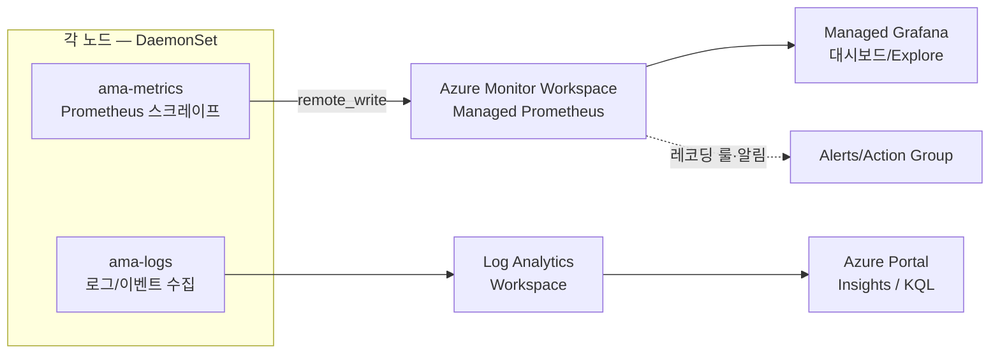
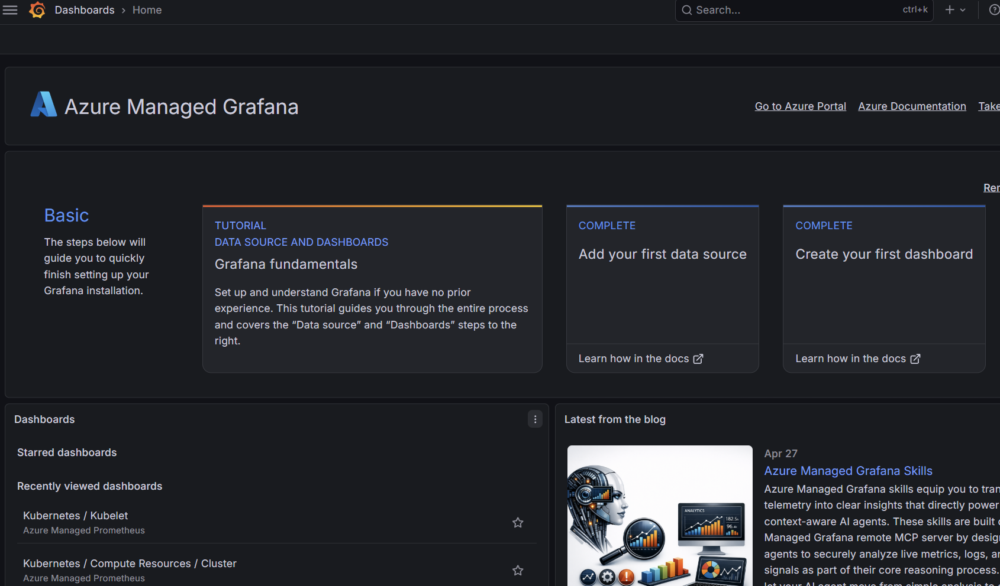
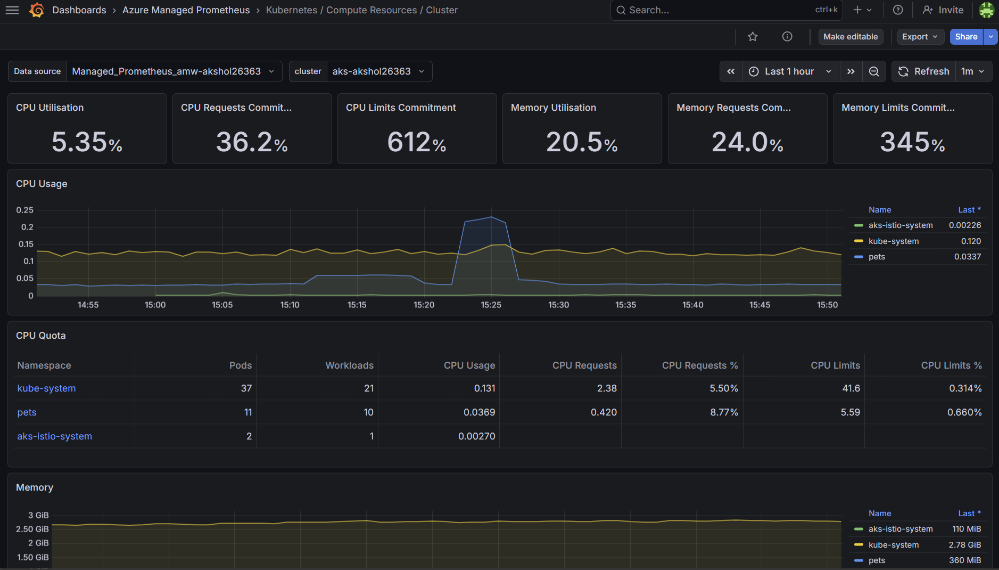
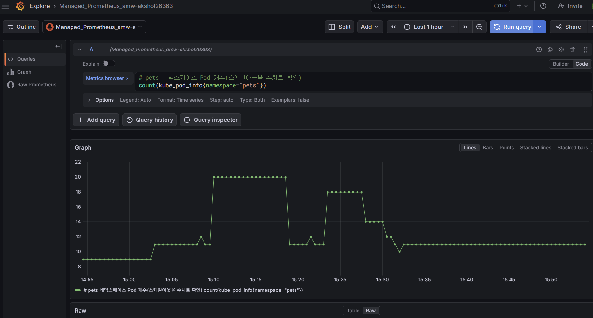
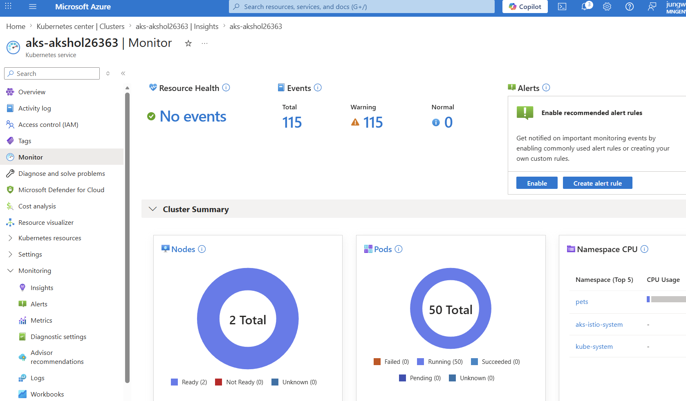
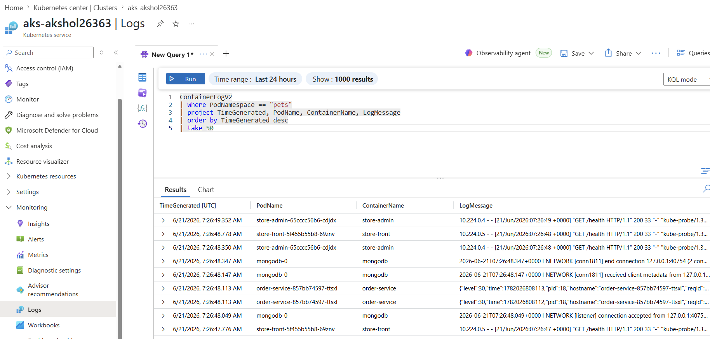

# 08. 모니터링

Managed Grafana/Prometheus와 Container Insights로 클러스터를 **메트릭(시계열)** 과 **로그(이벤트)** 양쪽에서 관측합니다. 앞 모듈(06~07)에서 만든 오토스케일링 동작을 실제 그래프와 로그로 확인하는 것이 이 모듈의 목표입니다.

## 0) 관측 파이프라인 이해

운영 가능한 시스템을 위한 관측성(Observability)은 흔히 **메트릭·로그·트레이스** 세 기둥으로 설명합니다. 이 워크숍은 그중 **메트릭**과 **로그** 두 경로를 Azure 관리형 서비스로 구성합니다(트레이스는 범위 외).

| 경로 | 수집 에이전트 | 저장소 | 조회 도구 | 용도 |
|---|---|---|---|---|
| **메트릭** | `ama-metrics` (Managed Prometheus) | Azure Monitor Workspace(AMW) | Managed Grafana | CPU/메모리/Pod·노드 수 등 시계열, 추세·임계치 |
| **로그** | `ama-logs` (Container Insights) | Log Analytics Workspace(LAW) | Azure Portal / KQL | 컨테이너 stdout/stderr, K8s 이벤트, 인벤토리 |

- 메트릭 경로는 배포 마지막 단계의 `az aks update --enable-azure-monitor-metrics`(에이전트 + DCE/DCR/DCRA + 레코딩 룰 자동 생성, 모듈 02 "3) ...")로, 로그 경로는 `aks.tf`의 `oms_agent`(애드온/MSI 인증) + `monitoring.tf`의 **로그 DCR/DCRA(`MSCI-...`)** 로 활성화했습니다(MSI 인증에서는 이 DCR이 있어야 `ContainerLogV2`가 LAW로 수집됩니다).
- 둘 다 **에이전트(DaemonSet)** 가 각 노드에서 데이터를 수집해 Azure 관리형 백엔드로 전송하는 구조라, 사용자가 Prometheus 서버나 수집기를 직접 운영·확장할 필요가 없습니다(관리형의 핵심 이점).
- **왜 두 경로인가?** 메트릭은 "지금 CPU가 몇 %인가, Pod가 몇 개인가" 같은 **수치 추세**에, 로그는 "주문 1042가 왜 실패했나" 같은 **개별 사건의 맥락**에 강합니다. 장애 분석은 보통 *메트릭으로 이상을 감지 → 로그로 원인 추적* 순서로 진행합니다.

관측 파이프라인을 그림으로 보면 다음과 같습니다.


> **수집 대상(스크레이프 타깃):** `ama-metrics`는 기본적으로 `cAdvisor`(컨테이너 CPU/메모리), `kubelet`, `kube-state-metrics`(K8s 객체 상태), `node-exporter`(노드 OS 메트릭)를 스크레이프합니다. 비용 최적화를 위해 **minimal-ingestion-profile**(핵심 메트릭만 수집)이 기본 적용됩니다.

---

## 1) Grafana 접속

Managed Grafana는 Azure가 운영하는 Grafana 인스턴스로, Entra ID(Azure AD) 인증과 AMW 데이터소스가 **사전 연결**되어 있습니다.

```bash
cd ~/ms-aks-basic-workshop01/terraform
terraform output -raw grafana_endpoint
```
출력 URL을 브라우저로 열고 **Azure 계정으로 로그인**합니다. (모듈 02에서 실습 사용자에게 `Grafana Admin` 역할을 부여했습니다.)

예상 출력:
```text
https://akshol-grafana-abcd.koreacentral.grafana.azure.com
```

브라우저로 접속해 Azure 계정으로 로그인하면 아래와 같은 Grafana 홈 화면이 보입니다.



로그인 후 좌측 메뉴 구성을 빠르게 익혀 둡니다.
- **Dashboards**: 미리 만들어진 대시보드 모음(아래 2번에서 사용).
- **Explore**: 임의의 PromQL 쿼리를 즉석에서 실행(아래 4번에서 사용).
- **Connections > Data sources**: `Managed_Prometheus_...` 데이터소스가 기본 등록되어 있는지 확인할 수 있습니다.

> 데이터소스가 보이지 않거나 권한 오류가 나면 역할 전파가 끝나지 않은 것입니다(아래 트러블슈팅 참고).

## 2) 메트릭 수집 상태 점검 (선택, 권장)

대시보드를 보기 전에, 메트릭 에이전트가 정상 동작하는지 클러스터 측에서 먼저 확인하면 문제 분리가 쉽습니다.

```bash
# 메트릭 에이전트(DaemonSet + Replica) 상태
kubectl get pods -n kube-system -l dsName=ama-metrics-node -o wide  # 노드별 DaemonSet
kubectl get pods -n kube-system -l rsName=ama-metrics  # 클러스터 단위 수집기(ReplicaSet)

# 클러스터에서 메트릭 활성화 여부
RG=$(terraform output -raw resource_group_name)
AKS=$(terraform output -raw aks_cluster_name)
az aks show -g "$RG" -n "$AKS" --query azureMonitorProfile.metrics.enabled -o tsv  # true 예상
```

예상 출력:
```text
$ kubectl get pods -n kube-system -l dsName=ama-metrics-node -o wide
NAME                    READY   STATUS    RESTARTS   AGE   NODE
ama-metrics-node-abcde  2/2     Running   0          20m   aks-system-...-vmss000000
ama-metrics-node-fghij  2/2     Running   0          20m   aks-system-...-vmss000001

$ az aks show ... --query azureMonitorProfile.metrics.enabled -o tsv
true
```

> `ama-metrics-node-*`는 노드별 DaemonSet, `ama-metrics-*`(ReplicaSet)는 kube-state-metrics 등 클러스터 단위 타깃을 스크레이프합니다. 모두 `Running`이어야 데이터가 AMW로 전송됩니다.

## 3) Prometheus 대시보드 확인

Grafana 좌측 **Dashboards**를 열면 Azure가 기본 제공하는 **Kubernetes 커뮤니티 대시보드 묶음**이 있습니다. 다음을 차례로 확인합니다.

| 대시보드 | 보는 내용 |
|---|---|
| **Kubernetes / Compute Resources / Cluster** | 클러스터 전체 CPU/메모리 사용량·요청(request)·상한(limit) 대비 사용률 |
| **Kubernetes / Compute Resources / Namespace (Workloads)** | `pets` 네임스페이스의 워크로드별 CPU/메모리 |
| **Kubernetes / Compute Resources / Node (Pods)** | 노드별 Pod 분포와 자원 사용 |
| **Kubernetes / Kubelet** | 노드 에이전트(kubelet) 상태·요청 처리량 |
| **Node Exporter / Nodes** | 노드 OS 레벨 CPU/메모리/디스크/네트워크 |

확인 포인트:
- 우측 상단 **시간 범위**를 `Last 30 minutes` 정도로 맞추고, 필요하면 자동 새로고침(`5s`/`10s`)을 켭니다.
- **Namespace (Workloads)** 대시보드에서 namespace를 `pets`로 필터링하면, 모듈 06에서 `orders` 큐가 쌓이며 `makeline-service`의 **Pod 수가 늘어났다가(KEDA 스케일아웃)**, 큐가 비면 다시 **0~1개로 축소**되는 모습을 볼 수 있습니다.
- **Cluster** 대시보드에서 NAP가 추가한 노드만큼 **할당 가능 CPU/메모리(Allocatable)** 가 늘어난 것을 확인합니다.

아래는 Grafana에서 Kubernetes 대시보드를 연 예시 화면입니다.



## 4) Explore로 PromQL 직접 질의

좌측 **Explore** → 데이터소스를 `Managed Prometheus`로 선택한 뒤, 아래 쿼리를 하나씩 실행해 봅니다. 오토스케일링과 직접 연결되는 메트릭 위주로 골랐습니다.

```promql
# pets 네임스페이스 Pod 개수(스케일아웃을 수치로 확인)
count(kube_pod_info{namespace="pets"})
```
```promql
# Deployment별 현재 복제본 수(makeline-service가 늘어나는지)
kube_deployment_status_replicas{namespace="pets"}
```
```promql
# makeline-service Pod들의 CPU 사용량(코어) — 큐 부하에 따라 상승
sum(rate(container_cpu_usage_seconds_total{namespace="pets", pod=~"makeline-service.*"}[5m]))
```
```promql
# 노드별 CPU 사용률(%) — NAP 노드 증설 효과 확인
100 * (1 - avg by (instance) (rate(node_cpu_seconds_total{mode="idle"}[5m])))
```
```promql
# pets 워크로드의 메모리 작업 집합(working set)
sum by (pod) (container_memory_working_set_bytes{namespace="pets"})
```

> **읽는 법:** `rate(...[5m])`는 5분 구간의 초당 증가율입니다. CPU `*_seconds_total`은 누적 카운터라 반드시 `rate()`로 감싸 "초당 소비 코어"로 변환해 봅니다. 그래프가 비어 있으면 시간 범위를 넓히거나(수집까지 1~5분), 메트릭 이름 철자를 확인하세요.

아래는 Explore에서 `count(kube_pod_info{namespace="pets"})` 쿼리로 `pets` Pod 개수 변화를 본 예시입니다. 모듈 06~07의 스케일아웃/스케일인이 Pod 수 그래프로 그대로 나타납니다.



## 5) (선택) 간단한 알림 규칙 개념

운영에서는 대시보드를 계속 보는 대신 **임계치 초과 시 알림**을 받습니다. Azure에서는 두 가지 방식이 있습니다.

- **Prometheus 알림 규칙(권장)**: AMW에 `PrometheusRuleGroup`을 만들어 PromQL 조건(예: `node CPU > 80% 5분 지속`)을 평가하고, **Action Group**(이메일/Webhook/ITSM)으로 통지합니다.
- **메트릭/로그 알림**: Azure Monitor의 메트릭 알림 또는 LAW 기반 로그 알림.

예시(개념 — 실제 적용은 선택):
```promql
# 노드 평균 CPU가 5분간 80% 초과하면 경보
(100 * (1 - avg(rate(node_cpu_seconds_total{mode="idle"}[5m])))) > 80
```
> 이 워크숍에서는 알림을 실제로 만들지 않지만, 위 PromQL을 `PrometheusRuleGroup`의 `expression`으로 넣으면 그대로 알림 규칙이 됩니다. `az aks update --enable-azure-monitor-metrics`가 만든 **기본 레코딩 룰**(`node.recording.rules` 등)도 포털 > AMW > Rule groups에서 볼 수 있습니다.

## 6) Container Insights (로그·인벤토리)

Azure Portal → AKS 클러스터 → **모니터링 > Insights**. 메트릭이 "얼마나"라면, 여기서는 "무엇이/왜"를 봅니다.

- **Cluster / Nodes / Controllers / Containers** 탭에서 노드·Pod 상태, 재시작 횟수, 리소스 사용을 시각적으로 확인합니다.
- **Reports**/**Workbooks**에서 미리 만든 분석(노드 디스크, 네트워크 등)을 볼 수 있습니다.

아래는 포털의 **Insights/Monitor** 클러스터 요약 화면 예시입니다. 노드/Pod 수, 네임스페이스별 CPU, 이벤트/리소스 상태를 한눈에 볼 수 있습니다.



### KQL로 로그·이벤트 조회

**모니터링 > 로그(Logs)** 에서 아래 쿼리를 실행합니다. (LAW에 연결된 KQL 콘솔)

> **전제 — `ContainerLogV2` 스키마:** 아래 쿼리는 `PodNamespace`/`PodName`/`LogMessage` 컬럼이 있는 **ContainerLogV2** 스키마를 사용합니다. 이 스키마는 **관리 ID(AAD) 인증으로 온보딩한 경우의 기본 테이블**이며, 이 워크숍은 모듈 02에서 `msi_auth_for_monitoring_enabled = true`(az CLI는 `--enable-msi-auth-for-monitoring`)로 그렇게 설정합니다. 만약 결과가 **빈 채로 나온다면** 원인은 두 가지입니다 — ① 클러스터가 레거시(워크스페이스 키) 인증으로 온보딩되어 로그가 V1 `ContainerLog`로 가는 경우(`useAADAuth=false`), ② **`useAADAuth=true`인데도** 빈 경우는 **로그용 `MSCI-...` DCR/DCRA가 누락**되어(메트릭은 정상) ama-logs가 LAW로 보낼 경로가 없는 경우입니다. 아래 트러블슈팅의 해당 두 항목을 참고하세요.

컨테이너 표준 출력 로그:
```kql
ContainerLogV2
| where PodNamespace == "pets"
| project TimeGenerated, PodName, ContainerName, LogMessage
| order by TimeGenerated desc
| take 50
```

예상 결과(표 형태로 표시됨):
```text
TimeGenerated [UTC]      PodName                        ContainerName    LogMessage
2026-06-12 03:21:05.123  order-service-7c9b8d6f5-abcde  order-service    Order 1042 received
2026-06-12 03:21:05.456  makeline-service-5b7d9c8f6-..  makeline         Processing order 1042
2026-06-12 03:21:06.001  store-front-8f6d5c7b9-pqrst    store-front      GET / 200 12ms
```

Azure 포털의 AKS > **Logs** 메뉴에서 위 쿼리를 실행하면 다음과 같이 표시됩니다:



특정 서비스의 에러만 필터:
```kql
ContainerLogV2
| where PodNamespace == "pets" and ContainerName == "order-service"
| where LogMessage has_any ("error", "exception", "fail")
| project TimeGenerated, PodName, LogMessage
| order by TimeGenerated desc
| take 50
```

Kubernetes 이벤트(스케줄링/이미지 풀/오토스케일 등 — 모듈 06~07 추적에 유용):
```kql
KubeEvents
| where Namespace == "pets"
| project TimeGenerated, Reason, Message, Name, KubeEventType
| order by TimeGenerated desc
| take 50
```

네임스페이스별 Pod 수 추이(스케일아웃을 로그 측에서 확인):
```kql
KubePodInventory
| where Namespace == "pets"
| summarize PodCount = dcount(Name) by bin(TimeGenerated, 5m)
| order by TimeGenerated asc
```

컨테이너 재시작이 잦은 Pod 찾기(불안정 워크로드 진단):
```kql
KubePodInventory
| where Namespace == "pets"
| summarize Restarts = max(ContainerRestartCount) by Name
| where Restarts > 0
| order by Restarts desc
```

> **메트릭 vs 로그 비용 감각:** Container Insights 로그는 수집량(GB)에 비례해 과금됩니다. 운영에서는 `ContainerLogV2`의 네임스페이스/스트림 필터링과 LAW **데이터 보존 기간** 조정으로 비용을 통제합니다. 실습 후에는 모듈 09에서 모든 백엔드가 함께 삭제됩니다.

---

## 검증 및 완료 체크리스트

다음 항목이 모두 충족되면 [09. 정리](09-cleanup.md)로 진행하세요.

- [ ] `terraform output -raw grafana_endpoint` URL로 Grafana에 로그인됨
- [ ] `kubectl get pods -n kube-system -l dsName=ama-metrics-node`의 에이전트가 모두 `Running`
- [ ] Prometheus 대시보드(Compute Resources / Cluster·Namespace)에 메트릭 그래프가 표시됨
- [ ] **Explore**에서 PromQL(`kube_deployment_status_replicas{namespace="pets"}`)이 결과를 반환함
- [ ] 모듈 06~07의 스케일링 이벤트가 그래프(또는 `KubeEvents`)에 반영됨
- [ ] Container Insights(Insights 탭)에 `pets` 네임스페이스 노드/Pod가 표시됨
- [ ] KQL `ContainerLogV2`/`KubeEvents`로 `pets` 로그·이벤트를 조회함

---

## 트러블슈팅
| 증상 | 원인 | 진단 | 조치 |
|---|---|---|---|
| Grafana 대시보드에 데이터 없음 | Prometheus 수집 파이프라인 미연결 또는 전파 지연 | `kubectl get pods -n kube-system -l dsName=ama-metrics-node`, 포털에서 DCRA 확인 | 모듈 02 "3) ..."의 `az aks update --enable-azure-monitor-metrics`(DCE/DCR/DCRA 생성) 적용 후 수 분 경과 대기 |
| Explore에서 특정 메트릭이 안 나옴 | minimal-ingestion-profile로 미수집 또는 이름 오타 | Grafana Explore의 메트릭 자동완성으로 존재 여부 확인 | 다른 핵심 메트릭으로 대체하거나, 필요한 타깃을 `ama-metrics-settings-configmap`에서 활성화 |
| Grafana 로그인/데이터소스 권한 오류 | `Grafana Admin`·`Monitoring Data Reader` 역할 전파 지연 | `az role assignment list --scope $(terraform output -raw grafana_resource_id) -o table` | 역할 전파(수 분) 대기 후 재로그인 |
| `terraform output grafana_endpoint`가 빈 값 | apply 미완료 | `terraform state list \| grep grafana` | 모듈 02의 `apply` 완료 확인 |
| **`ContainerLogV2` 쿼리가 무데이터** | 클러스터가 **레거시(워크스페이스 키) 인증**으로 온보딩되어 로그가 `ContainerLogV2`가 아닌 **레거시 `ContainerLog`(V1)** 테이블로 적재됨 | `ContainerLogV2 \| count` (0) vs `ContainerLog \| count` (>0), `az aks show -g "$RG" -n "$AKS" --query addonProfiles.omsagent.config.useAADAuth -o tsv` (→ `false`이면 레거시) | **권장:** 관리 ID 인증으로 전환 → `az aks update -g "$RG" -n "$AKS" --enable-msi-auth-for-monitoring`(또는 Terraform `msi_auth_for_monitoring_enabled = true` 후 `apply`). 재온보딩 수 분 뒤 새 로그부터 `ContainerLogV2`에 적재됨. **임시 조회(V1):** 아래 폴백 쿼리 사용 |
| **메트릭은 정상인데 로그(`ContainerLogV2`/`Logs by Volume`)만 무데이터, `useAADAuth=true`** | MSI 인증이지만 **Container Insights 로그 DCR(`MSCI-...`)+DCRA가 누락**됨. MSI 인증에서 로그는 **DCR을 통해서만** LAW로 흐르므로 DCR이 없으면 0건(메트릭은 별도 `MSProm-...` DCR로 흘러 정상). `oms_agent` 블록만으론 이 DCR이 생성되지 않음 | 클러스터 DCRA에 `MSProm-...`만 있고 `MSCI-...`가 없는지: `az monitor data-collection rule association list --resource $(az aks show -g "$RG" -n "$AKS" --query id -o tsv) -o table` | `monitoring.tf`의 `azurerm_monitor_data_collection_rule.container_insights`+`..._association` 적용(워크숍 코드 포함). 기존 클러스터 즉시 복구: `az aks enable-addons -g "$RG" -n "$AKS" -a monitoring --workspace-resource-id "$LAW_ID" --enable-msi-auth-for-monitoring` → 수 분 뒤 `MSCI-...` DCR 생성 + 로그 적재 |
| Container Insights에 로그 없음 | `ama-logs` 미기동 또는 LAW 미연결 | `kubectl get pods -n kube-system -l component=ama-logs-agent` | `oms_agent` 활성 확인, 수 분 후 KQL 재조회 |
| KQL `ContainerLogV2` 결과 0건 | (테이블에 데이터는 있으나) 수집 지연 또는 네임스페이스 오타 | 쿼리에서 `PodNamespace == "pets"` 확인, `ContainerLogV2 \| count` | 로그 수집까지 수 분 대기 후 재조회. 테이블 전체가 0건이면 위 "ContainerLogV2 무데이터"(스키마/인증) 항목 참고 |
| KQL에서 테이블을 못 찾음(`ContainerLogV2`) | 잘못된 워크스페이스에서 조회 | 포털 Logs 상단의 스코프가 클러스터의 LAW인지 확인 | AKS > 로그에서 열거나 올바른 LAW 선택 |
| 대시보드에 노드/Pod 메트릭 누락 | 스케일 이벤트 직후 시점 차이 | Grafana 시간 범위 확인 | 시간 범위를 `Last 15 minutes` 등으로 조정 |

### (참고) 레거시 `ContainerLog`(V1) 폴백 쿼리

클러스터가 레거시 인증으로 온보딩되어 `ContainerLogV2`가 비어 있을 때, **MI 인증으로 전환하기 전 임시로** V1 테이블에서 로그를 볼 수 있습니다. V1 `ContainerLog`에는 `PodNamespace`/`PodName` 컬럼이 없어, `KubePodInventory`와 `ContainerID`로 조인해 네임스페이스를 필터링합니다.

```kql
KubePodInventory
| where Namespace == "pets"
| distinct ContainerID, Name
| join kind=inner (ContainerLog) on ContainerID
| project TimeGenerated, PodName = Name, LogEntrySource, LogEntry
| order by TimeGenerated desc
| take 50
```
> 근본 해결은 V1 폴백이 아니라 **관리 ID 인증으로 재온보딩**(`--enable-msi-auth-for-monitoring` / `msi_auth_for_monitoring_enabled = true`)해서 `ContainerLogV2`를 기본 테이블로 쓰는 것입니다. `ContainerLog`(V1)는 **2026-09-30 지원 종료** 예정입니다.

다음: [09. 정리](09-cleanup.md)
