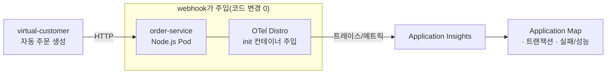
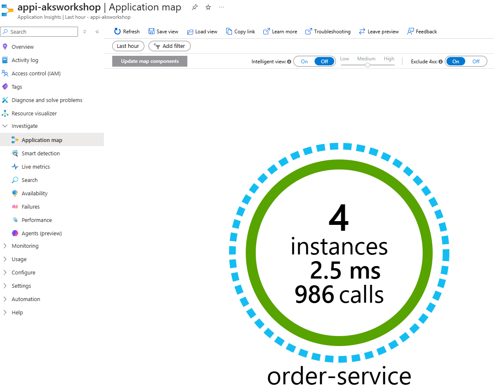
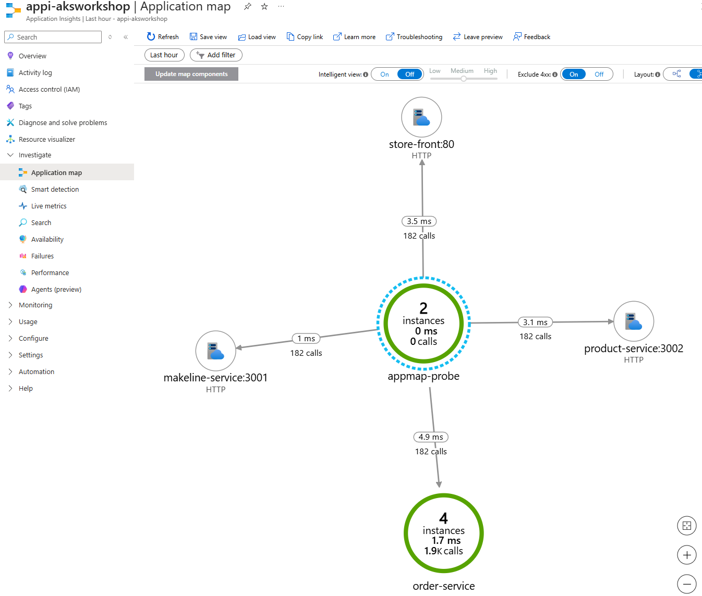

# 09.1 (옵션) 애플리케이션 자동 계측(Auto-instrumentation) — OpenTelemetry / Application Insights

> 🟢 **실행** = 직접 입력·수행 · 👁️ **예시** = 눈으로만(개념/발췌) · 📋 **예상 출력** = 비교용(입력 불필요)

> 🧩 **이 문서는 [09. 모니터링](09-monitoring.md)의 _옵션(선택)_ 모듈입니다.**
> **시간 여유가 있을 때** 추가로 해보는 hands-on 으로, 워크샵 완주에 필수는 아닙니다. 09까지(메트릭·로그)로 핵심 관측은 이미 끝났고, 이 모듈은 거기에 **분산 추적(트레이스)** 한 기둥을 **코드 수정 없이** 얹어보는 체험입니다. 30분 이상 여유가 있으면 진행하고, 빡빡하면 건너뛰어 [10. 정리](10-cleanup.md)로 가도 됩니다.

- 예상 소요: 약 20~30분 (App Insights 생성 1–2분 + 자동 계측 애드온 활성화 3–7분 + 트레이스가 포털에 보이기까지 2–5분)
- 사전 조건: [04. 애플리케이션 배포](04-deploy-app.md)까지 완료(= `pets` 네임스페이스에 `order-service` 등 store-demo 가 동작 중이고, `virtual-customer` 가 자동으로 주문을 생성하는 상태).

> ⚠️ **프리뷰 기능:** AKS 자동 계측(Java·Node.js)은 현재 **공개 미리 보기(public preview)** 입니다. SLA가 없으며 운영 환경 권장 대상이 아닙니다. **Linux 노드풀에서만** 동작하고, **워크스페이스 기반 Application Insights** 리소스가 필요합니다.

---

## 0) 개념 — 자동 계측과 OpenTelemetry

**관측성(Observability)의 세 기둥**은 메트릭·로그·**트레이스**입니다. [09](09-monitoring.md)에서 앞의 둘(메트릭=Prometheus/Grafana, 로그=Container Insights)을 구성했고, 이 모듈은 마지막 **트레이스**를 다룹니다.

- **OpenTelemetry(OTel)란?** 메트릭·로그·**트레이스**를 표준 방식으로 수집·전송하기 위한 **벤더 중립 오픈소스 표준/SDK**입니다. HTTP·DB·gRPC 같은 공통 라이브러리 호출을 가로채(instrument) **스팬(span)** 을 만들고, 이 스팬들이 모여 하나의 요청이 서비스들을 거치는 경로(=분산 추적)를 그립니다.
- **자동 계측(Auto-instrumentation)이란?** **소스 코드·Dockerfile을 전혀 바꾸지 않고** OTel 에이전트를 Pod에 주입해 텔레메트리를 생성하는 방식입니다(=codeless). AKS에서는 클러스터에 설치된 **mutating admission webhook**이 Pod 생성 시점을 가로채, **init 컨테이너로 Azure Monitor OpenTelemetry Distro**(언어별 에이전트)를 Pod 파일시스템에 복사하고 `NODE_OPTIONS`/`JAVA_TOOL_OPTIONS` 같은 환경변수로 활성화합니다.
- **무엇을 어디로?** 어떤 언어를 계측하고 텔레메트리를 어디로 보낼지는 쿠버네티스 커스텀 리소스 **`Instrumentation`**(`monitor.azure.com/v1`)로 정의합니다. 수신처는 **Application Insights**(연결 문자열)입니다.



> 이 워크샵의 **`order-service` 는 Node.js(Javascript)** 라 자동 계측 대상입니다(`makeline-service`=Go, `product-service`=Rust 는 현재 미지원). 그래서 **기존에 쓰던 앱을 그대로** 활용해, `virtual-customer` 가 만드는 주문 트래픽을 트레이스로 관찰합니다.

---

## 1) Application Insights 리소스 생성

자동 계측 텔레메트리를 받을 **워크스페이스 기반 Application Insights** 리소스를 만듭니다. [02](02-provision-terraform.md)에서 만든 **Log Analytics 워크스페이스(LAW)** 를 백엔드로 재사용합니다.

🟢 **실행**
```bash
cd ~/ms-aks-basic-workshop01/terraform
RG=$(terraform output -raw resource_group_name)
AKS=$(terraform output -raw aks_cluster_name)
MON_RG=$(terraform output -raw monitoring_resource_group_name)
LOCATION=$(az aks show -g "$RG" -n "$AKS" --query location -o tsv)

# (필수) application-insights CLI 확장 설치 — 'az monitor app-insights' 명령에 필요
#  · 미설치 상태에서 아래 create를 실행하면 리소스가 만들어지지 않습니다.
az extension add --name application-insights --only-show-errors \
  || az extension update --name application-insights --only-show-errors

# LAW(law-*) 리소스 ID 조회 → App Insights 백엔드로 사용
LAW_ID=$(az monitor log-analytics workspace list -g "$MON_RG" \
  --query "[?starts_with(name,'law-')].id | [0]" -o tsv)

# 워크스페이스 기반 Application Insights 생성
az monitor app-insights component create \
  --app appi-aksworkshop \
  --resource-group "$MON_RG" \
  --location "$LOCATION" \
  --workspace "$LAW_ID" \
  --application-type web \
  --only-show-errors -o table
```
- **확장 먼저:** `az monitor app-insights` 명령은 `application-insights` 확장이 있어야 합니다. 확장 없이 `component create`를 돌리면 리소스가 생성되지 않고, 이후 2)의 `component show`가 `(ResourceNotFound) ... appi-aksworkshop ... was not found`로 실패합니다.
- `--workspace`에 LAW를 지정해 **워크스페이스 기반(권장)** 리소스로 만듭니다(자동 계측 요구사항).
- `--app appi-aksworkshop` 이름은 이후 단계에서 동일하게 사용합니다.
- `component create` 출력에 `appi-aksworkshop`(provisioningState `Succeeded`)이 보이면 정상입니다. 이게 보여야 2)로 넘어가세요.

---

## 2) 연결 문자열 확보

1)에서 만든 Application Insights의 **연결 문자열(connection string)** 을 가져옵니다. 이 값은 4)의 `Instrumentation` CR에 넣어 **텔레메트리가 어느 리소스로 들어갈지** 결정합니다.

🟢 **실행**
```bash
# 연결 문자열(connection string) 확보 — Instrumentation CR 에 넣을 값
AICS=$(az monitor app-insights component show \
  --app appi-aksworkshop -g "$MON_RG" \
  --query connectionString -o tsv)
echo "Connection String: $AICS"
```
📋 예상 출력:
```text
$ echo "Connection String: $AICS"
Connection String: InstrumentationKey=xxxxxxxx-xxxx-xxxx-xxxx-xxxxxxxxxxxx;IngestionEndpoint=https://koreacentral-x.in.applicationinsights.azure.com/;LiveEndpoint=https://koreacentral.livediagnostics.monitor.azure.com/;ApplicationId=xxxxxxxx-xxxx-xxxx-xxxx-xxxxxxxxxxxx
```
> 연결 문자열은 포털의 **Application Insights 리소스 > 개요(Overview)** 페이지에서도 복사할 수 있습니다. 새 터미널 세션에서 이어서 진행한다면 `$AICS`(필요 시 `$MON_RG`)를 다시 설정하세요.

---

## 3) 클러스터에 자동 계측 활성화

클러스터에 admission webhook(자동 계측 애드온)을 설치합니다. 별도 프리뷰 플래그 등록은 필요 없고, `az aks update` 한 번이면 됩니다(약 3~7분).

🟢 **실행**
```bash
az aks update \
  --resource-group "$RG" \
  --name "$AKS" \
  --enable-azure-monitor-app-monitoring
```
📋 예상 출력(일부):
```text
 \ Running ..
{
  "azureMonitorProfile": {
    "appMonitoring": {
      "autoInstrumentation": { "enabled": true },
      ...
    }
  },
  "provisioningState": "Succeeded",
  ...
}
```
> 이 명령은 클러스터에 Pod 생성을 가로채는 **mutating webhook**을 배포합니다. 이때부터 `Instrumentation` CR이 있는 네임스페이스에서 **새로 만들어지는 Pod**에 OTel 에이전트가 주입됩니다(기존 Pod는 재시작해야 적용 — 5단계).

---

## 4) Instrumentation CR 적용

`pets` 네임스페이스에 **네임스페이스 단위(`default`)** 자동 계측을 정의합니다. 아래는 적용할 `manifests/instrumentation.yaml` 입니다.

👁️ **예시** (`manifests/instrumentation.yaml`)
```yaml
apiVersion: monitor.azure.com/v1
kind: Instrumentation
metadata:
  name: default              # 'default' = 네임스페이스 전체 적용(Java/Node.js만 지원)
  namespace: pets            # 애플리케이션 Pod 와 같은 네임스페이스
spec:
  settings:
    autoInstrumentationPlatforms:
      - NodeJs                # order-service(Node.js) 대상. 필요 시 - Java 추가
  destination:               # 필수: 텔레메트리 수신 대상
    applicationInsightsConnectionString: "REPLACE_WITH_YOUR_CONNECTION_STRING"
```

- **`metadata.name: default`** — 이름을 `default`로 두면 해당 네임스페이스의 **모든 Deployment**가 자동 계측 대상이 됩니다(Pod 별 annotation 불필요). Java·Node.js만 이 네임스페이스 단위 방식을 지원합니다.
- **`autoInstrumentationPlatforms: [NodeJs]`** — 주입할 언어 에이전트. `order-service`가 Node.js라 `NodeJs`만 지정합니다. (값은 **대소문자를 구분**합니다 — 지원 값은 `Java`·`NodeJs`. `NodeJS`로 적으면 `Unsupported value` 에러)
- **`destination.applicationInsightsConnectionString`** — 2)에서 받은 연결 문자열. 파일에는 placeholder가 들어 있으니, 아래처럼 **실제 값(`$AICS`)을 끼워** 적용합니다.

파일의 placeholder를 2)의 연결 문자열로 치환해 적용합니다. **적용 전에 `$AICS`가 비어 있지 않은지, 적용 후 CR에 placeholder가 남아 있지 않은지 반드시 확인**합니다(placeholder 그대로 적용되면 계측은 되지만 텔레메트리가 어디에도 도달하지 못해 포털이 'no data available'이 됩니다).

🟢 **실행**
```bash
cd ~/ms-aks-basic-workshop01

# (검증 1) 연결 문자열이 비어 있지 않은지 — 새 세션이면 2)를 다시 실행해 $AICS를 채우세요
echo "AICS=$AICS"    # InstrumentationKey=... 로 시작해야 정상. 비어 있으면 중단!

# placeholder를 실제 값으로 치환해 적용
sed "s|REPLACE_WITH_YOUR_CONNECTION_STRING|$AICS|" manifests/instrumentation.yaml \
  | kubectl apply -f -

kubectl get instrumentation -n pets

# (검증 2) CR에 실제 연결 문자열이 들어갔는지 — placeholder가 남아 있으면 안 됨
kubectl get instrumentation default -n pets \
  -o jsonpath='{.spec.destination.applicationInsightsConnectionString}{"\n"}'
```
📋 예상 출력:
```text
$ kubectl get instrumentation -n pets
NAME      AGE
default   5s
$ kubectl get instrumentation default -n pets -o jsonpath='...'
InstrumentationKey=xxxxxxxx-xxxx-xxxx-xxxx-xxxxxxxxxxxx;IngestionEndpoint=https://...
```
> ⚠️ 검증 2에서 `REPLACE_WITH_YOUR_CONNECTION_STRING`이 그대로 보이면, `$AICS`가 비어 있었거나 치환이 안 된 것입니다. 2)에서 `$AICS`를 다시 확보한 뒤 위 `sed ... | kubectl apply`를 재실행하고, **5)의 재시작까지 다시 수행**하세요(기존 Pod에는 잘못된 값이 이미 주입돼 있음).

---

## 5) 적용 트리거 — order-service 재시작

webhook는 **Pod 생성 시점**에만 에이전트를 주입하므로, 이미 떠 있는 `order-service` Pod를 **롤아웃 재시작**해 새 Pod에 주입을 트리거합니다.

🟢 **실행**
```bash
kubectl rollout restart deployment order-service -n pets
kubectl rollout status deployment order-service -n pets
```
📋 예상 출력:
```text
$ kubectl rollout status deployment order-service -n pets
deployment "order-service" successfully rolled out
```

주입이 실제로 일어났는지 **init 컨테이너**로 확인합니다. 자동 계측은 OTel Distro를 복사하는 init 컨테이너를 **하나 더** 추가하므로, 원래 있던 `wait-for-rabbitmq` 외에 컨테이너가 더 보이면 주입된 것입니다.

🟢 **실행**
```bash
kubectl get pod -n pets -l app=order-service \
  -o jsonpath='{.items[0].spec.initContainers[*].name}{"\n"}'
```
📋 예상 출력(원래 `wait-for-rabbitmq` + 계측 init 컨테이너가 추가됨):
```text
$ kubectl get pod -n pets -l app=order-service -o jsonpath='{.items[0].spec.initContainers[*].name}{"\n"}'
wait-for-rabbitmq azure-monitor-auto-instrumentation-nodejs
```
> `wait-for-rabbitmq`는 이 앱이 원래 가진 init 컨테이너입니다. 그 **뒤에 init 컨테이너가 하나 더**(`azure-monitor-auto-instrumentation-nodejs`) 생겼으면 주입 성공입니다. 더 확실히 보려면 주입된 환경변수까지 확인하세요: `kubectl get pod -n pets -l app=order-service -o jsonpath='{range .items[0].spec.containers[0].env[*]}{.name}{"\n"}{end}'` 출력에 `NODE_OPTIONS`/`OTEL_`·`APPLICATIONINSIGHTS_` 계열 변수가 있으면 계측이 활성화된 것입니다.

---

## 6) 부하 발생 후 텔레메트리 확인

**별도 부하 작업이 필요 없습니다.** `virtual-customer`가 주기적으로 주문을 생성해 `order-service`로 요청을 보내므로, 재시작 후 잠시 기다리면 트레이스가 쌓입니다. (원하면 브라우저로 store-front에서 직접 주문해도 됩니다.)

2~5분 뒤 **Azure 포털**에서 확인합니다. **가장 확실한 경로는 아래 ① Application Insights 리소스**입니다(텔레메트리는 여기로 직접 수집됩니다).

### ① Application Insights 에서 APM 경험 (권장·기본 경로)
포털 → **Application Insights(`appi-aksworkshop`)** 리소스에서:

| 블레이드 | 보이는 것 |
|---|---|
| **Application map** | 계측된 **cloud role**(기본은 `order-service` 단일 노드) 토폴로지. 더 풍부한 맵은 아래 ③ 참고 |
| **Transaction search / End-to-end transaction** | 개별 요청의 **분산 추적 워터폴**(스팬별 소요시간) |
| **Failures** | 실패한 요청·예외 |
| **Performance** | 응답시간 백분위수·의존성 지연 |

> 계측된 각 앱은 Application Insights에서 **cloud role**(예: `order-service`)로 나타납니다. 단, AKS 자동 계측은 **Live Metrics·Code Analysis(Profiler)는 지원하지 않습니다.**

**Application map 예시** — 기본 상태에서는 계측된 `order-service` 단일 노드가 인스턴스 수·평균 응답시간·호출 수와 함께 표시됩니다.


>
> ℹ️ **Application map이 `order-service` 하나만 보이는 건 정상입니다.** `pets`에서 자동 계측 지원 런타임(Node.js/Java)은 order-service뿐이고(makeline=Go·product=Rust·store-front=nginx는 미지원), order-service는 외부 HTTP 호출 없이 RabbitMQ에 큐 발행(rhea)만 하는데 rhea는 자동 계측 대상이 아니라 **연결할 엣지가 없습니다.** 토폴로지를 풍부하게 보려면 아래 ③을 적용하세요.

### ② (참고) AKS 블레이드에서 진입
- 포털 → **AKS 클러스터 > Workloads > Deployments > `order-service`** 선택
- ℹ️ **"Application Insights에서 보기(View in Application Insights)" 링크가 보이지 않을 수 있습니다.** 이 인라인 링크는 **프리뷰 UI라 포털 버전·리전에 따라 노출되지 않는 경우가 많습니다.** 링크가 없어도 정상이며, 계측 자체와는 무관합니다 — **위 ① App Insights 리소스로 바로 이동**해 확인하세요.
- 계측 활성화 여부는 5단계의 `kubectl`(init 컨테이너 주입) 또는 포털 **AKS > 모니터링 > 애플리케이션 모니터링(미리 보기)** 상태로 확인할 수 있습니다.

> ⏱️ 트레이스가 안 보이면 **2~5분 더 대기**하세요(수집·집계 지연). 그래도 없으면 5단계의 init 컨테이너 주입 여부와, 4단계 연결 문자열이 올바른 리소스의 것인지 확인하세요.

### ③ (선택) Application Map 보강 — 트래픽 프로브

단일 노드 맵이 시연에 아쉬우면, `pets`에 **작은 Node.js 트래픽 프로브**를 하나 띄웁니다. 네임스페이스 단위 `Instrumentation/default` 덕분에 이 프로브도 **자동 계측**되고, 내부 서비스로 HTTP를 주기 호출하므로 맵이 여러 노드·엣지로 확장됩니다.

- 프로브 → **order-service**(둘 다 계측된 Node): **서비스-투-서비스 엣지**(분산 추적)
- 프로브 → **product-service / makeline-service / store-front**(미계측): **의존성 노드**

공개 `node:20-alpine` 이미지만 사용해 **앱 빌드가 필요 없고**, 호출은 모두 `GET /health`(store-front는 `/`)라 **주문 생성 등 부작용이 없습니다.** (프로브는 코어 `http` 모듈을 사용합니다 — 전역 `fetch`/undici는 자동 계측이 잡지 못하는 경우가 있어 회피.)

🟢 **실행**
```bash
cd ~/ms-aks-basic-workshop01
kubectl apply -f manifests/appmap-loadgen.yaml
kubectl rollout restart deployment appmap-probe -n pets   # 스크립트 변경분 반영(ConfigMap 갱신 시)
kubectl rollout status deployment appmap-probe -n pets

# 프로브가 계측됐는지(init 컨테이너 주입) + 호출이 200으로 도는지 확인
kubectl get pod -n pets -l app=appmap-probe \
  -o jsonpath='{.items[0].spec.initContainers[*].name}{"\n"}'
kubectl logs -n pets deploy/appmap-probe --tail=8
```
📋 예상 출력:
```text
wait-for... (없음) azure-monitor-auto-instrumentation-nodejs
2026-07-01T...Z http://order-service:3000/health 200
2026-07-01T...Z http://product-service:3002/health 200
2026-07-01T...Z http://makeline-service:3001/health 200
2026-07-01T...Z http://store-front:80/ 200
```
2~5분 뒤 Application map을 새로고침하면 **`appmap-probe`를 중심으로 `order-service`·`product-service`·`makeline-service`·`store-front`로 뻗는 토폴로지**가 보입니다. 시연이 끝나면 7)에서 프로브도 함께 정리합니다.

🖼️ **예상 화면** — 프로브 보강 후 Application map:



> `appmap-probe`(중앙)에서 `store-front:80`·`product-service:3002`·`makeline-service:3001`로 각각 182 calls 엣지가 뻗고, `order-service`도 함께 노드로 표시됩니다. (각 서비스의 응답시간·호출수는 실습 시점에 따라 다릅니다.)

---

## 7) 정리 — 자동 계측 제거

데모 후 자동 계측만 깔끔히 제거합니다. **앱(order-service)은 그대로 유지**됩니다.

🟢 **실행**
```bash
# 0) (③을 적용했다면) 트래픽 프로브 제거
kubectl delete -f manifests/appmap-loadgen.yaml --ignore-not-found

# 1) Instrumentation CR 삭제(네임스페이스에서 계측 정의 제거)
kubectl delete instrumentation default -n pets

# 2) order-service 재시작 → 주입된 에이전트 제거(CR만 지우면 기존 Pod는 계속 계측됨)
kubectl rollout restart deployment order-service -n pets
```

> 클러스터 전체에서 기능까지 끄려면 `az aks update -g "$RG" -n "$AKS" --disable-azure-monitor-app-monitoring` 를 실행합니다. 단, **계측된 Deployment를 먼저 위 1~2로 해제**한 뒤 비활성화하세요(그러지 않으면 재배포 전까지 계속 계측됨). App Insights 리소스는 `terraform destroy`([10](10-cleanup.md))로 RG를 지우면 함께 삭제됩니다. 남은 데모에 영향을 주지 않으려면 이 모듈 리소스만 위처럼 정리하면 됩니다.

---

## 검증 및 완료 체크리스트

- [ ] 워크스페이스 기반 Application Insights(`appi-aksworkshop`)를 만들고 연결 문자열을 확보함
- [ ] `--enable-azure-monitor-app-monitoring` 가 `Succeeded` 로 활성화됨
- [ ] `pets` 네임스페이스에 `Instrumentation/default`(NodeJs)를 적용함
- [ ] `order-service` 재시작 후 자동 계측 **init 컨테이너 주입**을 확인함
- [ ] Application Insights의 **Application map / 트랜잭션**에서 `order-service` 트레이스를 확인함
- [ ] (선택) 트래픽 프로브(③)로 Application map에 여러 노드·엣지 토폴로지를 확인함
- [ ] (정리) Instrumentation CR 삭제 + 재시작으로 계측을 제거함(프로브 적용 시 함께 제거)

## 트러블슈팅

| 증상 | 원인 | 진단 | 조치 |
|---|---|---|---|
| `az aks update`가 `--enable-azure-monitor-app-monitoring`를 모름 | Azure CLI 구버전 | `az version` | `az upgrade` 로 2.60.0 이상으로 갱신 |
| `az monitor app-insights` 명령 없음/오류, 또는 2)에서 `(ResourceNotFound) ... appi-aksworkshop ... was not found` | `application-insights` 확장 미설치 상태로 1) `component create`가 실패해 리소스가 안 만들어짐 | `az extension list -o table`, `az monitor app-insights component show --app appi-aksworkshop -g "$MON_RG"` | `az extension add -n application-insights` 설치 후 **1)의 `component create`부터 다시 실행**(생성 확인 후 2) 진행). 첫 실행 시 자동 설치 프롬프트가 뜨면 `Y`로 동의 |
| `kubectl apply` 시 `no matches for kind "Instrumentation"` | webhook/CRD 미설치 | `kubectl get crd` 에 `monitor.azure.com` 포함 여부 | 3)의 애드온 활성화가 `Succeeded` 인지 확인 후 재적용 |
| `Instrumentation "default" is invalid: ... Unsupported value: "NodeJS"` | 플랫폼 값 대소문자 오류 | `kubectl get instrumentation -n pets`(빈 결과) | `autoInstrumentationPlatforms` 값을 **`NodeJs`**(또는 `Java`)로 수정 후 재적용 |
| init 컨테이너가 주입 안 됨 | CR 적용 전 Pod라 미반영 | `kubectl get pod -n pets -l app=order-service -o jsonpath='{.items[0].spec.initContainers[*].name}'` | CR 적용 **후** `kubectl rollout restart deployment order-service -n pets` |
| 포털이 계속 **'no data available'** (계측 env는 주입됐는데 데이터 없음) | CR에 연결 문자열이 아닌 **`REPLACE_WITH_YOUR_CONNECTION_STRING` placeholder**가 그대로 적용됨(치환 실패 또는 `$AICS` 빈 값) | `kubectl get instrumentation default -n pets -o jsonpath='{.spec.destination.applicationInsightsConnectionString}'` 와 `kubectl get pod -n pets -l app=order-service -o jsonpath='...env...' \| grep APPLICATIONINSIGHTS_CONNECTION_STRING` | 2)에서 `$AICS` 재확보 → `sed ... \| kubectl apply`로 재적용 → **5) order-service 재시작**(기존 Pod엔 잘못된 값이 주입돼 있어 반드시 재시작) |
| 포털에 트레이스 없음 | 수집 지연 또는 연결 문자열 오류 | App Insights > Transaction search 시간 범위 확인 | 2~5분 대기, 2)의 `$AICS` 가 해당 리소스 값인지 재확인 |
| 트레이스는 있으나 `makeline/product`가 안 보임 | 해당 서비스는 Go/Rust(미지원) | `autoInstrumentationPlatforms` 확인 | 현재 자동 계측 대상은 **Node.js(order-service)·Java** 뿐(정상) |
| (③ 적용) 프로브를 띄웠는데 Application map이 계속 `order-service` 단일 노드 | 프로브가 전역 `fetch`(undici) 사용 → 자동 계측이 아웃바운드 span을 못 만듦 | `kubectl logs -n pets deploy/appmap-probe`(200 응답은 도는지), init 컨테이너 주입 여부 | 최신 `manifests/appmap-loadgen.yaml`(코어 `http` 모듈)로 재적용 후 `kubectl rollout restart deployment appmap-probe -n pets`, 2~5분 대기 |
| AKS Deployment 개요에 **"Application Insights에서 보기" 링크가 없음** | 인라인 링크는 프리뷰 UI라 포털 버전·리전에 따라 미노출(정상) | — | 링크 유무와 무관하게 계측은 동작. **App Insights(`appi-aksworkshop`) 리소스로 직접 이동**해 Application map·트랜잭션 확인 |
| Live Metrics가 비어 있음 | AKS 자동 계측은 Live Metrics 미지원 | — | 정상. Application map·트랜잭션·실패/성능 블레이드를 사용 |

다음: [10. 정리](10-cleanup.md)
